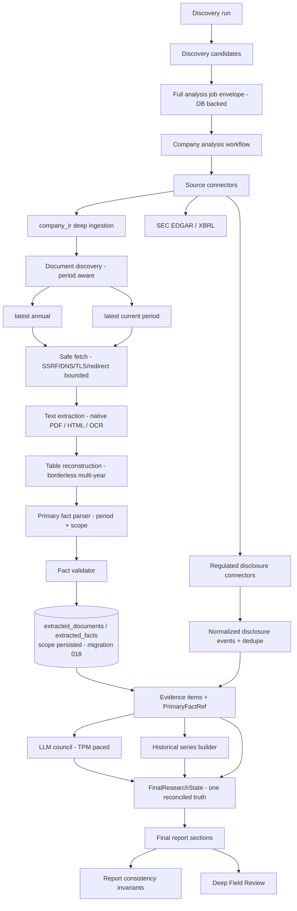

# Private-Use Production Readiness — Technical Specification

**Status:** LIVE (updated throughout the campaign)
**Owner:** InvestingBuddy engineering
**Started:** 2026-08-25
**Baseline:** staging API/web `bfac6e1`, Alembic head `017`, extraction pipeline version `11`
**Production:** not provisioned, untouched, and out of scope for this campaign.

---

## 1. Executive objective

Bring InvestingBuddy from "strong staging research engine" to **private-use production ready**:
an authenticated human researcher (internal analyst / invited private user) can run the full
research loop against **real, current, primary evidence** for a European issuer universe and
**trust what the system tells them** — including what it says is missing.

This is explicitly **not** a public retail launch, **not** autonomous investment advice, and
**not** authorisation to deploy production.

---

## 2. Definition of "private-use production ready"

The system is private-use production ready when an authenticated researcher can reliably:

```
DISCOVER → SELECT COMPANY → RUN FULL ANALYSIS
        → INGEST CURRENT + HISTORICAL PRIMARY EVIDENCE
        → VIEW FINANCIAL SNAPSHOT / HISTORICAL TRENDS / CURRENT RESULTS
        → VIEW CATALYSTS & REGULATORY EVENTS
        → RUN LLM COUNCIL → RUN DEEP FIELD REVIEW
        → TRACE CLAIMS TO SOURCES → RE-RUN SAFELY → RECOVER FROM FAILURES
```

without major contradictory state.

**`research_complete == true` is NOT required.** "Insufficient evidence", "missing field",
"not valuation ready" and "requires more evidence" are all valid, correct outputs.

What is **never** allowed:

| Forbidden state | Meaning |
|---|---|
| `FACT_PRESENT_AND_MISSING` | a fact is presented in one section and declared missing in another |
| `SCOPE_CONTRADICTION` | a segment figure occupies a Group slot (or vice-versa) |
| `HISTORICAL_AS_CURRENT` | a prior-year figure presented as the current period |
| `INTERIM_AS_ANNUAL` | an H1/Q figure presented as a full-year figure |
| `SOURCE_TIER_CONTRADICTION` | issuer-PDF facts labelled as SEC/XBRL, or T5 price presented as a filing fact |
| `PRIMARY_SOURCE_PRESENT_BUT_ACQUISITION_GAP` | "source the annual report" while it is already ingested |
| `DFR_FIELD_GAP_FALSE_POSITIVE` | one company's missing field attributed to another |
| `NONE_LITERAL_LEAK` / `ENUM_REPR_LEAK` | Python `None` / `SourceTier.X` rendered to a human |
| `DUPLICATE_DOCUMENT_IDENTITY` / `DUPLICATE_EVENT_IDENTITY` | the same artifact counted twice |
| silent job loss | a long-running analysis disappears with no recoverable state |
| fabrication | any invented value, citation, period or scope |

---

## 3. Current architecture baseline

Independently verified on 2026-08-25 before any change:

| Item | Verified value |
|---|---|
| repo HEAD | `8e6161c` (docs-only above the deployed app SHA) |
| staging API `/health` | `commit_sha=bfac6e1`, `environment=staging`, build `32784433094` |
| staging web `/api/version` | `commit_sha=bfac6e1`, build `32784433136` |
| Alembic head | `017` |
| backend tests | **3755 passed, 12 skipped, 0 failed** |
| `ruff check .` | clean |
| `mypy app` | **71 errors / 10 files** (accepted baseline) |
| Azure subscription | `Visual Studio Ultimate with MSDN` — **Enabled** |
| Azure OpenAI | `ib-stg-openai`, `gpt-4.1-mini`, GlobalStandard capacity **60** (not to be changed) |
| Production | not provisioned |

Accepted capabilities that this campaign **extends rather than replaces**: async full analysis,
TPM-aware council scheduling, real committee chair, typed evidence contracts
(`FinancialDataSummary` / `FundamentalsResolution` / `EvidenceInventory`), field-level
provenance, issuer-primary document ingestion, SEC XBRL path, issuer-scoped document CDN
authority, extension-less PDF discovery, native PDF extraction, Azure OCR fallback, two-column
reconstruction, multi-year borderless table reconstruction, period-scoped fact extraction,
canonical document identity, pipeline-version cache invalidation, post-ingestion
`FinalResearchState`, fact-centric gap reconciliation, `SourceQualityAssessment`,
`ThinEvidenceAssessment`, grouped discovery warnings, verified issuer registry,
regenerate-from-final lineage recovery, council citation binding, DFR exact report linkage.

---

## 4. Current known deficiencies

Each was confirmed against the code at `bfac6e1`, not assumed.

**D1 — Fact scope is not persisted (correctness-critical).**
`ExtractedFact` has no scope column. `ValidatedFact.scope` exists only in memory;
`extracted_document_service._persist_validated_facts` never writes it and
`_rebuild_artifact` never restores it. Demonstrated: a rehydrated `ValidatedFact` returns
`scope=None`. Because `final_report_generator._high_confidence_facts_for` treats
*absent* scope as the implicit Group convention, a **cache-reused** run can promote a
segment figure into a canonical Group slot — the exact regression Phase 32A fixed for the
fresh path only.

**D2 — Historical series are extracted then discarded.**
Phase 32D produces ~52 period-scoped Pandora facts (FY2021–FY2025), but every downstream
consumer (`_high_confidence_facts_for`, canonical snapshot, council pack, report sections)
takes a **single representative value per field**. No trend reaches a human or the council.

**D3 — The canonical snapshot is narrower than the evidence.**
`_PRIMARY_FINANCIAL_FACT_FIELDS` = `{revenue, operating_profit, net_income, free_cash_flow,
total_assets, total_debt, cash_and_equivalents}`. The parser already extracts
`operating_margin`, `operating_cash_flow`, `net_debt`, `net_cash`, `total_equity`,
`recurring_operating_profit`, `recurring_operating_margin`, `employees` — none reach the
canonical snapshot.

**D4 — Source-type copy is US-centric.**
Issuer-PDF facts and EU gap text still carry SEC/XBRL/10-K vocabulary in several places.

**D5 — DFR identity gaps are ungrounded.**
`field_review_evidence_pack.build_company_summary` carries no per-company identity
completeness signal (LEI / ISIN / sector / reporting currency), so the comparative council
has nothing to ground an identity-gap claim on and can generalise one company's gap to all.

**D6 — Discovery-stage metrics are unlabelled.**
Candidate cards keep (correctly immutable) discovery-time scores after full analysis, with
no marker saying so.

**D7 — Current-period evidence never reaches the report.**
`document_discovery.rank_documents` sorts strictly by kind (annual `0` < results `1` <
interim `2`) and `primary_document_max_docs_per_issuer` is `3`. On an issuer page listing
many annual reports (Richemont lists ~30), **no interim document can ever be selected**, and
among the annuals there is no recency preference at all — DOM order wins.

**D8 — Regulated-disclosure connectors are reference-only.**
`nordic_disclosures`, `six_swiss`, `euronext_regulated_info`, `uk_fca_nsm` emit a venue
pointer plus an honest gap. No live event is ever retrieved.

**D9 — Job durability is recoverable but not observable.**
A DB-backed analysis-job envelope with a derived stale threshold exists, but recovery only
happens when a human re-POSTs, and `GET .../analysis-job` reports `running` indefinitely for
a job whose worker died. Nothing sweeps orphans at startup.

---

## 5. In-scope work

| Phase | Scope |
|---|---|
| **PR-A** | This spec; migration `018` persisting typed fact scope; scope round-trip through persistence, cache reuse, revalidation, evidence and report |
| **PR-B** | Canonical bounded historical financial series + comparability rules + council/report propagation |
| **PR-C** | Canonical snapshot expansion; source-neutral copy; DFR identity-gap grounding; discovery-stage label |
| **PR-D** | Current-period (annual vs interim vs trading update) document selection, period semantics and canonical selectors |
| **PR-E** | Live regulated-disclosure retrieval + normalized event model + semantic dedupe |
| **PR-F** | Machine-verifiable report-consistency invariants; job durability/observability; issuer registry corrections |
| **PR-G** | Live multi-issuer acceptance, corrective PRs, documentation/ADR closure |

## 6. Explicit non-goals

* No public publication workflow; `human_review_required=true` / `publication_ready=false` stay.
* No BUY/SELL/HOLD/WATCH, price target, fair value, intrinsic value, projected upside/downside,
  return promise, or autonomous trade instruction — ever.
* No forecasting, no annualisation of interim results, no projected financials.
* No broker integration or trade execution.
* No new speculative "predict catalysts" system — PR-E is acquisition + normalisation only.
* No production deployment, production resource creation, production secret/config change, or
  production migration.
* No weakening of auth, SSRF/DNS/TLS/redirect validation, provenance, citations, company/run
  isolation, fail-closed extraction, or source-tier semantics.
* No issuer-specific hardcoded financial values and no ticker-specific parsing/URL hacks.
  Curated issuer-specific *trust* registration is allowed; parsing stays generic.
* No bypass of login, paywall, CAPTCHA, access control or explicit anti-bot mechanisms.

---

## 7. Architecture / data flow



The invariant this campaign protects: **one canonical fact state drives every deterministic
human-facing surface.** No section may compute its own private view of what is known.

---

## 8. Data-model changes

Only one schema change is planned: **migration `018`**.

`extracted_facts` gains a typed, additive scope representation:

| Column | Type | Semantics |
|---|---|---|
| `scope_type` | `VARCHAR(20)` NULL | `group` \| `segment` \| `NULL` (unknown — never guessed) |
| `scope_name` | `VARCHAR(200)` NULL | normalized segment identity, e.g. `Specialist Watchmakers`; NULL for group/unknown |
| `scope_key` | `VARCHAR(220)` NULL | deterministic dedupe/identity key: `group` \| `segment:<casefolded name>` \| NULL |

`scope_key` is derived, never user-supplied, and is what fact identity / dedupe / supersession
compare on. `scope_name` preserves the as-found label for display; `scope_type` is the coarse
semantic the report layer must branch on.

**Why three columns and not one string:** the report layer needs a *decidable* Group-vs-segment
question (`scope_type`) that does not depend on string-matching a label table at read time,
while diagnostics and the DFR need the human label. `scope_key` exists so the dedupe identity
is stable under label whitespace/casing drift without collapsing two genuinely different
segments.

## 9. Migration strategy

* Purely **additive**, all three columns nullable, no default backfill that invents meaning.
* **Backfill only where deterministic:** rows whose existing in-band signal is unambiguous.
  Since no scope was ever persisted, there is no recoverable historical signal — every
  pre-existing row stays `NULL` (unknown remains unknown). This is stated explicitly rather
  than inferred, because guessing `group` for legacy rows would manufacture exactly the
  contradiction class this campaign removes.
* Reversible `downgrade()` dropping the three columns.
* Because *interpretation* of persisted facts changes, `CURRENT_EXTRACTION_PIPELINE_VERSION`
  is bumped, so every legacy row is revalidated under current semantics rather than trusted.

## 10. Historical-series model

`app/services/sources/financial_history.py` builds a bounded, typed series:

```
FinancialHistorySeries
  metric: str                 # canonical field name
  scope_type / scope_name     # group | segment
  currency / unit / scale
  period_type: annual | interim | quarter
  observations: [FinancialHistoryPoint(period, period_sort_key, value, source_url,
                                       page_number, table_location, confidence)]
  completeness: complete | partial
  comparability: comparable | not_comparable(reason)
```

* Maximum **5** annual periods (configurable, default 5, floor 2).
* Metrics: revenue, operating profit, operating margin, net income, operating cash flow,
  free cash flow, total assets, total equity, net debt / net cash, employees — **only where
  present**. Absent metrics are never forced.
* Raw values are preserved. Any derived number carries `calculation_type`, input fact
  identities, periods, formula, and `derived` provenance.

## 11. Historical comparability rules (fail-closed)

Two observations are comparable **only** when company, metric, `scope_key`, `period_type`,
unit/scale and currency all match. Never compared: FY vs H1/Q, Group vs segment, EUR vs DKK
without an approved conversion, net debt vs total debt, EBIT vs EBITDA, continuing operations
vs Group when scope differs. Allowed deterministic descriptive calculations: absolute change,
percentage change, YoY growth, margin change in percentage points — and only with a valid
denominator and valid periods. **No forecasting. No projection. No return prediction.**

## 12. Canonical financial snapshot model

`_PRIMARY_FINANCIAL_FACT_FIELDS` expands to the validated statement fields listed in §10.
Never conflated: `net_debt` ≠ `total_debt`; `net_cash` ≠ `cash_and_equivalents`;
`operating_profit` ≠ EBITDA. Market-derived fields (market cap, EV, P/E, EV/EBITDA) stay in
their own T5 block and are never implied to be filing facts. A Group snapshot slot is filled
**only** by `scope_type == group` (or a legacy `NULL` on the fresh path, the pre-existing
implicit convention) — never by a segment substitute. Absent ⇒ shown missing.

## 13. Current-period source architecture

Document selection becomes **period-aware and recency-aware**:

* Each discovered document carries a derived `period_kind` (`annual` | `interim` |
  `trading_update` | `other`) and a `period_sort_key` parsed from title/URL.
* Selection reserves quota: **≥1 latest annual** and **≥1 latest current-period** document,
  instead of a flat kind-rank truncation.
* Canonical selectors expose `latest_annual`, `latest_interim`, `latest_current_period`
  without losing historical context. FY2025 revenue and H1 2026 revenue coexist.
* An interim value never overwrites an annual value: they are different periods, full stop.
* **No annualisation** of interim results is implemented in this campaign.

## 14. Regulated-disclosure connector architecture

Existing connectors are **upgraded in place** (no parallel architecture) from
reference-only to bounded live retrieval, behind an explicit flag, normalising into ONE typed
event model (`app/services/sources/disclosure_events.py`):

```
DisclosureEvent
  issuer_ticker / issuer_name / venue / country
  published_at (tz-aware) / headline / category / language
  official_url / attachment_urls / document_identifier / period
  source_tier / retrieved_at / provenance[] / event_type
```

Venues and their live status are recorded in §J of the final handoff and in the live-status
table below (§27).

## 15. Source / provenance hierarchy

`T1_primary_filing` (issuer-owned document) > `T1_primary_company_source` (issuer transport)
> `T2_regulator_or_gov` (exchange/regulator venue) > `T5_api_aggregator` (price/fundamentals)
> `T6_model_estimate`. Dimensional quality (identity / financial / catalyst / overall) is
preserved: T5 price must not downgrade a genuine T1 statement fact, and one T1 statement fact
must not make catalyst evidence look strong.

## 16. Period / currentness semantics

Currentness is decided from publication date, document title, internal reporting period and
official source metadata — **never from a filename alone**. Labels are explicit: *Latest
annual*, *Latest interim*, *Latest market price*, *Latest official event*. FY2025 is not
"current" if H1 2026 exists.

## 17. Scope semantics

`group` = consolidated. `segment` = a named business area/segment. `NULL` = unknown, and
unknown never becomes group at persistence time. Group and segment series are independent.

## 18. Cache / version semantics

`pipeline_version` gates reuse. A change to what text is extracted, or to how extracted text
is interpreted (including scope), bumps `CURRENT_EXTRACTION_PIPELINE_VERSION`. Live acceptance
always proves the new version first, then proves cache reuse explicitly.

## 19. Failure / retry semantics

Every venue connector enforces lookback window, max items, pagination cap, wall-clock budget,
response byte cap, attachment byte cap, redirect limit, exact allowed domains, DNS/IP
validation, TLS, rate limiting and a stable cache. A failing venue degrades to an honest gap.
No unbounded scraping, no infinite pagination, no recursive attachment crawl.

## 20. Security model

Unchanged and not weakened. Every new fetch goes through the existing SSRF-guarded, DNS-pinned,
redirect-validated `safe_web_fetcher` with an **exact** allowlist. Global fetch authority is
never widened to make one issuer work; issuer-scoped `document_domains` remain the only
mechanism. Explicit anti-bot mechanisms are respected, not bypassed.

## 21. Operational-readiness requirements

Authentication, authorisation, job lifecycle, failure persistence, app-restart behaviour,
retry, idempotency, deployment, migration, health endpoint, provider failure handling, Azure
OpenAI rate-limit handling, extraction timeouts, cache consistency, logging, correlation/run
IDs and source-fetch diagnostics are all audited in PR-F. A long-running analysis must not
silently disappear: orphaned in-flight jobs are detected and surfaced as recoverable.

## 22. Observability requirements

Structured logging must answer: what failed, where, for which run/company/document, was it
retried, was cache used, which pipeline version, which connector, which council agent, which
source, was the job resumed. Never logged: secrets, tokens, full sensitive payloads, entire
copyrighted documents. Volume stays bounded.

## 23. Test strategy

Every phase ships unit, contract, integration, regression and negative/fail-closed tests.
Schema phases add migration-upgrade and round-trip tests. Source phases add fixture-based
connector tests, security tests, bounded-pagination tests, redirect tests and dedupe tests.
Current-period adds period-comparison tests; historical adds scope/period comparability tests;
report adds semantic consistency tests; jobs add restart/recovery tests.

## 24. Live acceptance matrix

At least **5** issuers across **≥4 venues** and **≥4 countries**, mandatory PNDORA + CFR.
Full matrix recorded in §51 of the final handoff.

## 25. Rollout / rollback plan

Merge to `main` → GitHub Actions path-filtered deploy to staging → SHA-verified smoke →
migration `018` applied to staging via the documented runbook → live acceptance. Rollback:
migration `018` is reversible and additive; every new live-retrieval behaviour is flag-gated
and defaults consistent with the accepted baseline until proven.

## 26. Phased implementation plan

See §5 and the PR ledger (§29). Per-phase exact problem, affected modules, schema, tests,
live acceptance, dependencies and exit criteria are recorded in the ledger as each phase lands.

## 27. Source landscape research — European issuer universe (as of 2026-08-25)

Researched live on 2026-08-25. Every "latest" below was verified against the official
document's own publication date and internal reporting period, never a filename.

| Issuer | Venue / Country | Latest annual | Latest current period | Official source | Fetchable |
|---|---|---|---|---|---|
| **PNDORA** Pandora A/S | Nasdaq Copenhagen / Denmark | FY2025 Annual Report | **Q2 2026 Interim Financial Report, published 12 Aug 2026, Company Announcement 1015** | `pandoragroup.com` IR + `pandora.a.bigcontent.io` CDN | ✅ 200, `application/pdf`, 1.46 MB, 43 pp |
| **CFR** Richemont | SIX / Switzerland | **FY26 Annual Report (year ended 31 Mar 2026)** | **FY27 Q1 sales, quarter ended 30 Jun 2026, ad-hoc announcement 15 Jul 2026** | `richemont.com` | ✅ 200, both PDFs |
| **RMS** Hermès | Euronext Paris / France | URD 2025 (EN), published Apr 2026 | **H1 2026 results press release, 29 Jul 2026** | `finance.hermes.com` + `assets-finance.hermes.com` | ✅ 200 |
| **KER** Kering | Euronext Paris / France | URD 2025 (EN), published 21 Apr 2026 | **H1 2026 press release + First-Half Report 2026, 28 Jul 2026** | `kering.com` + `assets-keringcom.keringapps.com` | ✅ 200 |
| **UHR** Swatch Group | SIX / Switzerland | Annual Report 2025 | **Half-year report 2026** | `swatchgroup.com` | ✅ 200 |
| **MONC** Moncler | Euronext Milan / Italy | FY2025 | **H1 2026 Financial Results, 22 Jul 2026** | eMarket Storage (CONSOB-authorised) | ✅ via storage; issuer site in maintenance |
| **MC** LVMH | Euronext Paris / France | FY2025 | H1 2026 | `lvmh.com` (Prismic, client-rendered) | ⚠️ publications list is client-side only |
| **BRBY** Burberry | LSE / United Kingdom | FY2026 | Q1 FY2027 | `burberryplc.com` | ⛔ proof-of-work anti-bot challenge — **not bypassed by design** |

Regulated-disclosure venue research:

| Venue | Mechanism found | Status |
|---|---|---|
| Nasdaq Nordic (CO/ST/HE/OL) | official `api.news.eu.nasdaq.com/news/query.action` — JSON, per-issuer, headline + category + official view URL + typed attachments | **live-capable** |
| Borsa Italiana / CONSOB | official **eMarket Storage** (`emarketstorage.it`) per-issuer listing with direct official PDFs | **live-capable** |
| SIX Swiss | no public per-issuer disclosure API found; issuers publish Art. 53 LR ad-hoc announcements on their own sites | issuer-primary route |
| Euronext Paris | `live.euronext.com` company-news is server-rendered but modal-loaded and paginated | issuer-primary route |
| LSE / FCA NSM | NSM portal `403`; NSM search API rejects every documented index; LSE per-issuer news API not public | **documented limitation** |

## 28. Acceptance criteria

The campaign may return READY only if every item in §52 of the program brief (A–O) holds.

## 29. PR / deployment ledger

| PR | Purpose | Merge SHA | CI | Migration |
|---|---|---|---|---|
| [#149](https://github.com/IvanAnikin/InvestingBuddy/pull/149) | PR-A — persist Group/segment fact scope | `6b7b4cb` | green | **018** applied to staging 2026-08-25 |
| [#150](https://github.com/IvanAnikin/InvestingBuddy/pull/150) | PR-B — historical financial series | `8b516e3` | green | none |
| [#151](https://github.com/IvanAnikin/InvestingBuddy/pull/151) | PR-C — snapshot expansion, source-neutral copy, DFR gaps | `99df1b9` | green | none |
| _(PR-D in flight)_ | PR-D — current-period (interim) evidence | | | none |

## 30. Final status

_To be completed at campaign close: IMPLEMENTED / DEFERRED NON-BLOCKING / BLOCKED /
LIVE VALIDATED / PRIVATE-USE READINESS STATUS._
