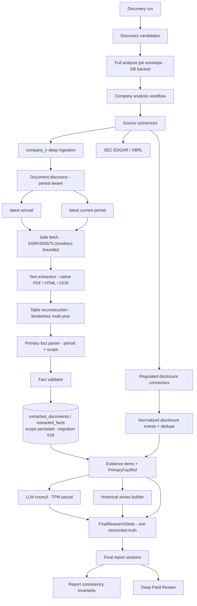

# Private-Use Production Readiness — Technical Specification

**Status:** CLOSED 2026-08-26 — READY FOR MANUAL PRIVATE-USE PRODUCTION VERIFICATION
**Owner:** InvestingBuddy engineering
**Started:** 2026-08-25
**Baseline:** staging API/web `bfac6e1`, Alembic head `017`, extraction pipeline version `11`
**Production:** not provisioned, untouched, and out of scope for this campaign.

---

## 1. Executive objective

Bring InvestingBuddy from "strong staging research engine" to **private-use production ready**:
an authenticated human researcher (internal analyst / invited private user) can run the full
research loop against **real, current, primary evidence** for a European issuer universe and
**trust what the system tells them** — including what it says is missing.

This is explicitly **not** a public retail launch, **not** autonomous investment advice, and
**not** authorisation to deploy production.

---

## 2. Definition of "private-use production ready"

The system is private-use production ready when an authenticated researcher can reliably:

```
DISCOVER → SELECT COMPANY → RUN FULL ANALYSIS
        → INGEST CURRENT + HISTORICAL PRIMARY EVIDENCE
        → VIEW FINANCIAL SNAPSHOT / HISTORICAL TRENDS / CURRENT RESULTS
        → VIEW CATALYSTS & REGULATORY EVENTS
        → RUN LLM COUNCIL → RUN DEEP FIELD REVIEW
        → TRACE CLAIMS TO SOURCES → RE-RUN SAFELY → RECOVER FROM FAILURES
```

without major contradictory state.

**`research_complete == true` is NOT required.** "Insufficient evidence", "missing field",
"not valuation ready" and "requires more evidence" are all valid, correct outputs.

What is **never** allowed:

| Forbidden state | Meaning |
|---|---|
| `FACT_PRESENT_AND_MISSING` | a fact is presented in one section and declared missing in another |
| `SCOPE_CONTRADICTION` | a segment figure occupies a Group slot (or vice-versa) |
| `HISTORICAL_AS_CURRENT` | a prior-year figure presented as the current period |
| `INTERIM_AS_ANNUAL` | an H1/Q figure presented as a full-year figure |
| `SOURCE_TIER_CONTRADICTION` | issuer-PDF facts labelled as SEC/XBRL, or T5 price presented as a filing fact |
| `PRIMARY_SOURCE_PRESENT_BUT_ACQUISITION_GAP` | "source the annual report" while it is already ingested |
| `DFR_FIELD_GAP_FALSE_POSITIVE` | one company's missing field attributed to another |
| `NONE_LITERAL_LEAK` / `ENUM_REPR_LEAK` | Python `None` / `SourceTier.X` rendered to a human |
| `DUPLICATE_DOCUMENT_IDENTITY` / `DUPLICATE_EVENT_IDENTITY` | the same artifact counted twice |
| silent job loss | a long-running analysis disappears with no recoverable state |
| fabrication | any invented value, citation, period or scope |

---

## 3. Current architecture baseline

Independently verified on 2026-08-25 before any change:

| Item | Verified value |
|---|---|
| repo HEAD | `8e6161c` (docs-only above the deployed app SHA) |
| staging API `/health` | `commit_sha=bfac6e1`, `environment=staging`, build `32784433094` |
| staging web `/api/version` | `commit_sha=bfac6e1`, build `32784433136` |
| Alembic head | `017` |
| backend tests | **3755 passed, 12 skipped, 0 failed** |
| `ruff check .` | clean |
| `mypy app` | **71 errors / 10 files** (accepted baseline) |
| Azure subscription | `Visual Studio Ultimate with MSDN` — **Enabled** |
| Azure OpenAI | `ib-stg-openai`, `gpt-4.1-mini`, GlobalStandard capacity **60** (not to be changed) |
| Production | not provisioned |

Accepted capabilities that this campaign **extends rather than replaces**: async full analysis,
TPM-aware council scheduling, real committee chair, typed evidence contracts
(`FinancialDataSummary` / `FundamentalsResolution` / `EvidenceInventory`), field-level
provenance, issuer-primary document ingestion, SEC XBRL path, issuer-scoped document CDN
authority, extension-less PDF discovery, native PDF extraction, Azure OCR fallback, two-column
reconstruction, multi-year borderless table reconstruction, period-scoped fact extraction,
canonical document identity, pipeline-version cache invalidation, post-ingestion
`FinalResearchState`, fact-centric gap reconciliation, `SourceQualityAssessment`,
`ThinEvidenceAssessment`, grouped discovery warnings, verified issuer registry,
regenerate-from-final lineage recovery, council citation binding, DFR exact report linkage.

---

## 4. Current known deficiencies

Each was confirmed against the code at `bfac6e1`, not assumed.

**D1 — Fact scope is not persisted (correctness-critical).**
`ExtractedFact` has no scope column. `ValidatedFact.scope` exists only in memory;
`extracted_document_service._persist_validated_facts` never writes it and
`_rebuild_artifact` never restores it. Demonstrated: a rehydrated `ValidatedFact` returns
`scope=None`. Because `final_report_generator._high_confidence_facts_for` treats
*absent* scope as the implicit Group convention, a **cache-reused** run can promote a
segment figure into a canonical Group slot — the exact regression Phase 32A fixed for the
fresh path only.

**D2 — Historical series are extracted then discarded.**
Phase 32D produces ~52 period-scoped Pandora facts (FY2021–FY2025), but every downstream
consumer (`_high_confidence_facts_for`, canonical snapshot, council pack, report sections)
takes a **single representative value per field**. No trend reaches a human or the council.

**D3 — The canonical snapshot is narrower than the evidence.**
`_PRIMARY_FINANCIAL_FACT_FIELDS` = `{revenue, operating_profit, net_income, free_cash_flow,
total_assets, total_debt, cash_and_equivalents}`. The parser already extracts
`operating_margin`, `operating_cash_flow`, `net_debt`, `net_cash`, `total_equity`,
`recurring_operating_profit`, `recurring_operating_margin`, `employees` — none reach the
canonical snapshot.

**D4 — Source-type copy is US-centric.**
Issuer-PDF facts and EU gap text still carry SEC/XBRL/10-K vocabulary in several places.

**D5 — DFR identity gaps are ungrounded.**
`field_review_evidence_pack.build_company_summary` carries no per-company identity
completeness signal (LEI / ISIN / sector / reporting currency), so the comparative council
has nothing to ground an identity-gap claim on and can generalise one company's gap to all.

**D6 — Discovery-stage metrics are unlabelled.**
Candidate cards keep (correctly immutable) discovery-time scores after full analysis, with
no marker saying so.

**D7 — Current-period evidence never reaches the report.**
`document_discovery.rank_documents` sorts strictly by kind (annual `0` < results `1` <
interim `2`) and `primary_document_max_docs_per_issuer` is `3`. On an issuer page listing
many annual reports (Richemont lists ~30), **no interim document can ever be selected**, and
among the annuals there is no recency preference at all — DOM order wins.

**D8 — Regulated-disclosure connectors are reference-only.**
`nordic_disclosures`, `six_swiss`, `euronext_regulated_info`, `uk_fca_nsm` emit a venue
pointer plus an honest gap. No live event is ever retrieved.

**D9 — Job durability is recoverable but not observable.**
A DB-backed analysis-job envelope with a derived stale threshold exists, but recovery only
happens when a human re-POSTs, and `GET .../analysis-job` reports `running` indefinitely for
a job whose worker died. Nothing sweeps orphans at startup.

---

## 5. In-scope work

| Phase | Scope |
|---|---|
| **PR-A** | This spec; migration `018` persisting typed fact scope; scope round-trip through persistence, cache reuse, revalidation, evidence and report |
| **PR-B** | Canonical bounded historical financial series + comparability rules + council/report propagation |
| **PR-C** | Canonical snapshot expansion; source-neutral copy; DFR identity-gap grounding; discovery-stage label |
| **PR-D** | Current-period (annual vs interim vs trading update) document selection, period semantics and canonical selectors |
| **PR-E** | Live regulated-disclosure retrieval + normalized event model + semantic dedupe |
| **PR-F** | Machine-verifiable report-consistency invariants; job durability/observability; issuer registry corrections |
| **PR-G** | Live multi-issuer acceptance, corrective PRs, documentation/ADR closure |

## 6. Explicit non-goals

* No public publication workflow; `human_review_required=true` / `publication_ready=false` stay.
* No BUY/SELL/HOLD/WATCH, price target, fair value, intrinsic value, projected upside/downside,
  return promise, or autonomous trade instruction — ever.
* No forecasting, no annualisation of interim results, no projected financials.
* No broker integration or trade execution.
* No new speculative "predict catalysts" system — PR-E is acquisition + normalisation only.
* No production deployment, production resource creation, production secret/config change, or
  production migration.
* No weakening of auth, SSRF/DNS/TLS/redirect validation, provenance, citations, company/run
  isolation, fail-closed extraction, or source-tier semantics.
* No issuer-specific hardcoded financial values and no ticker-specific parsing/URL hacks.
  Curated issuer-specific *trust* registration is allowed; parsing stays generic.
* No bypass of login, paywall, CAPTCHA, access control or explicit anti-bot mechanisms.

---

## 7. Architecture / data flow



The invariant this campaign protects: **one canonical fact state drives every deterministic
human-facing surface.** No section may compute its own private view of what is known.

---

## 8. Data-model changes

Only one schema change is planned: **migration `018`**.

`extracted_facts` gains a typed, additive scope representation:

| Column | Type | Semantics |
|---|---|---|
| `scope_type` | `VARCHAR(20)` NULL | `group` \| `segment` \| `NULL` (unknown — never guessed) |
| `scope_name` | `VARCHAR(200)` NULL | normalized segment identity, e.g. `Specialist Watchmakers`; NULL for group/unknown |
| `scope_key` | `VARCHAR(220)` NULL | deterministic dedupe/identity key: `group` \| `segment:<casefolded name>` \| NULL |

`scope_key` is derived, never user-supplied, and is what fact identity / dedupe / supersession
compare on. `scope_name` preserves the as-found label for display; `scope_type` is the coarse
semantic the report layer must branch on.

**Why three columns and not one string:** the report layer needs a *decidable* Group-vs-segment
question (`scope_type`) that does not depend on string-matching a label table at read time,
while diagnostics and the DFR need the human label. `scope_key` exists so the dedupe identity
is stable under label whitespace/casing drift without collapsing two genuinely different
segments.

## 9. Migration strategy

* Purely **additive**, all three columns nullable, no default backfill that invents meaning.
* **Backfill only where deterministic:** rows whose existing in-band signal is unambiguous.
  Since no scope was ever persisted, there is no recoverable historical signal — every
  pre-existing row stays `NULL` (unknown remains unknown). This is stated explicitly rather
  than inferred, because guessing `group` for legacy rows would manufacture exactly the
  contradiction class this campaign removes.
* Reversible `downgrade()` dropping the three columns.
* Because *interpretation* of persisted facts changes, `CURRENT_EXTRACTION_PIPELINE_VERSION`
  is bumped, so every legacy row is revalidated under current semantics rather than trusted.

## 10. Historical-series model

`app/services/sources/financial_history.py` builds a bounded, typed series:

```
FinancialHistorySeries
  metric: str                 # canonical field name
  scope_type / scope_name     # group | segment
  currency / unit / scale
  period_type: annual | interim | quarter
  observations: [FinancialHistoryPoint(period, period_sort_key, value, source_url,
                                       page_number, table_location, confidence)]
  completeness: complete | partial
  comparability: comparable | not_comparable(reason)
```

* Maximum **5** annual periods (configurable, default 5, floor 2).
* Metrics: revenue, operating profit, operating margin, net income, operating cash flow,
  free cash flow, total assets, total equity, net debt / net cash, employees — **only where
  present**. Absent metrics are never forced.
* Raw values are preserved. Any derived number carries `calculation_type`, input fact
  identities, periods, formula, and `derived` provenance.

## 11. Historical comparability rules (fail-closed)

Two observations are comparable **only** when company, metric, `scope_key`, `period_type`,
unit/scale and currency all match. Never compared: FY vs H1/Q, Group vs segment, EUR vs DKK
without an approved conversion, net debt vs total debt, EBIT vs EBITDA, continuing operations
vs Group when scope differs. Allowed deterministic descriptive calculations: absolute change,
percentage change, YoY growth, margin change in percentage points — and only with a valid
denominator and valid periods. **No forecasting. No projection. No return prediction.**

## 12. Canonical financial snapshot model

`_PRIMARY_FINANCIAL_FACT_FIELDS` expands to the validated statement fields listed in §10.
Never conflated: `net_debt` ≠ `total_debt`; `net_cash` ≠ `cash_and_equivalents`;
`operating_profit` ≠ EBITDA. Market-derived fields (market cap, EV, P/E, EV/EBITDA) stay in
their own T5 block and are never implied to be filing facts. A Group snapshot slot is filled
**only** by `scope_type == group` (or a legacy `NULL` on the fresh path, the pre-existing
implicit convention) — never by a segment substitute. Absent ⇒ shown missing.

## 13. Current-period source architecture

Document selection becomes **period-aware and recency-aware**:

* Each discovered document carries a derived `period_kind` (`annual` | `interim` |
  `trading_update` | `other`) and a `period_sort_key` parsed from title/URL.
* Selection reserves quota: **≥1 latest annual** and **≥1 latest current-period** document,
  instead of a flat kind-rank truncation.
* Canonical selectors expose `latest_annual`, `latest_interim`, `latest_current_period`
  without losing historical context. FY2025 revenue and H1 2026 revenue coexist.
* An interim value never overwrites an annual value: they are different periods, full stop.
* **No annualisation** of interim results is implemented in this campaign.

### 13.1 Current-period RETRIEVAL (added by the current-period acceptance correction)

The selection rules above were implemented and unit-tested in PR-D, and the final acceptance
matrix still showed `Current = —` for two issuers whose current-period reports this system
could fetch and extract. The whole loss was upstream of selection:

| Stage | Defect | Fix |
|---|---|---|
| Discovery | A **Next.js App Router** page streams its content as `self.__next_f.push([1,"…"])` — JSON-encoded string FRAGMENTS of one logical stream. `next_data` looks for a hydration script id App Router never emits, and `embedded_json` needs a balanced literal inside ONE script body. Pandora's Q2 2026 interim report lived only there, so the interim INDEX page became the "current-period document". | New bounded strategy **`next_flight`**: reassemble the pushed chunks into one capped buffer, then read URLs from their own quoted JSON string values (which is what lets an official URL containing spaces survive). No browser, no JS execution, no extra fetch; identical https / safe-host / allowlist / secret-strip guards. |
| Classification | `ANNUAL_REPORT_KEYWORDS` covers annual, full-year, half-year and "interim" wording and has **no quarterly vocabulary at all**. Richemont's newest reporting is a quarterly SALES release, so the reserve had nothing to reserve a slot for. | New `CURRENT_PERIOD_KEYWORDS` (period wording only — never general press wording) combined into `_INDEX_KEYWORDS` for depth-0 discovery. |
| Selection | The reserve was applied at the end of the `max_docs_per_issuer + _MAX_THIN_FALLBACK_DOCS` candidate list, but ingestion **stops at `max_docs_per_issuer`** once one document has real financial content. The reserved document was ranked, logged and never fetched. | `_rank_deep_targets(..., reserve_within=max_docs_per_issuer)` — the reserve now lands where ingestion actually reaches. |

Widening the candidate set exposed three ordering defects that had been masked by the narrower
one, each of which chose the wrong document live:

* a ZIP archive named `… (PAND-2025-12-31-en.zip)` counted as a document, because the filename
  ends in a parenthesis — trailing brackets are now stripped before the extension test;
* the anchor-**wording** heuristic sat ahead of both downloadability and recency, so a news page
  headlined "Richemont publishes FY26 Annual Report" outranked the report PDF beside it (labelled
  merely "Download"), and Pandora's "Annual Report 2024" outranked "Annual Report 2025". The rank
  is now `(kind, downloadable, recency, supporting-material, wording)`;
* one document reached the ranker under two spellings (raw-space href vs percent-encoded) and
  spent two of three bounded slots on itself — de-duplication now uses `document_identity`.

Results-day **supporting material** (presentation, transcript, appendix, analyst consensus,
aide-memoire) is demoted generically, so "the newest current-period document" is a determinate
choice rather than a DOM-order one.

### 13.2 Current-period PERIOD TRUTH (added by the current-period acceptance correction)

Reaching the current-period document made a second, more dangerous class of defect reachable.
A new pure module, `app/services/sources/document_period.py`, answers the prior question
`financial_period` never asked: **what period is this DOCUMENT about?**

`detect_document_period(title, url, headings, text)` reads the document's OWN words, strongest
rule first — the issuer's combined fiscal label (`fy27-q1` → **Q1 2027**), then an unambiguous
four-digit label (`Q2 2026`, `H1 2026`), then a period-end sentence ("for its first quarter
ended 30 June 2026"). Nothing is derived from a fiscal calendar, a publication date or a
registry. A nine-month cumulative period is **refused**, not mapped: it is neither a quarter nor
a half, and this model has no representation for it. An annual report states no interim period,
so every existing behaviour is unchanged.

That period then governs four things:

1. **The undated-figure fallback is period-TYPED.** The old fallback supplied the document's
   most common explicit token — in Richemont's quarterly release, the bare `2026` from its
   exchange-rate table, corporate calendar and copyright line — so an undated "Group sales at
   € 6.3 billion" became **annual 2026 revenue** beside the € 22.4 bn FY2026 figure. It now
   inherits the document's own period (`Q1 2027`).
2. **A bare-year table column inside an interim document is not a full year.** Pandora's Q2 2026
   lease note heads its columns `| 2026 | 2025 |` with the qualifier "30 June" wrapped onto the
   row beneath; read as full years it produced a *validated* "FY2025 revenue" of DKK 248 m (from
   a row labelled "Variable leases linked to revenue"). Recovering the intended period from a
   wrapped date row is a table-geometry problem this layer does not attempt — it **fails closed**
   and leaves the column unmapped.
3. **An interim document is never an AUTHORITY for a full year.** Its own year is not over, so a
   figure read as that year loses its period entirely; a prior-year comparative keeps its period
   but is demoted to excerpt-only, because the annual report is the authority. Nothing is
   deleted and every demotion states its reason on the fact.
4. Both the live extraction path and the **cached rebuild** path resolve it identically, or a
   reused document would re-derive different periods from the same bytes.

**The four reporting states** (`app/services/sources/period_state.py`) are now typed and named
on the report itself, under `financial_snapshot.reporting_periods`:

| State | Example | Meaning |
|---|---|---|
| `latest_annual` | FY2025 | the last completed financial year |
| `latest_interim` | H1 2026 | the last half-year reported |
| `latest_quarter` | Q2 2026 | the last quarter reported |
| `latest_current_period` | Q2 2026 | the newest of the two part-year states |

Recency is decided by when a period **ENDS**, not by its bare ordinal: ranking on the ordinal put
half-years and quarters on one scale, where H2 2026 and Q2 2026 tied at 2 although they end six
months apart. A quarter wins the tie with the half it ends beside, following the same
"more specific claim" precedent as the interim-marker parser. The states are derived from the
slots the section actually filled — never from the whole fact set — so they cannot name a period
the report does not show, and three consistency invariants assert exactly that.

`select_latest_annual` never falls back to an interim period: a canonical annual slot may only
hold a full year, and the honest answer when none exists is *unknown*.

## 14. Regulated-disclosure connector architecture

Existing connectors are **upgraded in place** (no parallel architecture) from
reference-only to bounded live retrieval, behind an explicit flag, normalising into ONE typed
event model (`app/services/sources/disclosure_events.py`):

```
DisclosureEvent
  issuer_ticker / issuer_name / venue / country
  published_at (tz-aware) / headline / category / language
  official_url / attachment_urls / document_identifier / period
  source_tier / retrieved_at / provenance[] / event_type
```

Venues and their live status are recorded in §J of the final handoff and in the live-status
table below (§27).

### 14.1 Current-period document from an official regulated venue

Moncler's acceptance row read `Annual — / Current — / 0 T1 facts`. Its own investor site has
served an HTTP 403 maintenance page on every path throughout this campaign, so nothing could be
retrieved from it — while the same H1 2026 Financial Results were already being retrieved, in
full, from the Italian CONSOB-authorised storage mechanism. The connector held the official PDF
URL, put it in an evidence item, and nobody ever opened it.

Opening it is **not a secondary-source substitution**: a storage mechanism holds the document the
issuer FILED, unaltered, under a statutory obligation — the same primary filing over a different,
official transport. The distinction is preserved where it matters: transport stays
`T2_regulator_or_gov`, content stays `T1_primary_filing`, and the venue is named on every item.

`app/services/sources/disclosure_documents.py` is the pure selection half. It fetches nothing and
is fail-closed at every step: only a **results** disclosure qualifies, only one that states a
current period in its own headline, only one whose document sits on the **venue's own registered
host**, and never a "Notice of publication of …" (a storage mechanism publishes both the two-page
notice and the report). The step is a genuine **fallback** — it runs only when the issuer's own
site produced no current-period document, so an issuer serving its own interim report is
unaffected — and it opens **at most one** document, through the same SSRF-guarded,
magic-byte-checked, byte- and page-capped extractor everything else uses. When nothing qualifies,
a precise technical reason is recorded; there is no silent absence and no substitute source.

Two extraction defects the real Moncler document then exposed, both of which would have put a
WRONG number in a canonical Group slot:

* **A label-colon headline is not a sentence.** "STONE ISLAND REVENUES: EUR 200.3 million" has no
  grammatical subject and no reporting verb, so no scope rule matched and the figure came out
  UNSCOPED — which the pipeline reads as the implicit Group convention. The real Group figure
  (EUR 1,289.9 m) was correctly refused as ambiguous (four revenue magnitudes in one excerpt),
  leaving a **brand's** revenue as the only candidate for the Group current-period slot. A bounded
  headline rule now reads the qualifier: Group vocabulary → `group`, a named entity → that
  segment, a period ("H1") → refused.
* **A ratio base is not a figure.** "…a 14.0% incidence **on** revenues, compared with EUR 170.4
  million in H1 2025" yielded EUR 170.4 m as H1 2025 revenue. The parser already excluded "of "
  before a revenue label for exactly this reason; "on " is the same construction and is now
  excluded too.

**Documented limitation:** Moncler's H1 2026 **Group revenue** is still not extracted. Its release
states four revenue magnitudes in one excerpt (Group, prior-year Group, and one brand each), and
the parser's ambiguity refusal — deliberate, and correct — declines all of them. Its H1 2026
Group EBIT, net result and free cash flow ARE extracted. This is an honest absence, not a wrong
number, and resolving it needs excerpt-level value/label association work that is a separate
slice, not a current-period defect.

### 14.2 Current-period evidence reaching the two councils

Retrieving a current-period document, and dating its figures correctly, is only worth anything if
the councils can see it for what it is.

* **The company council** gets a compact, explicitly-labelled current-period slice, added directly
  after the historical-trend slice and for the same reason: what an issuer reported MOST RECENTLY
  is as material as how it has trended, and both must survive the evidence cap. One header line
  naming all four states, then one dense line per metric and scope, each stating its own period in
  words (`H1 2026`, `Q1 2027`) so an interim figure can never read as a year. Every line says the
  two are not comparable and that nothing has been annualised. No arithmetic of any kind.
* **Budgeting:** `regulated_disclosure_financial_fact` matched no budget category and fell to
  `source_reference` — the bucket dropped FIRST under pressure. For an issuer whose own website is
  down those are the only financial facts it has, so it now budgets as primary-document evidence,
  exactly as `sec_filing_financial_fact` does and for the same reason.
* **The Deep Field Review** carries each candidate's four reporting states as a stated field, read
  off THAT candidate's own exact-linked report. It previously had to read a `_current_period`
  SUFFIX to know what a datapoint meant, and had no way to state "no current-period reporting was
  retrieved for this company" — the same shape as the live defect where one company's missing LEI
  became a claim about both. `None` means the report does not show that state; it never means
  "same as the other company".

### 14.3 Correctives found by LIVE running (current-period acceptance)

Both passed every unit test first, and both were invisible to the fixtures for the same reason:
each needed a shape only a real document produces.

| # | Defect | How it was found |
|---|---|---|
| 1 | The period-search window reached BACK across a sentence boundary. On Pandora's Q2 2026 report, page 27, "…DKK 1,253 million **in 2025**, … the 8.7% last year. EBIT EBIT for the first half of 2026 was DKK 2,951 million" gave this year's EBIT the previous sentence's year and — with "first half" also in the window — stamped it **H1 2025**. The window is now clipped backwards at a sentence terminator, the same "a label may only claim what is in its own clause" principle the money patterns already use. Choosing the numerically *nearest* year instead was tried and is worse: "…in H1 2025. Free cash flow in H1 2026 was …" puts the previous sentence's year closer to the label than its own, and it moved three correct Moncler facts onto the prior year. | reading the fresh live reports |
| 2 | "the latest interim FOR THIS FIELD" is not "the current period". Every results release restates last year's figures beside this year's; where only the comparative survived for one field, that field's slot held a **prior-year** period under a heading that says current — a live Moncler report showed `revenue_current_period` as **Q2 2025** beside an H1 2026 EBIT. The report now decides ONE current period and a slot may only hold a fact whose period ENDS at that same point (keeping H1 2026 and Q2 2026 together, both ending 30 June). A field with nothing that current has no current-period slot, exactly as a field with no annual fact has no `_primary_filing` slot. | comparing the fresh live reports field by field |

**Documented limitation.** A prior-year comparative stated in a PARENTHETICAL inside the same
sentence ("Net result: EUR 164,715 thousand … (EUR 153,460 thousand in H1 2025)") can still take
the wrong year, because sentence-boundary clipping cannot help within one sentence. It no longer
reaches any canonical slot — the current-period rule above excludes it — but it remains as
evidence with a wrong period. Resolving it needs intra-sentence value/period association, which is
a separate slice.

## 15. Source / provenance hierarchy

`T1_primary_filing` (issuer-owned document) > `T1_primary_company_source` (issuer transport)
> `T2_regulator_or_gov` (exchange/regulator venue) > `T5_api_aggregator` (price/fundamentals)
> `T6_model_estimate`. Dimensional quality (identity / financial / catalyst / overall) is
preserved: T5 price must not downgrade a genuine T1 statement fact, and one T1 statement fact
must not make catalyst evidence look strong.

## 16. Period / currentness semantics

Currentness is decided from publication date, document title, internal reporting period and
official source metadata — **never from a filename alone**. Labels are explicit: *Latest
annual*, *Latest interim*, *Latest market price*, *Latest official event*. FY2025 is not
"current" if H1 2026 exists.

## 17. Scope semantics

`group` = consolidated. `segment` = a named business area/segment. `NULL` = unknown, and
unknown never becomes group at persistence time. Group and segment series are independent.

## 18. Cache / version semantics

`pipeline_version` gates reuse. A change to what text is extracted, or to how extracted text
is interpreted (including scope), bumps `CURRENT_EXTRACTION_PIPELINE_VERSION`. Live acceptance
always proves the new version first, then proves cache reuse explicitly.

## 19. Failure / retry semantics

Every venue connector enforces lookback window, max items, pagination cap, wall-clock budget,
response byte cap, attachment byte cap, redirect limit, exact allowed domains, DNS/IP
validation, TLS, rate limiting and a stable cache. A failing venue degrades to an honest gap.
No unbounded scraping, no infinite pagination, no recursive attachment crawl.

## 20. Security model

Unchanged and not weakened. Every new fetch goes through the existing SSRF-guarded, DNS-pinned,
redirect-validated `safe_web_fetcher` with an **exact** allowlist. Global fetch authority is
never widened to make one issuer work; issuer-scoped `document_domains` remain the only
mechanism. Explicit anti-bot mechanisms are respected, not bypassed.

## 21. Operational-readiness requirements

Authentication, authorisation, job lifecycle, failure persistence, app-restart behaviour,
retry, idempotency, deployment, migration, health endpoint, provider failure handling, Azure
OpenAI rate-limit handling, extraction timeouts, cache consistency, logging, correlation/run
IDs and source-fetch diagnostics are all audited in PR-F. A long-running analysis must not
silently disappear: orphaned in-flight jobs are detected and surfaced as recoverable.

## 22. Observability requirements

Structured logging must answer: what failed, where, for which run/company/document, was it
retried, was cache used, which pipeline version, which connector, which council agent, which
source, was the job resumed. Never logged: secrets, tokens, full sensitive payloads, entire
copyrighted documents. Volume stays bounded.

## 23. Test strategy

Every phase ships unit, contract, integration, regression and negative/fail-closed tests.
Schema phases add migration-upgrade and round-trip tests. Source phases add fixture-based
connector tests, security tests, bounded-pagination tests, redirect tests and dedupe tests.
Current-period adds period-comparison tests; historical adds scope/period comparability tests;
report adds semantic consistency tests; jobs add restart/recovery tests.

## 24. Live acceptance matrix

At least **5** issuers across **≥4 venues** and **≥4 countries**, mandatory PNDORA + CFR.
Full matrix recorded in §51 of the final handoff.

## 25. Rollout / rollback plan

Merge to `main` → GitHub Actions path-filtered deploy to staging → SHA-verified smoke →
migration `018` applied to staging via the documented runbook → live acceptance. Rollback:
migration `018` is reversible and additive; every new live-retrieval behaviour is flag-gated
and defaults consistent with the accepted baseline until proven.

## 26. Phased implementation plan

See §5 and the PR ledger (§29). Per-phase exact problem, affected modules, schema, tests,
live acceptance, dependencies and exit criteria are recorded in the ledger as each phase lands.

## 27. Source landscape research — European issuer universe (as of 2026-08-25)

Researched live on 2026-08-25. Every "latest" below was verified against the official
document's own publication date and internal reporting period, never a filename.

| Issuer | Venue / Country | Latest annual | Latest current period | Official source | Fetchable |
|---|---|---|---|---|---|
| **PNDORA** Pandora A/S | Nasdaq Copenhagen / Denmark | FY2025 Annual Report | **Q2 2026 Interim Financial Report, published 12 Aug 2026, Company Announcement 1015** | `pandoragroup.com` IR + `pandora.a.bigcontent.io` CDN | ✅ 200, `application/pdf`, 1.46 MB, 43 pp |
| **CFR** Richemont | SIX / Switzerland | **FY26 Annual Report (year ended 31 Mar 2026)** | **FY27 Q1 sales, quarter ended 30 Jun 2026, ad-hoc announcement 15 Jul 2026** | `richemont.com` | ✅ 200, both PDFs |
| **RMS** Hermès | Euronext Paris / France | URD 2025 (EN), published Apr 2026 | **H1 2026 results press release, 29 Jul 2026** | `finance.hermes.com` + `assets-finance.hermes.com` | ✅ 200 |
| **KER** Kering | Euronext Paris / France | URD 2025 (EN), published 21 Apr 2026 | **H1 2026 press release + First-Half Report 2026, 28 Jul 2026** | `kering.com` + `assets-keringcom.keringapps.com` | ✅ 200 |
| **UHR** Swatch Group | SIX / Switzerland | Annual Report 2025 | **Half-year report 2026** | `swatchgroup.com` | ✅ 200 |
| **MONC** Moncler | Euronext Milan / Italy | FY2025 | **H1 2026 Financial Results, 22 Jul 2026** | eMarket Storage (CONSOB-authorised) | ✅ via storage; issuer site in maintenance |
| **MC** LVMH | Euronext Paris / France | FY2025 | H1 2026 | `lvmh.com` (Prismic, client-rendered) | ⚠️ publications list is client-side only |
| **BRBY** Burberry | LSE / United Kingdom | FY2026 | Q1 FY2027 | `burberryplc.com` | ⛔ proof-of-work anti-bot challenge — **not bypassed by design** |

Regulated-disclosure venue research:

| Venue | Mechanism found | Status |
|---|---|---|
| Nasdaq Nordic (CO/ST/HE/OL) | official `api.news.eu.nasdaq.com/news/query.action` — JSON, per-issuer, headline + category + official view URL + typed attachments | **LIVE** (PR-E) |
| Borsa Italiana / CONSOB | official **eMarket Storage** (`emarketstorage.it`) per-issuer listing with direct official PDFs | **LIVE** (PR-E, new connector) |
| SIX Swiss | no public per-issuer disclosure API found; issuers publish Art. 53 LR ad-hoc announcements on their own sites | issuer-primary route |
| Euronext Paris | `live.euronext.com` company-news is server-rendered but modal-loaded and paginated | issuer-primary route |
| LSE / FCA NSM | NSM portal `403`; NSM search API rejects every documented index; LSE per-issuer news API not public | **documented limitation** |

## 28. Acceptance criteria

The campaign may return READY only if every item in §52 of the program brief (A–O) holds.

## 29. PR / deployment ledger

| PR | Purpose | Merge SHA | CI | Migration |
|---|---|---|---|---|
| [#149](https://github.com/IvanAnikin/InvestingBuddy/pull/149) | PR-A — persist Group/segment fact scope | `6b7b4cb` | green | **018** (applied to staging 2026-08-25) |
| [#150](https://github.com/IvanAnikin/InvestingBuddy/pull/150) | PR-B — bounded historical financial series | `8b516e3` | green | none |
| [#151](https://github.com/IvanAnikin/InvestingBuddy/pull/151) | PR-C — snapshot expansion, source-neutral copy, DFR gaps | `99df1b9` | green | none |
| [#152](https://github.com/IvanAnikin/InvestingBuddy/pull/152) | PR-D — current-period (interim) evidence | `3f45268` | green | none |
| [#153](https://github.com/IvanAnikin/InvestingBuddy/pull/153) | PR-E — live regulated disclosures | `dc3df2e` | green | none |
| [#154](https://github.com/IvanAnikin/InvestingBuddy/pull/154) | PR-F — consistency invariants + job durability | `eac749e` | green | none |
| [#155](https://github.com/IvanAnikin/InvestingBuddy/pull/155) | Corrective — search a venue by name, not legal form | `d73b4ed` | green | none |
| [#156](https://github.com/IvanAnikin/InvestingBuddy/pull/156) | Corrective — series see every fact; call `fetch_events` | `8558bc2` | green | none |
| [#157](https://github.com/IvanAnikin/InvestingBuddy/pull/157) | Corrective — disclose a newer annual period | `d71353c` | green | none |
| [#158](https://github.com/IvanAnikin/InvestingBuddy/pull/158) | Corrective — apply the implicit-Group convention consistently | `7048e2c` | green | none |
| [#159](https://github.com/IvanAnikin/InvestingBuddy/pull/159) | Corrective — canonical fact from the complete high-confidence set | `74b1158` | green | none |
| [#160](https://github.com/IvanAnikin/InvestingBuddy/pull/160) | Corrective — state the DFR identity-gap spread | `d66842c` | green | none |
| [#161](https://github.com/IvanAnikin/InvestingBuddy/pull/161) | Docs — campaign status and live acceptance | `acf6871` | n/a (docs) | none |
| [#162](https://github.com/IvanAnikin/InvestingBuddy/pull/162) | Surface the retrieved regulated disclosures to a human | `024cbd2` | green | none |
| [#163](https://github.com/IvanAnikin/InvestingBuddy/pull/163) | Polish — strip venue short-name prefix; count channels | `abd1f7a` | green | none |
| [#158](https://github.com/IvanAnikin/InvestingBuddy/pull/158) | Corrective — apply the implicit-Group convention consistently | `7048e2c` | green | none |

**Deployment ledger**

| Item | Value |
|---|---|
| staging API | `7048e2c` (`/health`, `environment=staging`) |
| staging web | `abd1f7a` (`/api/version`, build `32970640276`) |
| Alembic head (staging) | `018` |
| extraction pipeline version | `13` |
| `SOURCE_LIVE_DISCLOSURES_ENABLED` | `true` on staging (off by default in code) |
| Azure OpenAI capacity | unchanged at 60 |
| production | not provisioned, untouched |

### Definitive live acceptance (staging `abd1f7a`, 2026-08-26)

Discovery run **`aeee88d6-d228-4b46-b46d-86da99e1704d`** — "European luxury goods
companies", 8 candidates, discovery council **8/8 agents, real LLM chair, no fallback**.

| Issuer | Venue | Country | Report | Annual | Current | T1 facts | Series | Disclosures | Council |
|---|---|---|---|---|---|---|---|---|---|
| PNDORA | Nasdaq Copenhagen | Denmark | `a3d6ef3e` | FY2025 | — | 9 | **6 × FY2021–FY2025** | 5 (Nasdaq Nordic) | 8/8 real chair |
| CFR | SIX Swiss | Switzerland | `eb7f2f7e` | FY2026 | — | 6 | **5 segment series** | 0 (venue reference only) | 8/8 real chair |
| RMS | Euronext Paris | France | `f3fc5507` | FY2026 | H1 | 4 | 0 | 0 (venue reference only) | 8/8 real chair |
| KER | Euronext Paris | France | `77e1257e` | FY2025 | **H1 2026** | 12 | 4 | 0 (venue reference only) | 8/8 real chair |
| MONC | Euronext Milan | Italy | `fc948705` | — | — | 0 (honest) | 0 | **5 (eMarket Storage)** | 8/8 real chair |

**Deep Field Review `d1c0c98f-d3a9-4d5f-b2cd-56d0d6cb6c46`** — 8/8 agents, real chair,
exact report lineage for all five, `safety_valid=true`, `publication_ready=false`.

**Report consistency: 0 serious findings across all five reports.**

### Correctives found by LIVE acceptance

All four passed every unit test first. Each unit test exercised the *piece*; running live exercised the *path*.

| # | Defect | How it was found |
|---|---|---|
| 1 | Venue searched by full legal name (`"Pandora A/S"`) returned only boilerplate managers'-transaction notices and **silently dropped** the Q2 2026 results and the CFO appointment — no headline carries a legal-form suffix | running the connector against the real Nasdaq Nordic service |
| 2 | Historical series were derived from the per-document-**capped** evidence items, so 52 persisted period-scoped facts became one observation per metric and the report claimed "no multi-period series was reconstructed"; separately the venue connectors' `fetch_events` was **never called** by the evidence collector, and `borsa_italiana` was missing from the runnable regulator set | comparing a live Pandora report against `GET /reports/{id}/primary-documents` |
| 3 | A canonical slot showed FY2024 revenue while the report's own series showed FY2025 (which fell below the slot's confidence bar) | **the PR-F invariant checker itself**, on a live Kering report |
| 4 | The fix for #3 did not fire: the selected fact was unscoped, and fail-closed scope matching refused to compare it with a Group-scoped candidate — even though the slot had already placed it there under the implicit-Group convention | re-running live acceptance after #157 |
| 5 | *Which* period filled a canonical slot depended on evidence-pack ordering: `primary_facts` was read from the **capped** evidence items, so a rounded FY2024 prose figure occupied the revenue slot while a high-confidence FY2025 figure existed and had simply not survived the cap | inspecting the Kering report after #158 |
| 6 | The DFR correctly reported ISIN and sector missing for all five companies, then wrote a task to source "(ISIN, LEI)" for all — while three of five had a sourced LEI. Per-company grounding removed false claims about *individuals*; it did not stop five lists being *merged* | verifying the live DFR against the per-company data |
| 7 | The connector retrieved **fifteen** real Pandora announcements that informed the council — but a researcher could not SEE any of them: the council persists only sources it CITES, and `news_catalyst_discovery` is built by a different agent that never sees connector evidence | inspecting the live reports' catalyst section against the connector's own output |
| 8 | The Italian venue prefixes rows with the issuer's SHORT name, so stripping the LEGAL name left "MONCLER " in the headline — and in the dedupe key; and "confirmed by N channels" counted provenance lines, inflating a single-channel event to six | reading the rendered live reports |
| — | **Operational, not a defect:** five concurrent full analyses on the single-worker B1 staging tier exceed the 45-minute stale threshold; run in batches of two | two consecutive interrupted batches, then a single run completing in **5.2 min** |
| 4 | The fix for #3 did not fire: the selected fact was unscoped, and fail-closed scope matching refused to compare it with a Group-scoped candidate — even though the slot had already placed it there under the implicit-Group convention | re-running live acceptance after #157 |

## 29.1 Current-period acceptance (staging `c93e085`, 2026-08-28)

The campaign closed with `Current = —` for PNDORA and CFR and `0 T1 facts` for MONC, though each
had published an official current-period report this system could fetch and extract. All three
failures were reproduced live against `3b316ff` before anything was changed, and each lost the
document at a **different stage** — see §13.1 (retrieval), §13.2 (period truth), §14.1 (the
regulated-venue path) and §14.3 (the two correctives live running then found).

**PRs [#165](https://github.com/IvanAnikin/InvestingBuddy/pull/165) → `3ea6b42` and
[#166](https://github.com/IvanAnikin/InvestingBuddy/pull/166) → `c93e085`**, both CI-green.
Alembic head **unchanged at 018** — no schema change. Extraction pipeline version **13 → 15**.
No `apps/web` change (deployed web `abd1f7a` proven tree-identical to the API SHA).

Thesis discovery run **`48837187-3ec0-475c-a56e-5cc17f582d7b`** — "European luxury goods
companies", 8 candidates. All three analyses run **serially** (see the gotcha below).

| Issuer | Report | Latest annual | Latest current | Current-period source | Council | Consistency |
|---|---|---|---|---|---|---|
| **PNDORA** | `a17f94b2` | **FY2025** | **H1 2026** | Q2 2026 Interim Report, issuer CDN | 8/8, real chair | 0 findings |
| **CFR** | `dc3d8352` | **FY2026** | **Q1 2027** | FY27 Q1 sales ad-hoc, 15 Jul 2026 | 8/8, real chair | 0 findings |
| **MONC** | `06c8a0d3` | — (site down) | **H1 2026** | H1 2026 Financial Results, eMarket Storage, 22 Jul 2026 | 8/8, real chair | 0 findings |

**PNDORA** — FY2025 baseline intact and unchanged (revenue DKK 32,549 m, EBIT DKK 7,783 m,
operating margin 23.9%, OCF DKK 7,361 m, FCF DKK 5,022 m, net debt DKK 13,719 m, total assets
DKK 29,603 m, total equity DKK 5,282 m) beside H1 2026 revenue DKK 14,328 m, EBIT DKK 2,951 m and
net profit DKK 1,817 m. **Two separate documents**: Annual Report 2025 (52 facts) and the Q2 2026
interim report (3 facts).

**CFR** — FY2026 Group revenue **€22.4 bn is untouched** beside **Q1 2027** sales of €6.3 bn.
**Three separate documents**: the FY26 annual report, the FY26 annual-results ad-hoc announcement,
and the FY27 Q1 sales ad-hoc announcement (1 fact — the €6.3 bn). Before this work that same
€6.3 bn was being read as **annual 2026 revenue**.

**MONC** — H1 2026 EBIT €245.4 m, net result €164.7 m and free cash flow €34.0 m, ingested from
the CONSOB-authorised storage while the issuer's own site still returns HTTP 403. Content tier
`T1_primary_filing`, transport tier `T2_regulator_or_gov`, venue named on every item.

**Deep Field Review `28f56e51-9591-4585-bf48-7d9fe2523a15`** — 8/8 agents, 0 failed, real LLM
chair (`llm_chair`, no fallback, 1 attempt), `safety_valid=true`, `publication_ready=false`.
**Exact report lineage**: `dc3d8352` (CFR), `a17f94b2` (PNDORA), `06c8a0d3` (MONC) — the three
fresh reports and nothing else; the five other candidates are recorded as `draft_only`. Each
candidate carries its OWN report's four reporting states, so currentness is compared per company
rather than inferred across companies.

### Remaining limitations (honest, not worked around)

* **Moncler's H1 2026 Group REVENUE is not extracted.** Its release states four revenue magnitudes
  in one excerpt (Group, prior-year Group, and one per brand) and the parser's ambiguity refusal —
  deliberate, and correct — declines all of them. An honest absence, not a wrong number.
* **A prior-year comparative in a PARENTHETICAL can still take the wrong year** ("Net result: EUR
  164,715 thousand … (EUR 153,460 thousand in H1 2025)"). Sentence-boundary clipping cannot help
  within one sentence. It no longer reaches any canonical slot, but remains as evidence with a
  wrong period. Intra-sentence value/period association is a separate slice.
* **Moncler has no annual baseline**, because `monclergroup.com` still returns HTTP 403 on every
  path. The storage mechanism supplies the current period only.
* **Pandora's Annual Report 2024** extracts `metadata_only` — a genuine second-document limitation,
  not a current-period one. FY2021-FY2025 series come from the 2025 report.

### GOTCHAS for future work

* **Manual-ticker discovery must use a BARE ticker plus a separate `exchange`.** Passing
  `PNDORA.CO` with `exchange=CO` leaves the combined form on the company record, and
  `get_verified_issuer_source` only splits a combined ticker when `exchange` is **not** given — so
  the verified-issuer registry never matches, the company-IR and regulator connectors never run,
  and the report comes back with zero primary documents and no financial slots at all. One full
  acceptance batch was lost to this.
* **After merging, wait for the container recycle before starting an analysis.** The deploy
  workflow reports success and `/health` can already answer from the OLD container; a recycle a few
  minutes later killed two in-flight jobs. They correctly reported `interrupted` + `recoverable`
  after the 45-minute threshold and a plain re-POST recovered them — but that is 45 minutes lost.
* **Run analyses SERIALLY after a pipeline-version bump.** Version 15 forces a full re-extraction
  of every cached document, including a 169-page annual report; two concurrent runs on the
  single-worker B1 tier no longer fit the stale threshold, even though two concurrent runs were
  fine with warm caches.

## 29.2 Manual-QA state/copy reconciliation (staging, 2026-08-28)

Browser QA of the three accepted current-period reports found five places where a report told a
reader something about its OWN state that the same report disproved a section later. None is an
extraction or period defect; all four current-period invariants still passed on every one of them.

| # | Contradiction | Root cause |
|---|---|---|
| 1 | A document card read **"5 excerpt(s), 0 fact(s)"** for the very document whose **8** facts the report was presenting in its own current-period slots | The venue adapter emits excerpts before facts and the caller truncated with the generic per-source cap (**5**) — five excerpts survived and every validated fact was evicted, so the council never saw them as citable evidence either. `_prioritize_ir_items` already exists to prevent exactly this and was never applied to the venue path. Separately the two counts describe genuinely different populations and neither row said so. |
| 2 | *"Denmark regulated-disclosure connector scaffolded … pending regulator integration"* beside live Nasdaq Nordic announcements; *"live retrieval is disabled"* above eight facts extracted from a document opened at that venue | `fetch_filings` returns the venue reference plus an honest "content not fetched" gap; `fetch_events` then does the live retrieval. Both results were kept. The SEC connector separately asserted a **different** connector's state ("scaffolded, not yet live"), which it cannot see. |
| 3 | An Italian issuer told to *"Cross-check company name and domicile against SEC EDGAR or SEDAR+"* | `borsa_italiana` was added to the connector registry and never to the research agent's display-name map, so Italian issuers silently fell through to the generic US/Canada wording. |
| 4 | *"primary filings (T1/T2) required"* on a report already presenting validated T1 statement facts | A fixed string in the risk summary, while the warnings block beside it was already truth-conditional. |
| 5 | *"Regulator filing events (SEC EDGAR)"* / *"(SEC XBRL)"* for a Danish or Italian issuer | One global label for every jurisdiction. |

**Fixes.** Venue evidence now goes through the same category-diverse fact reservation as issuer-IR
evidence, so typed facts never compete with prose for the same slots; both count rows carry an
explicit `counts_basis` naming the population they count. A new pure
`sources/connector_state.py` records what each connector ACTUALLY reached in the run and replaces
— never silently drops — any gap whose `source_id` + typed `gap_type` that run disproved; the
"home regulator is scaffolded" gap now runs after the regulator loop, gated on it. The SEC gap
stops asserting another connector's state. `borsa_italiana` gains display names, and
`test_every_regulator_connector_has_a_display_name` asserts all three maps stay complete.
The risk summary's incompleteness REASON is now derived from `FinancialEvidenceState` — the
warning itself is unchanged and still withholds an investment decision. Regulator channel labels
name the issuer's own venue, stay source-neutral when none resolves, and still say SEC for an
SEC-eligible issuer.

**Four new consistency invariants** (13 → 17), each verified to fire on the pre-fix live reports
and to stay silent on the legitimate cases: `CONNECTOR_STATE_CONTRADICTION`,
`PRIMARY_FILING_REQUIRED_CONTRADICTION`, `JURISDICTION_TASK_MISMATCH`,
`FACT_COUNT_SEMANTICS_MISMATCH`.

**Note on an existing test.** `test_yes_evidence_channel_taxonomy_is_correct` asserted
`"SEC XBRL" in label` for a Danish issuer, two lines after forbidding "SEC" on the issuer row of
the same report — it encoded the defect it sat beside. It now asserts the issuer's own venue.

### 29.3 One corrective to the new invariants

Running `CONNECTOR_STATE_CONTRADICTION` against the regenerated reports flagged a sentence that
is TRUE: *"Danish-language business-press articles about Pandora A/S (Børsen) are not fetched at
report time"*. That is a T4 news reference, not a filing venue, and it is correctly not fetched.
The marker `not fetched at report time` was matching any subject.

The check now also requires the sentence's SUBJECT to be the regulated-disclosure channel
(`regulated disclosure` / `primary filing` / `filing content` / `regulator` / `storage mechanism`
/ `disclosure venue`). Verified from both sides: it still fires on all three pre-fix reports and
is silent on all three regenerated ones. An invariant that fires on a true sentence is itself a
defect — it trains a reader to ignore the audit.

### 29.4 The regulator-event channel counts what it is named after

Making the label truthful exposed a contradiction the old wording had hidden. The channel now
reads *"Official regulated disclosures / filing events (eMarket Storage (CONSOB))"* — and it was
reporting **"not sourced, 0 events"** on a report displaying **five live disclosures from that
venue**, because it had only ever counted SEC filing events from the catalyst summary. Under the
old "(SEC EDGAR)" label that was arguably true; under a truthful label it is a plain
contradiction.

The channel now counts both official sources and keeps them separately decomposable
(`filing_event_count`, `regulated_disclosure_count`), and `CONNECTOR_STATE_CONTRADICTION` gained
a structured arm that catches the shape directly rather than relying on prose.

### 29.5 Manual-QA verification (staging `17648f5`, 2026-08-28)

Report content is PERSISTED, so corrected deterministic copy needs regeneration. All three were
regenerated **serially** in the same thesis lineage
`48837187-3ec0-475c-a56e-5cc17f582d7b`.

| Issuer | Report | Council | Consistency |
|---|---|---|---|
| PNDORA | `c0c2028a-17e3-465c-8726-90734080ae92` | 8/8, 0 failed, real chair | **0 findings** |
| CFR | `21971572-7b98-4787-833c-585c93ccca55` | 8/8, 0 failed, real chair | **0 findings** |
| MONC | `af17b241-c948-4093-b126-02f0361f99ce` | 8/8, 0 failed, real chair | **0 findings** |

**Deep Field Review `83bdea30-1748-46cb-8081-6190b60da21d`** — 8/8 agents, 0 failed, real LLM
chair (no fallback, 1 attempt), `safety_valid=true`, `publication_ready=false`. Exact lineage:
those three reports and nothing else; the five other candidates are recorded `draft_only`.

**Count semantics.** Moncler's H1 2026 document now reads **5 excerpt(s), 8 fact(s)** — matching
the 8 facts persisted for it — and every count row states the population it counts. Pandora (55)
and Richemont (34) still differ from their per-document evidence-item totals, because those are
genuinely different populations, and each row now says which.

**Connector state.** Pandora and Moncler carry *"Live regulated disclosures were retrieved from
… in this run"* (Moncler adds *"and the issuer's own filing held there was opened and
extracted"*), each still stating that retrieval is bounded to the lookback window. **Richemont
correctly RETAINS** *"Switzerland regulated-disclosure connector scaffolded"* and *"…is published
via SIX Swiss Exchange regulatory disclosures"*, because SIX genuinely stayed reference-only —
the negative control. No SEC gap asserts another connector's state.

**Jurisdiction tasks.** PNDORA → *Nasdaq Nordic company disclosures (Danish FSA)*; CFR → *SIX
Swiss Exchange regulatory disclosures*; MONC → *eMarket Storage (CONSOB-authorised)*. No SEC
EDGAR or SEDAR+ recommendation on any of the three.

**Incompleteness copy.** All three: *"Assessment is incomplete — the issuer's own primary filing
is ingested, but the remaining statement lines (…) and identity/regulatory confirmation are still
required before any investment decision."* The warning is intact.

**Channels.** Regulator rows name the issuer's own venue and carry it in a separate `venue` field;
the official-events row reports *"available — 5 live regulated disclosure(s)"* for Pandora and
Moncler and *"not sourced"* for Richemont, matching each report's own disclosure section exactly.

## 29.6 One authoritative meaning per fact count

The first pass at this labelled the two counts a Moncler report showed. Manual QA then found the
same class on **Richemont**, where the research memo shows `1 / 9 / 4` for three documents while
the Primary Documents tab shows `9 / 24 / 1` for the same three, under a report-level total of
`34` — every number correct, nothing saying which population each counts. Traced across the three
live reports:

| surface | population | PNDORA | CFR | MONC |
|---|---|---|---|---|
| research memo, per document | fact-shaped **evidence items** built for the council (budget-bounded) | 3, 14 | 1, 9, 4 | 8 |
| research memo, total | the report's **high-confidence primary facts** | 55 | 34 | 8 |
| Primary Documents tab, per document | active **persisted rows** for that document | 52, 0, 3 | 9, 24, 1 | 8 |
| Primary Documents tab, summary | active persisted rows across the run | 55 | 34 | 8 |
| evidence channel "issuer primary facts" | distinct canonical **fields** — not facts | 9 | 5 | 4 |

Richemont's "4" and "24" are the **same document**; so are Pandora's "14" and "52".

`app/services/fact_count_scopes.py` is now the closed vocabulary — `Persisted validated facts`,
`Report primary facts`, `Cited evidence facts`, `Canonical statement fields` — each with a label
and a one-line definition. The rule is **not** "make the numbers agree": forcing agreement would
mean hiding facts the report holds or inflating a count past the rows that exist. It is:

* every displayed fact count NAMES its population — the key itself
  (`report_primary_fact_count`, `cited_evidence_fact_count`,
  `persisted_validated_fact_count`) plus a `fact_count_scope` / `fact_count_label`, with the
  definitions stated once per report; and
* two counts on one object claim one population and must agree.

Counts of different scopes are free to differ — that is the point. `FACT_COUNT_SEMANTICS_MISMATCH`
was rewritten to that contract: a bare, unscoped `fact_count` anywhere in a report is a finding.
The admin Primary Documents panel renders the scope label rather than a bare "fact(s)". Generic
lineage regression tests cover all three real document shapes — multi-year annual, annual +
annual-results + quarter, and single regulated-storage current-period — from both sides.

### 29.7 Fact-count verification (staging `2e1e342`, 2026-08-28)

All three reports regenerated **serially** in lineage `48837187-3ec0-475c-a56e-5cc17f582d7b`.

| Issuer | Report | Council | Consistency |
|---|---|---|---|
| PNDORA | `2c661528-82f4-4293-9fba-1890c9fff301` | 8/8, 0 failed, real chair | **0 findings** |
| CFR | `eff5cf93-df3c-47fd-9d2b-f2133192c076` | 8/8, 0 failed, real chair | **0 findings** |
| MONC | `6a08c411-7bbd-4756-9fb4-309192a35a37` | 8/8, 0 failed, real chair | **0 findings** |

**Deep Field Review `6a81afe4-6e86-4aac-8d15-52f128acd31c`** — 8/8, 0 failed, real LLM chair (no
fallback), `safety_valid=true`, `publication_ready=false`, exact lineage over those three.

Every displayed count now names its population, and **no unqualified `fact_count` key exists
anywhere** in either payload:

| | PNDORA | CFR | MONC |
|---|---|---|---|
| `report_primary_fact_count` — *Report primary facts* | 55 | 34 | 8 |
| `cited_evidence_fact_count` — *Cited evidence facts* | 14, 3 | 9, 4, 1 | 8 |
| `persisted_validated_fact_count` — *Persisted validated facts* | 52, 3, 0 | 24, 9, 1 | 8 |
| `validated_fact_count` (run) — *Persisted validated facts* | 55 | 34 | 8 |
| `field_count` — *Canonical statement fields* | 9 | 5 | 4 |

Richemont's `4` (cited) and `24` (persisted) are the same document and now say so. The
per-document persisted count is asserted equal to the rows returned beside it, so the two cannot
drift. The four definitions are stated once per payload.

## 30. Final status

**Campaign closed 2026-08-26. Status: READY FOR MANUAL PRIVATE-USE PRODUCTION VERIFICATION.**

### IMPLEMENTED

| Area | What now holds |
|---|---|
| **Scope persistence** (migration `018`) | `scope_type` / `scope_name` / `scope_key` on `extracted_facts`; scope is part of fact identity; survives extract → persist → reload → cache reuse → report. `UNKNOWN` is a real third state, never coerced to `group`. |
| **Historical series** | `ReportingPeriod` + `FinancialHistorySeries`; series keyed by the full identity (metric, scope, period type, currency, unit, scale); fail-closed comparability; ≤5 periods, ≤8 council lines; descriptive arithmetic only. |
| **Canonical snapshot** | Field set **derived** from the parser's own vocabulary — 7 → 15 fields. `net_debt`/`total_debt`, `net_cash`/`cash`, `operating_profit`/`recurring_operating_profit` are distinct slots that cannot alias. |
| **Source-neutral copy** | `annual_filing_name()` and `_statement_source_label()` resolve from the issuer's own jurisdiction; US wording is kept only where the jurisdiction is genuinely unresolved or genuinely US. |
| **Current-period evidence** | Period- and recency-aware document selection with a reserved current-period slot; interim markers read from the value's own local window; `<field>_primary_filing` (latest annual) and `<field>_current_period` (latest interim) are separate, explicitly non-comparable slots. **No annualisation.** |
| **Live regulated disclosures** | One `DisclosureEvent` model; **live** retrieval from Nasdaq Nordic and eMarket Storage (Italy); semantic dedupe that merges an issuer copy with an exchange copy while keeping **both** provenances. |
| **Consistency invariants** | All thirteen classes assertable over an assembled report, each tested from both sides. |
| **Job durability** | `interrupted` + `recoverable` derived at read time; read-only startup sweep that logs orphans without re-enqueuing. |

### LIVE VALIDATED (staging `abd1f7a`)

* Fresh discovery run `aeee88d6-d228-4b46-b46d-86da99e1704d` — 8 candidates, discovery council **8/8 agents, real LLM chair, no fallback**.
* **5 issuers**, **4 countries**, **4 venues** completed end-to-end; every council **8/8 agents, 0 failed, real chair**.
* **0 serious consistency findings** across all five reports.
* Live regulated disclosures visible on the report surface: **Pandora's Q2 2026 results announcement** (Nasdaq Nordic, 12 Aug 2026) and **Moncler's H1 2026 Financial Results** (eMarket Storage, 22 Jul 2026) — the latter retrieved from the CONSOB-authorised venue while the issuer's own site was serving a maintenance page.
* Pandora: 9 canonical facts matching the accepted baseline exactly, plus **6 five-year series (FY2021–FY2025)**.
* Richemont: Group figures matching the accepted baseline, plus **5 independent segment series** — Jewellery Maisons, Specialist Watchmakers and Other each tracked separately, with no segment figure in a Group slot.
* Kering: current-period **H1 2026** facts in their own labelled slots beside FY2025 annual facts.
* Deep Field Review `d1c0c98f-d3a9-4d5f-b2cd-56d0d6cb6c46` — 8/8 agents, real chair, **exact report lineage** for all five; identity gaps verified **field-by-field against the underlying per-company data** (ISIN and sector genuinely missing for all five; LEI, present for three, is no longer over-generalised).
* Job durability proven live: a deploy recycled the container mid-run, all five jobs reported `interrupted` + `recoverable`, and a plain re-POST recovered them.

### DEFERRED — NON-BLOCKING

* **LSE / FCA NSM** and **Burberry** — the NSM portal returns 403, its search API rejects every documented index, and the issuer's own site is behind a proof-of-work challenge. **Not bypassed by design.** UK is therefore not in the accepted five.
* **LVMH** — the publications index is client-rendered only; no server-rendered document list to discover from.
* **SIX Swiss** and **Euronext Paris** remain venue-reference-only; both issuers' ad-hoc announcements are reachable through the issuer-primary path, which is what the accepted Richemont result uses.
* **Moncler** — `monclergroup.com` was serving its own maintenance page throughout; its regulated disclosures were still retrieved from the CONSOB-authorised venue. Its report is honestly evidence-thin.
* **Multi-period interim tables that mix column types** (Pandora's `Q2 2026 | Q2 2025 | H1 2026 | H1 2025 | FY 2025`) are still refused by the table reconstructor's monotonicity check — correctly fail-closed; those figures reach the pipeline through prose.
* **Operational:** five concurrent full analyses exceed the 45-minute stale threshold on the single-worker B1 staging tier. Run in batches of two; a single analysis completes in ~5 minutes.

### BLOCKED

None.

### PRIVATE-USE READINESS STATUS

**READY FOR MANUAL PRIVATE-USE PRODUCTION VERIFICATION.** Production is not
provisioned and was not touched at any point in this campaign.
