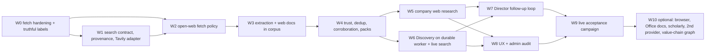

# Open-Web Research: Implementation Plan

**Status:** `PROPOSED — NOT STARTED`. Opened 2026-09-29 on `main` = `d29f1e1`, Alembic head
**041**. **No phase starts until the user approves the [spec](open-web-research-spec.md) (U0).**

**Companion documents:**
- [spec](open-web-research-spec.md)
- [search provider evaluation](open-web-search-provider-evaluation.md)
- [threat model](open-web-research-threat-model.md)
- [acceptance plan](open-web-research-acceptance-plan.md)

Paths are relative to `apps/api/app/` unless they start with `apps/`, `docs/` or `infra/`.
Every path listed under **Reuse** or **Modify** was confirmed to exist on 2026-09-29.
Paths listed under **Add** are new.

---

## 0. How the work is sliced

- **One PR per slice.** Every slice PR targets `main`, the branch V3.19 and the non-US
  primary-documents work used. It is merged and deployed dark behind its flag before the next
  slice starts. Docs-only slices are the exception.
- **Migrations go first.** They are additive and nullable, and are applied before the code
  that reads them is deployed. Applying them to the live database needs approval U9.
- **Gates for every code slice** (identical to V3.19):
  - `ruff check` is clean.
  - `pytest` passes on SQLite **and** on PostgreSQL 16 at the current head
    (`V3_TEST_POSTGRES_URL`). State `ENABLE_INTEGRATION_TESTS` next to the counts.
  - `mypy app` is at or below the 71/10 baseline.
  - Web slices also run `npm run typecheck`, `npm run lint`, `npm run build` and the relevant
    Playwright specs.
  - Before merge, an independent code review and a security/evidence review run as subagents.
    Blocking, high and medium findings must be fixed.
- **Normal CI never calls a live search API.** `FakeSearchProvider` and recorded fixtures are
  the only providers the suite uses. Live checks are opt-in scripts (acceptance plan §6).
- **Definition of done is production behaviour, read end to end.** Tests passing is not
  enough. Every live defect found in the last two phases was found only by reading a report.

### 0.1 Dependency graph

### 0.2 Decision points by phase

| Phase | Needs before merge | Needs before live activation |
|---|---|---|
| W0 | none (a security fix to existing code; can ship even if the rest of the spec is not approved) | — (no new capability). U14 is the interim mitigation until W0 ships |
| W1 | U0 | **U1** (Tavily key + spend caps), U9 (migration 042) |
| W2 | — | **U2** (open-web fetch from App Service), **U3** (robots/TDM), **U8** (UA contact) |
| W3 | — | U4 (raw-byte TTL), U6 (OCR, optional), U9 (migration 043) |
| W5 | — | U11, U12 |
| W6 | — | U10 |
| W10 | per item | U5 (browser infrastructure), U13 (Exa) |

---

## W0: Fetch hardening and truthful search labels

**Scope.** Fix what is already wrong, before anything widens.
- Fix defects D1–D14 in [threat model §2.3](open-web-research-threat-model.md#23-defects-found-in-this-audit-current-to-fix-in-w0-before-any-widening):
  CGNAT, WireServer, the full `169.254/16` range, `is_global`, encoded IPs, userinfo, port,
  `trust_env`, decompression bound, total deadline, IDN, public-suffix list, the
  substring-strip bug, the Python version assertion, and cookie persistence across redirect hops.
- **Urgency.** Several defects are reachable today through `fetch_public_source` (threat model §2.3), so W0 does not wait for approval of the rest of the spec. Until it ships, the interim mitigation is U14 (turn off `V3_DEEPSEEK_SEARCH_ENABLED`).
- Route `CompanyPressReleaseProvider._fetch` through `safe_fetch_document`.
- Fix the robots agent token mismatch.
- Define `v3_external_search_timeout_seconds` in Settings.
- Make search provenance truthful. When `SearchTrace.query_call_count == 0`, `search_web`
  leads are labelled `model_recall`, and the tool summary says `web_search_unavailable`
  (spec §22.3).
- Correct the DOC≠CODE docstrings:
  - `discovery/leads.py:13-16`
  - `providers/__init__.py:7-9`
  - `governance.py:349`
  - the comment at `config.py:~1215` that claims an 8 MB fetch cap.

**Modules.**

| Action | Files |
|---|---|
| Modify | `services/sources/safe_web_fetcher.py`, `services/sources/pinned_transport.py`, `services/sources/document_fetcher.py`, `services/sources/redaction.py`, `services/sources/live_fetchers.py` (`resolve_ip`), `integrations/providers/company_press_release_provider.py`, `services/traversal/issuer_site.py` (PSL, agent token), `services/agent_tools/external.py`, `integrations/deepseek/providers.py`, `core/config.py` |
| Add | `services/sources/public_suffix.py` (a vendored PSL snapshot, no network at runtime) |

**Data model.** None. **API.** None. **UI.** None.

**Tests.**
- New `tests/test_web_w0_fetch_hardening.py` covering SSRF-01…SSRF-25 (acceptance §2.1).
- Regression runs of `test_phase32a_slice5b1_pinned_transport.py`,
  `test_v3_issuer_site_traversal.py`, `test_v3_external_research_integration.py` and
  `test_repeat_run_external_research.py`.
- A press-release provider test with a redirect to a private IP.
- A recall-labelling test that uses the recorded fixture `deepseek_responses_web_search.json`
  with its search calls removed.

**Acceptance.**
- Every SSRF-* case fails before any socket to the target opens.
- A production SEC, NSM or ASX refresh on a known issuer (Pensana) produces the same document
  counts as before the change.
- No recall lead is ever labelled `search`.

**Deployment risk:** Low to medium. The stricter guard could refuse a legitimate issuer host,
for example one behind a CDN on a non-443 port or on CGNAT-adjacent addressing. Mitigations:
refusals are logged with a code, and the acceptance run on real issuers catches a regression.

**Rollback:** Revert the PR. There is no data change.

**Complexity:** M (about 1–2 days).

---

## W1: Search contract, provenance and the Tavily adapter (dark)

**Scope.**
- Build the `SearchRequest` / `SearchExecution` / `SearchResultItem` contract (spec §8.1),
  extending the `SearchProvider` protocol.
- Extend `FakeSearchProvider` with recorded fixtures.
- Add the Tavily adapter (spec §8.2), including capability declarations and client-side
  filter enforcement.
- Add `web_research/queries.py` (sanitiser, operator allow-list, rule G1 private-token
  guard) and `web_research/search.py` (fan-out, search cache, provenance rows, fail-closed
  states).
- Add `WebResearchBudget` and the daily cap.
- Give `ProviderGovernance.assert_permitted` / `assert_no_credentials` their first runtime
  call site, in the adapter.
- Record consumption units (`web_search_calls`, `tavily_credits`) and add a price-book entry.
- Add an admin read endpoint for search audit.

**Modules.**

| Action | Files |
|---|---|
| Modify | `services/providers/contracts.py`, `services/providers/fakes.py`, `services/providers/governance.py` (`tavily` row, PUBLIC_ONLY), `services/consumption.py` (units, price-book keys), `core/config.py` (flags from spec §26.2; `TAVILY_API_KEY` in `CREDENTIAL_SETTING_FIELDS`, `repr=False`), `main.py` (router) |
| Add | `services/web_research/__init__.py`, `queries.py`, `search.py`, `budget.py`, `audit.py`; `integrations/search/__init__.py`, `integrations/search/tavily.py`; `models/web_research.py` (`WebSearchQuery`, `WebSearchResult`, `WebFetchAttempt`); `alembic/versions/042_add_web_search_provenance.py`; `api/v1/web_research_admin.py` (admin only, same guard as `research_decisions.py`); `tests/fixtures/web/tavily_*.json` |

**Data model.** Migration **042**: `web_search_queries`, `web_search_results`,
`web_fetch_attempts` (spec §26.3).

**API.** `GET /api/v1/admin/web-research/jobs/{research_job_id}` and
`GET /api/v1/admin/web-research/discovery-runs/{discovery_run_id}` (as built in W1; the two
run kinds have different id spaces) return queries, results, dispositions, fetch attempts,
totals and cost units. The search plan is added when the planner lands (W5/W6). Admin only
and never a public route.

**UI.** None.

**Tests.**
- Query sanitiser: QI-01…QI-06.
- Normalization of results from each fixture.
- Client-side filter enforcement and the `filters_enforced_by` record.
- Fail-closed states:
  - no key → `web_search_unavailable`, with 0 network calls;
  - HTTP 401, 429 and 5xx, and timeout → `executed=false` plus an error code;
  - a 200 with an unparseable body → `executed=false`.
- Budget and daily cap, including that a failed call still counts.
- Governance refusal when a payload contains a credential marker.
- The key never appears in `repr`, logs or assertion diffs. Assertions compare
  `is_configured` only, never the key value.
- Migration 042 upgrade and downgrade on PostgreSQL 16.

**Acceptance.**
- With the flag on and `provider=fake`, a scripted run writes complete provenance rows.
- **After U1 (live smoke, opt-in script):** 5 real Tavily queries. Each has `executed=true`,
  a `provider_request_id`, `network_call_count=1` and cost units recorded, and the admin
  endpoint shows them.

**Deployment risk:** Low. The feature is dark, and the migration is additive.

**Rollback:** Turn the flag off. The 042 downgrade drops only new tables.

**Complexity:** M–L (about 3 days).

---

## W2: Open-web fetch policy

**Scope.**
- Add `FetchPolicy.OPEN_WEB` over the hardened guard (spec §9.2):
  - robots.txt (RFC 9309, our own token) and TDM signal capture;
  - the per-host `SlidingWindowLimiter`, wired for the first time;
  - global and per-host semaphores;
  - retries;
  - canonicalisation with tracking-parameter removal and same-domain `rel=canonical`;
  - charset detection;
  - content sniffing;
  - paywall, login and CAPTCHA detection → `discovered_not_retrievable`;
  - a negative cache;
  - `web_fetch_attempts` rows.
- Add a user-supplied URL entry point (spec §21), used by later phases.

**Modules.**

| Action | Files |
|---|---|
| Modify | `services/sources/document_fetcher.py` (policy parameter), `services/sources/rate_limit.py`, `services/sources/cache.py` (wire the existing primitives) |
| Add | `services/web_research/fetch.py`, `services/web_research/robots.py`, `services/web_research/canonical.py`, `services/web_research/access.py` (paywall/login/CAPTCHA detection) |
| Dependency | `charset-normalizer` (already a transitive dependency of the HTTP stack; pin it explicitly) |

**Data model.** Uses `web_fetch_attempts` from 042.

**API.** None. **UI.** None.

**Tests.**
- Redirect cases SSRF-10…SSRF-15, re-run through the policy.
- robots: disallow, allow, 4xx allow, 5xx fail-closed, crawl-delay.
- A TDMRep header and a `.well-known` file.
- Per-host pacing, using a fake clock.
- Retry rules: 429 with `Retry-After`, 5xx, no retry on 403.
- Tracking-parameter removal, and the same-domain canonical rule.
- Charset: Latin-1, Windows-1252, Shift-JIS fixtures.
- Paywall fixtures: HTTP 402, JSON-LD `isAccessibleForFree:false`, a login wall.
- Decompression bomb: FILE-03.

**Acceptance.**
- Against 20 real public URLs (government, association, press, issuer), the dispositions are
  correct and none is fetched in breach of robots.
- The per-host interval is observed in timing logs.

**Deployment risk:** Medium. This is the first time the platform fetches non-allowlisted
hosts, which needs U2.

**Rollback:** `V3_WEB_FETCH_ENABLED=false`. The allowlisted paths are unaffected.

**As built (W2).** Modules: `web_research/fetch.py`, `robots.py` (RFC 9309 + TDM signals),
`canonical.py`, `access.py`, `content.py` (sniffing, class caps, charset, `js_required`),
`limiter.py`, `negative_cache.py`, `domain_policy.py` (the versioned denylist) and
`user_urls.py`. Deviations from the plan, each deliberate:

- The guard gained `FetchPolicy.OPEN_WEB` on `async_check_fetch_url` (allowlist off,
  resolution + runtime check mandatory) rather than a parameter on `safe_fetch_document`:
  that function gates on the SERVED content type before any byte is sniffed and exposes
  no response headers, so `fetch.py` composes the same W0 primitives (shape check, guard,
  mandatory pinned transport, `guarded_client_kwargs`, `read_bounded_body` with a new
  `sniff_cap` hook) instead.
- robots.txt and TDMRep are cached per **origin**, not per registrable domain: RFC 9309
  scopes a robots.txt to its host. Pacing is per registrable domain as specified. An
  unreachable robots.txt is cached for 15 minutes (about one run), not 24 h. They are
  fetched with their OWN 20 s deadline (never the run's remainder), follow up to 5
  redirects then fail closed, write their own attempt rows (`origin` `robots`/`tdm`), and
  an outcome caused by the run's own deadline is never cached. Matching uses a
  non-backtracking wildcard matcher with rule (2,000) and pattern (1,024) caps.
- Page-level metadata with no dedicated column (ETag/Last-Modified, `rel=canonical`,
  charset, `js_required`, MIME mismatch, TDM signals) rides on the last entry of
  `redirect_chain_json` under `meta`, so no migration was needed (docs/DATABASE.md).
- A TDM reservation or an access wall returns no bytes (`content=None`); the spec §20.3
  `partial_preview` ingestion of a served preview is left to W3.
- Also refused: a `consent_wall` reason, and a DNS failure is coded `dns_failure` (never
  negative-cached).
- Review round 1 hardening: the row is written once, outside the deadline; a
  negative-cache hit never adds a strike; failures are keyed on the REQUESTED URL's
  canonical form (never a page-declared canonical); redirects charge each new domain's
  page cap; a sniffed PDF over the run's PDF cap is not read; HTML served as `text/html`
  with an unlisted first tag is HTML; pacing never holds a global slot; walls need
  interstitial markers / main-content password fields / a consent-only page (site-wide
  challenge beacons, nav login boxes and cookie banners are not walls); only WHATWG
  charset labels are honoured; plain `ref` is not a tracking parameter; denylist
  `2026-09-30.2`.
- Review round 2: no NUL/control/surrogate string reaches a row (URL →
  `<unparseable-url>`, other text → U+FFFD); robots caps only ever cut toward STRICTER
  (over-long Disallow truncated, Allows dropped first, >2,000 Disallows → `Disallow: /`);
  each `X-Robots-Tag` header is scoped separately; Imperva's per-page resource script is
  not a CAPTCHA; only the matched robots groups are normalised (ASCII fast path); a
  robots/TDMRep request cut by the run deadline writes a `run_deadline` row. One
  `AsyncSession` must not be shared by concurrent `open_web_fetch` calls.

**Complexity:** L (about 3–4 days).

---

## W3: Extraction and web documents in the Research Corpus

**Scope.**
- Extract HTML main content with trafilatura (`bare_extraction` on our bytes), with the
  existing stdlib extractor as fallback. Capture metadata: title, date plus the date's source,
  author, OpenGraph/JSON-LD, language and `rel=canonical`. Strip visible-text-only elements
  and Unicode for prompt rendering.
- Route web PDFs through `extract_primary_document`, adding the two-pass large-document mode
  (spec §10.2).
- Run extraction in a bounded **process pool** with a kill timeout.
- Score documents for injection suspicion.
- Detect company mentions and resolve brand scope (spec §16.1–16.2).
- Ingest web documents: `ExtractedDocument` → `ingest_extracted_document` →
  `public_web` / `public_issuer` / `public_official` versions carrying `transport`,
  `content_origin`, tier, `use_constraint` and taint, plus subjects and chunks.
- `fetch_public_source` also ingests the documents it verifies, and links
  `research_leads.research_document_version_id`.
- Bump the extraction pipeline version.

**Modules.**

| Action | Files |
|---|---|
| Modify | `services/sources/primary_document_extractor.py` (large-document mode), `services/sources/live_fetchers.py` (process pool helper), `services/corpus/documents.py` (web write path; subject scope), `services/corpus/identity.py` (theme `document_key`), `services/corpus/policy.py` (`use_constraint`), `services/corpus/search/types.py` and `services/corpus/search/backends/postgres.py` (new filters), `services/providers/leads.py` / `services/agent_tools/external.py` (ingest on verify), `services/sources/document_discovery.py` (new kinds), `services/sources/language.py`, `services/entities/vocabulary.py` (`brand` alias), `services/sources/extraction_pipeline_version.py` (19) |
| Add | `services/web_research/extract.py`, `classify.py` (document kind, taint), `entities.py`, `ingest.py`, `services/web_research/source_policy.py` (per-domain `use_constraint` registry, versioned); `alembic/versions/043_add_web_documents_to_corpus.py`; `tests/fixtures/web/*.html`, `*.pdf` |
| Dependency | `trafilatura>=2.2` (Apache-2.0; brings `lxml`, `htmldate`, `justext`, `courlan`). Run a memory measurement on B1 before merge. |

**Data model.** Migration **043** (spec §26.3).

**API.** Corpus search gains filter parameters (internal).

**UI.** None yet.

**Tests.**
- Extraction fixtures:
  - a news article;
  - a government page;
  - an association page with a PDF link;
  - a non-English page (German, French, Japanese);
  - a JS-only shell page, which must produce `js_required` and no fake text;
  - an injection page (PI-01…PI-06);
  - hidden text;
  - an SVG and an XML bomb (FILE-05).
- The PDF whitepaper fixture ingested with page lineage.
- A 300-page synthetic PDF: two-pass mode picks the right pages within the deadline.
- Subject rows for a three-company article.
- Cartier → Richemont `segment:` scope, never group.
- A company-less theme document deduplicates under the partial index.
- An `ev:x:` resolves to a version.
- Migration 043 upgrade and downgrade on PostgreSQL 16.
- Pipeline-version bump regression: V2 reuse restamps.

**Acceptance.**
- A real whitepaper PDF and a real trade article can be found by `search_company_corpus` /
  `search_theme_corpus` with correct metadata.
- No regression in NSM/ASX/SEC document counts.

**Deployment risk:** Medium. It adds a dependency and memory on B1, and bumps the pipeline
version.

**Rollback:** `V3_WEB_CORPUS_INGEST_ENABLED=false`. Web versions stay stored but can be
excluded by the retrieval filter.

**As built (W3).** Modules: `web_research/extract.py` (trafilatura on our own lxml tree,
hidden-content removal, metadata with date source, stdlib fallback, PDF two-pass),
`pool.py` (spawned process pool, SIGKILL on timeout, separate warm-up), `classify.py`
(source class → tier/access class, document kind, injection taint), `source_policy.py`
(versioned `use_constraint` registry), `entities.py` (mentions + brand scope), `dedup.py`
(SimHash, provisional `origin_key`), `ingest.py` (the write path, lead path,
`ev:x:` resolver), `text_safety.py` (prompt rendering). Deviations, each deliberate:

- **Migration 044, not 043** (043 is the report-reconciliation branch's); temporarily
  `down_revision="042"`. It adds two version columns beyond the spec list:
  `source_class` (the retrieval filter needs a stored class) and
  `web_extractor_version`.
- **The pipeline version is not bumped** (another branch takes 19); web versions carry
  `WEB_EXTRACTOR_VERSION` instead, and `ExtractedDocument.pipeline_version` is the current
  constant.
- `ExtractedDocument` is created directly by `ingest.py` (not through
  `persist_primary_document_artifacts`, whose flags and fact validation are V2's); the
  corpus version then goes through the unchanged `ingest_extracted_document` bridge with
  a view carrying THIS run's company.
- Web documents are keyed by address (title-only period policy), never `<kind>:<period>`.
- A verified lead's bytes come from `verify_lead`'s own fetch, which predates robots/TDM;
  before storing them `ingest.py` asks `fetch.ingestion_clearance` (robots.txt + TDMRep,
  cached per origin; needs `V3_WEB_FETCH_ENABLED`; its policy-file requests write
  `robots`/`tdm` attempt rows as W2 does) and reads the page's TDM meta. Response
  headers (`X-Robots-Tag: noai`) are not visible on that path.
- Retrieval: `CorpusFilters` gained `source_classes`, `subject_scopes`, `theme_keys`,
  `use_constraints`, `exclude_injection_suspect` and `subject_company_ids` (documents that
  name the company as a subject); `published_from` is the "since" filter. PostgreSQL
  applies them as subqueries inside the same statement.
- **Review round 1** (fixes): host+path-prefix matching only for `host/path` source
  rules; subject retrieval admits only strong rows' documents and weak rows' evidence
  chunks, marked `via_subject` with a non-Group scope; themes as subject rows (044
  amended in place: no `research_documents.theme_key`, `relation='theme'`, a coalescing
  unique index); re-index on reuse; same-company non-web bytes linked; lead path
  prepares (robots/TDMRep, header TDM, walls, extraction) OUTSIDE its savepoint under a
  180 s bound; pool: process-wide gate, cancellation kills, `RLIMIT_AS`
  (`V3_WEB_EXTRACTION_MEMORY_MB`, 768) and per-task `RLIMIT_CPU`, 25 tasks per worker,
  scrubbed environment + empty cwd; analysis (SimHash, taint, mentions) in the worker;
  `render_for_prompt` before `json.dumps`; stylesheet / colour-hidden text; PDF
  near-white / sub-point text into the taint score; text-found dates kept out of the
  period rules; PDF cover / `/CreationDate` dates; `include_undated`; licence signals
  from `<head>` only; context needs sector words / ticker / venue / legal form.
  Deferred to W4: down-ranking suspect documents and the "never sole support" rule.
- Not done here: `partial_preview` ingestion (W2 hands no bytes for a walled page),
  near-duplicate clustering and wire attribution (W4), a licence-id column, crawl-kind
  scoring (W5), OCR for web PDFs (U6), a B1 memory measurement.

**Complexity:** L (about 4–5 days).

---

## W4: Trust, deduplication, corroboration and evidence packs

**Scope.**
- Source classes, with the class → tier mapping (spec §13.1).
- Claim-type rules applied at finding persistence (spec §13.3), with labels.
- SimHash near-duplicate detection.
- The origin-key algorithm (spec §14.2) and corroboration states (spec §14.3).
- Contradictions through the existing contradiction model.
- Web facts: event facts and `web_reported_value` conflicts (spec §17.3).
- Ranked evidence packs (spec §17.1).
- A `search_theme_corpus` tool, plus new filters on `search_company_corpus`.

**Modules.**

| Action | Files |
|---|---|
| Modify | `services/sources/publisher_tiers.py` and `services/sources/taxonomy.py` (source classes), `services/agents/investigator.py` (pack scoring, labels, origin cap), `services/agent_tools/corpus_search.py`, `services/agent_tools/contracts.py` (new tool name), `services/agent_tools/builtin.py` (register), `services/ledger/*` (claim-type check on finding persist) |
| Add | `services/web_research/dedup.py`, `services/web_research/trust.py`, `services/web_research/packs.py`; data files for trade press, associations and publisher groups (versioned) |

**Data model.** Uses the 043 columns (`simhash`, `origin_key`).

**API.** None. **UI.** None.

**Tests.**
- A duplicate syndicated article: five copies make one origin.
- A wire attribution pattern.
- A PR-wire host resolves to the issuer origin.
- A same-owner publisher group.
- An issuer-only superlative is labelled, not stated as fact.
- A web revenue figure vs a filing figure: the filing is canonical and a conflict is
  recorded (ACC-85).
- Conflicting sources are retained.
- Pack caps: 3 items per origin, at least one primary item.
- A snippet never appears in a prompt (PI-09).

**Acceptance.** On recorded fixtures for one issuer, packs are deterministic and labels are
correct.

**Deployment risk:** Medium. It changes the Investigator's pack composition, which affects
existing reports once web documents exist.

**Rollback:** Revert. Weights are versioned, and web items can be filtered out.

**As built (W4).** Modules: `web_research/trust.py` (origin algorithm, issuer identity,
publisher groups `PUBLISHER_GROUPS_VERSION`, corroboration states, claim types and
§13.3 rules `TRUST_RULES_VERSION`, contradictions, §17.3 web facts),
`web_research/packs.py` (`PACK_WEIGHTS_VERSION` weights, greedy deterministic selection),
`web_research/dedup.py` (union-find clustering, earliest-published representative,
`near_duplicate_rows`). Decisions, each deliberate:

- **No migration.** The plan's data model holds: `simhash` / `origin_key` (044) carry
  dedup and origin. The finding's label is a statement PREFIX (`[company says] …`,
  `[company describes itself as …] …`, `[reported in the press; a filing figure differs] …`),
  never stacked, and `claim_key` is computed from the unlabelled text. The structured
  verdict (claim type, corroboration state, origins, classes, web fact) is written to the
  question's `acquisition_log_json` as a `rung="trust"` step. A queryable column for the
  corroboration state (for W8's UI) is a later migration decision.
- **W4 is inert without web evidence.** The rules run only when a finding cites open-web
  evidence (a web corpus chunk or a verified `ev:x:` lead); the pack re-ranks only when
  web evidence is present; the origin cap applies to web origins only, so a filing's
  chunks are never capped. Note: verified leads ARE web evidence, so a lead-backed
  finding is now checked and labelled (e.g. one USGS figure → `single source estimate`).
- **Ingest.** Origin = `trust.document_origin` (verified issuer domain / filing header →
  claims from page text → registry group → registrable domain; see the review round below
  for the verified-vs-claimed rule). A near-duplicate is LINKED to the stored document
  (subjects row), never re-chunked, under the guards listed below. `content_origin` stays
  the publisher's registrable domain.
- **Contradictions.** At persistence, a non-guidance money field stated for the same
  period and scope by a different origin with a different value (track B's
  `compare_values`) records a `conflicting_sources` gap describing every side (class,
  origin, date, value; display order regulator > issuer > press, newer first). For a
  financial-statement field the filing side is canonical and the web finding is relabelled
  "reported in the press; a filing figure differs" (value-free, see the review round);
  otherwise there is no winner. Guidance
  fields are excluded (temporal supersession is track B's).
- **Claim keys reuse `research_fields`** (`fields_stated`, `field_clause`, `money_values`,
  `SUPERSEDABLE_FIELDS`) — no parallel vocabulary. Financial-statement fields:
  revenue, operating cash flow, net debt, cash, period capex.
- **PI-09.** A web corpus hit reaches the prompt as a whitelist (`evidence_id`, `text`,
  `source_class`, `origin_key`, date, period, scope, page, section): no title, citation
  label or URL. Search snippets and titles never enter the corpus.
- **Retrieval.** `search_corpus` forwards `source_classes`, `theme_keys`,
  `subject_scopes`, `exclude_injection_suspect`; hits carry `source_class`, `origin_key`,
  `injection_suspect`. `search_theme_corpus` is registered but held by no role (W6).
**W4 review round 1 (fixes, branch `feature/web-w4-fix`).** Design rule: *an origin read
from page text is a claim.* It may only reduce independence.

- Origins are **verified** (verified issuer domain; filing/exchange host whose header
  names the run's issuer; registry group; registrable domain) or **claimed**
  (`claimed:<what the page says>@<publisher>`: wire attribution, "Source:", "About X" +
  contact block, cross-domain canonical). A claim counts as the thing it claims
  (`independence_key`); it never becomes `issuer:<id>`, never merges with a verified
  origin, never counts as issuer voice. PR-wire / RNS / ASX hosts are never an origin
  (`unknown:<url hash>` or a claim). Residual: a wire release naming the issuer is
  "management says"-labelled for guidance, because no wire account is verified to an
  issuer yet.
- `issuer:<id>` is compared to the RUN's company in every rule (`is_verified_issuer`);
  `ledger.record_finding(issuer_key=…)` defaults to `run.company_id`; no issuer key means
  nothing is "mine".
- Corroboration counts independence keys of NON-weak classes only (two scraper pages are
  one weak source). Contradiction detection skips pairs by PUBLISHER, not by claimed
  origin. Display (labels, prompt) shows only domains / registry groups / "the company".
- Near-duplicate linking: exact bytes (W3) or SimHash <= 3 with identical numbers, same
  company/theme scope, never to a lower-authority representative, min 40 tokens, band
  prefilter (4 x 16-bit) in SQL; "earliest" is stored order (never a page date); stored
  origins are never rewritten; a link keeps the stricter `use_constraint`.
- Reconciliation reads the stored label (`trust.label_of_statement`): a finding labelled
  "reported in the press…", self-described or anecdotal never closes a gap
  (`web_context_only`). The relabel is value-free ("a filing figure differs"); the
  filing's figure lives in the `conflicting_sources` gap. Readers strip labels
  (`unlabelled_statement`).
- Ledger contradiction scan: newest 50 findings that state the same money field, ONE
  batched support lookup, at most 3 gaps per finding, in a SAVEPOINT that degrades to "no
  contradiction" (nothing the caller holds is modified inside it).
- Attribution regexes read fixed windows with per-line anchors (no quadratic scans);
  `cluster_near_duplicates` is banded (5,000 members: 68 s -> < 1 s); packs: suspect
  primaries are never forced, primary needs the run's issuer origin, the pack date comes
  from the evidence (no clock); verified leads use the stored version's class/origin, an
  unresolved lead is one shared non-independent origin; lead strings are rendered and
  capped like chunks.
**W4 verification round (principle: when in doubt, understate independence and never
link).**

- *Independence-bearing* (`trust.bears_independence`): the run's verified issuer (one
  origin), or a page with a known non-weak class that is not an issuer-voice / filing
  class, from a verified non-wire publisher. Wire / RNS / ASX / open-submission hosts
  (and the opaque `unknown:` token that stands in for them), unresolved leads (no class),
  weak classes and unverified claims never are. Corroboration needs two independence keys
  AND two verified publishers, one not the issuer, computed order-independently.
  Understated by design: a subsidiary's brand domain, a syndicated issuer release.
- Only the VERIFIED issuer's page is "company says"; a page that claims the issuer's text
  is one unverified source. A claimed origin on a wire host has the page as its
  publisher, so two releases on one wire can still contradict.
- Filing/exchange header authorship: the issuer's full name OPENS the first line, the
  document was ingested for the run's company, and the header is not the issuer as the
  object of an act ("Name of Issuer", "proposal / offer / bid for X").
- Near-duplicate linking is `dedup.safe_to_link`: equal token sequences, or differences
  confined to ordinary words (no digit, FY/H1/Q token, negation, direction/trend word,
  re-ordering; at most 40 changed tokens). A PR-wire host ranks below an issuer's own
  domain and the filing classes, and a document with a verified `issuer:<id>` origin links
  only to a candidate with that same origin.
- Primary pack items: a web item with no origin is not primary; platform evidence is
  flagged. The contradiction scan also reads findings with no `claim_key` (classified
  from their text, same bound).

- Known limits: `resolve_support` cannot know `via_subject` for a PRIOR finding's items;
  "(Reuters)" in a wire's own lead on a verified Reuters host is still a claim.

- Not done here: event facts in a fact table (§17.3 is computed and logged, not stored as
  rows — no table exists), Discovery's 6-item per-candidate pack (W6), a Hamming index.

**Complexity:** L (about 4 days).

---

## W5: Company research uses live multi-query web search

**Scope.**
- Add `ensure_web_context` to the V3 pipeline (spec §7.1), running wave 2 plus the `RISK`
  family under mode budgets.
- The planner's company families and templates (spec §4.2).
- Deterministic result selection (spec §11.3).
- Bounded crawling from seeds (spec §11.1), which generalises `traverse_issuer_site` instead
  of duplicating it.
- Re-point `search_web` to the configured `SearchProvider`, so it returns candidates rather
  than claims.
- The mode presets for web searches rise 4/12/30/60 → 6/16/36/60.
- `ResearchBudget.check` gets its first caller.
- Retire `V3_DEEPSEEK_SEARCH_ENABLED` (U12).
- Report sections read web evidence (spec §17.4).
- V2 `news_catalyst_discovery` can read catalyst evidence.

**Modules.**

| Action | Files |
|---|---|
| Modify | `services/pipeline/v3_pipeline.py` (new step after `ensure_core_disclosures`, around `:430-458`), `services/research_mode.py`, `services/consumption.py` (`ResearchBudget.check` caller), `services/agent_tools/external.py`, `services/agents/routing.py`, `services/agents/investigator.py` (external rung), `services/traversal/issuer_site.py` (generalised seeds), `services/pipeline/professional_research.py` (section evidence mapping), `services/final_report_generator.py` (catalyst section source) |
| Add | `services/web_research/planner.py`, `services/web_research/selection.py`, `services/web_research/crawl.py`, `services/web_research/stage.py` (the `ensure_web_context` orchestration) |

**Data model.** None new.

**API.** None. **UI.** Report sections already render. The evidence drawer lands in W8.

**Tests.**
- The query plan for a fixture company is deterministic, including the template version.
- The budget stops at each ceiling: queries, fetches, PDFs, bytes and wall time.
- An exception in the web stage does not fail the job (P10).
- Provider outage → `web_search_unavailable`, and research completes on official sources
  (ACC-88).
- `search_web` returns no citable fields.
- The regression suite for SEC, NSM and ASX (acceptance §8).

**Acceptance.** Recorded-fixture end to end: the company report cites at least one web
`ev:c:` in catalysts and at least one in industry, with correct labels. Live acceptance
follows in W9.

**Deployment risk:** Medium to high. This is the first user-visible behaviour change, and
it adds runtime to every company job.

**Rollback:** `V3_COMPANY_WEB_RESEARCH_ENABLED=false`.

**As built (W5).** Modules: `web_research/planner.py` (`QUERY_TEMPLATE_VERSION`
`w5.1`, versioned templates, venue→locale table and glossary, freshness windows, bounded
cached model expansion), `selection.py` (§11.3 score, per-family quotas, recorded skip
reasons), `crawl.py` (§11.1/§11.2), `stage.py` (`ensure_web_context`). Decisions, each
deliberate:

- **No migration.** Dispositions reuse `web_search_results.disposition` (`selected`,
  `skipped:<reason>`, `ingested`, `reused`, `not_ingested:<reason>`, `not_retrievable:<reason>`,
  `fetch_failed:<reason>`); the new unit `bytes_downloaded` lives in `consumption_json` and is
  *listed only once instrumented* (`OPTIONAL_UNITS`), so every record written with the stage off is
  byte-identical to before.
- **Order.** Classification, subject profile and stage detection now run BEFORE the stage and
  indexing (they read corpus rows, not the index), so the stage plans from them and a third-party
  page can never feed the stage detector. With the flag off the pipeline output is unchanged
  (checked by diffing `run_v3_research` outcomes against W4 for three companies; the only
  differences are pre-existing run-to-run ones: open-question row order and a network error text).
- **Flag semantics.** `V3_COMPANY_WEB_RESEARCH_ENABLED` (default off; consumers: the stage and tool
  registration). `search_web`/`fetch_public_source` register only when it AND
  `V3_WEB_SEARCH_ENABLED` AND a provider are set (`routing.web_search_provider_for`);
  `V3_DEEPSEEK_SEARCH_ENABLED` registers nothing there any more but still gates the labelled
  `model_recall` Discovery paths. `search_web` returns candidates only (no claim, no id) through
  `run_searches`; `leads` is an empty list.
- **Budgets.** Mode → profile (`research_mode.WEB_PROFILE_BY_MODE`); web-search counts 6/16/36/60;
  `ResearchBudget.check` is called before each search wave and trims it. The Investigator's
  `ExternalSearchBudget` is the mode ceiling minus the searches the stage executed.
- **Isolation.** The stage runs in a SAVEPOINT inside `try`; failure is `web_stage_failed`.
  On PostgreSQL search provenance is written in its own committed session so paid calls survive a
  failed stage; fetches are sequential on one session (concurrency is the limiter's, per host).
- **Report.** Additive `web_evidence` blocks on competitive_position, industry_and_market,
  growth_and_catalysts and risks_and_counter_thesis (class, origin, date, W4 statement label,
  §14.3 corroboration) and `web_research` on evidence_quality_and_gaps (searches run, sources found
  but not accessible). The V2 `news_catalyst_discovery` section gains `web_catalyst_evidence` only
  when catalyst documents were stored. Third-party strings are neutralised.
- **Review round 1.** Subject profile and stage detector read official (non-web) chunks only
  (`corpus/official.py`); URLs containing a gate term are dropped from catalyst evidence;
  `fetch_public_source` stays registered under the legacy flag while `search_web` needs the new
  ones; the raised mode ceilings apply only with the stage on; the Investigator's headroom is the
  stage's network calls; provenance falls back to the caller's session (then NULL job/agent-run
  link); RISK selection never lets the issuer's own page lead and keeps a URL under its
  best-scoring family; the platform's own fetcher is not a priced vendor unit; NFKC-folded
  operators, `sk-` keys and connection strings are refused; no expansion for an unconfigured
  provider; the expansion cache key includes the limit.
- **Deferred.** Expansion cache is in-process (not durable across restarts); the Director GAP
  follow-up loop and an Investigator step that fetches `search_web` candidates are W7; no browser.

**Complexity:** L–XL (about 5 days).

---

## W6: Discovery on the durable worker, with live search

**Scope.**
- Add a `discovery_research` durable job type (U10). The Discovery endpoints enqueue the job
  instead of using `BackgroundTasks`.
- Wave 1 families: `ENTITY`, `VALUE_CHAIN`, `VENUE`, `LOCAL_LANG`, `DEMAND`, `DOCUMENT`.
- Bounded, cached LLM expansion (spec §4.3).
- Per-venue locale table and glossary.
- Saturation-aware follow-ups (spec §5.3).
- Entity extraction from fetched pages.
- A new `discovery_mode="search"` lead source feeding the existing `verify_identity`. The
  `evidence_url` path serves venues without a directory.
- Admission rules A1–A4 (spec §6.2), with persisted failure codes.
- The Discovery Council pack (spec §17.1).
- The fallback to V3.19 recall is labelled.

**Modules.**

| Action | Files |
|---|---|
| Modify | `services/discovery/pipeline.py` (lead source priority), `services/discovery/leads.py` (search source), `services/discovery/identity.py` (`evidence_url` from web), `services/discovery/constraints.py` (A3 status), `services/market_discovery_service.py` (enqueue), `api/v1/market_discovery.py`, `services/jobs/handlers.py`, `services/jobs/job_contract.py` (new job type), `services/llm/discovery_prompts.py` (pack contract) |
| Add | `services/web_research/discovery_stage.py`, `services/web_research/locales.py` (venue → locale; versioned glossary) |

**Data model.** Uses 042 and 043. The job type is a value in an existing column.

**API.** The Discovery run response gains `web_search_state` and per-candidate
`discovery_mode` / `admission` fields. These are additive.

**UI.** The Discovery workbench polling already exists. Labels land in W8.

**Tests.**
- An obscure-company fixture: a company absent from `THEME_COMPANY_REGISTRY` is found by
  search, identity-verified and admitted with A1–A3 evidence.
- A snippet-only mention is not admitted.
- A wrong-company page (a name collision) is rejected by the identity guard.
- Saturation → `exclude_domains` is applied.
- Local-language query generation.
- Provider outage → labelled recall fallback, never `search`.
- Durable job: lease, heartbeat and resume after a worker restart.
- The V3.19 guards are unchanged: size hallucination and attribute leakage.

**Acceptance.** Recorded fixtures A–F (acceptance §3) pass. Live acceptance follows in W9.

**Deployment risk:** High. Discovery changes execution model and behaviour.

**Rollback:** `V3_DISCOVERY_WEB_SEARCH_ENABLED=false` restores V3.19 behaviour on the durable
worker. The durable move is its own slice (W6a) so it can be reverted independently.

**Complexity:** XL (about 6–7 days, as two slices: W6a durable, W6b search).

**W6b as built (`feature/web-w6b-discovery-search`).** New: `web_research/discovery_planner.py`
(families ENTITY / VALUE_CHAIN / VENUE / LOCAL_LANG / DEMAND / DOCUMENT from the intent's closed
vocabularies, project / permit / offtake / financing / capacity / regulation / counter-thesis
templates, saturation follow-ups, bounded cached expansion that may not name a company),
`locales.py` (venue->locale, region/country->locales, versioned glossary: de fr it es da sv no fi
pl cs ja zh), `candidate_extract.py` (deterministic mention extraction from paragraphs and table
rows), `discovery_stage.py` (search with resume, round-robin selection that ranks a known name's
own site down, fetch + W3 extraction, theme documents), `discovery/admission.py` (A1-A4 with
persisted codes), `discovery/council_pack.py` (<= 6 items per candidate, `priority_basis`). The
pipeline puts web leads after registry / held and before model recall; a lead labelled `search`
without an executed query row and a fetched page is rejected `no_search_provenance`.
Decisions and deviations: a web lead's printed name must agree with the exchange's name under
the STRICT rule (V3.19's ticker-matched rule accepts one shared word - "Apex Metals" vs "Apex
Fisheries"); with live search available a recall lead is final only if corroborated by an executed
verification search + fetched theme passage (else `also_surfaced`, `recall_not_corroborated`); an issuer's own page counts as issuer material for A3 once its
identity is verified; the LLM entity extractor and LLM translation fill-in are NOT built (the
extractor is regex-only; the glossary is extended in reviewed diffs).

---

## W7: Bounded follow-up research loop

**Scope.**
- A gap-type → `GAP` query template map (spec §7.3).
- A web rung in the Director's `_has_a_rung_left`.
- Saturation and "answered" stop reasons.
- Contradictions become gaps.
- Escalation counts verified `ev:x:` evidence and web chunks as improvement.
- Council follow-up questions, where playbooks declare them, use the targeted profile.

**Modules.**

| Action | Files |
|---|---|
| Modify | `services/director/loop.py`, `services/director/planner.py`, `services/escalation/evidence.py`, `services/playbooks/*` (declarative follow-up templates) |
| Add | `services/web_research/followup.py` |

**Data model.** None. **API.** None. **UI.** None.

**Tests.**
- The loop stops on each reason: budget, rounds, wall time, saturation and answered.
- No follow-up query contains page-derived tokens (PI-07).
- A contradiction produces exactly one follow-up.
- Escalation improvement counts `ev:x:`.

**Acceptance.** A fixture in which a margin gap is closed by a follow-up document.

**Deployment risk:** Medium, because of cost and runtime growth. Bounded by
`mode.rounds`.

**Rollback:** `V3_WEB_FOLLOWUP_ENABLED=false`.

**As built (W7).** Modules: `web_research/followup.py` (gap topics and GAP templates,
`WebFollowup`, the challenge wave, risk evidence, `assess_challenge_basis`), the web rung in
`director/loop.py`, the deterministic candidate step in `agents/investigator.py`, the risk-evidence
input in `agents/red_team.py`, the `verified_leads` dimension in `escalation/evidence.py`. No
migration, no API. Decisions, each deliberate:

- **A rung, not a loop.** `run_investigation(..., web_followup=...)`: before the follow-ups of a
  round are chosen, the open closable gaps whose field a web search could plausibly answer get one
  web round; documents that arrive make the question's corpus re-read a rung (`_has_a_rung_left(
  web_rung=)`) and the specialist is handed the platform-built query (`QuestionContext.
  followup_queries`). A gap is followed up once (a contradiction exactly once). The last Director
  round is never a web round.
- **Stop reasons** (new, closed vocabulary): `answered` (EVERY absence gap the web rounds targeted is
  closed by a finding, by track B's pure `reconcile`; a contradiction is resolved by the disagreement
  machinery and never counts; `web_followup.targeted_absence_gaps/closed` give the denominator), `saturation` (the last web
  round stored nothing relevant and nothing else is left), `web_budget` (a LIMIT: web rounds or
  budget spent with web-answerable gaps unspent). Round, task and wall limits bind as before; a
  completed run that left web improvement undone says which limit (`improvement_stopped_by`).
- **PI-07.** Queries use only versioned templates, the verified company name, ticker/venue,
  classification industry, subject-profile commodities, the year and a closed field label. A
  gap's text selects a topic; none of it is copied.
- **Fail closed on closure.** Margin, backlog and customer concentration are not in track B's
  field vocabulary, so a finding about them can never be PROVEN to close a gap: the follow-up runs,
  the document is read, the gap stays open and the run does not say `answered`. A third-party-only
  finding closes a gap only partially (track B's rule). This is a deviation from the brief's "margin
  gap closed" acceptance: it is demonstrated with production capacity, and margin demonstrates the
  honest outcome.
- **Own budget inside a run-level ceiling (W7-D2, review round 1).** The stage plans up to the mode's
  whole `max_web_searches`, so the rung does not share the Investigator's `ExternalSearchBudget`. Per
  round it spends the `followup` profile (6 queries / 12 fetches / 3 PDFs), clamped on EVERY use to what
  the run may still spend: the mode's stage profile plus the follow-up allowance (web rounds x profile +
  3 challenge queries), with `V3_RUN_MAX_WEB_SEARCHES` capping the SUM when set. Usage is read from the
  job's provenance rows (searches; fetches and bytes when a job id scopes them, else the instance's own),
  so a fresh instance (an escalation round is a new job and a new ceiling, by design) cannot reset a
  total. A round's wall limit is clamped to the Director's wall time left; the challenge wave is not
  started with none left. Web rounds per mode: 1/2/3/4 (QUICK has one Director round, so no web round).
- **Challenge wave (spec 7.4).** Neutral RISK queries the stage did not run (permit problem, project
  cancellation, financing risk, cost overrun, production issue, ...), one slot always a counter-thesis
  query (technology disadvantages, industry oversupply, commodity substitute). The Red Team receives
  `risk_evidence` (class, origin display, document date, independence, a capped excerpt inside a
  nonce-fenced block; injection-suspect pages and other companies' documents are excluded). RISK ids are
  NEVER citable by the responder, and evidence a challenge rests on is stripped from a response before
  the platform decides the outcome: citing the adverse page cannot resolve the challenge it raised. A
  challenge that omits `risk_evidence_ids`, cites an unknown id, or quotes an excerpt without citing it
  is labelled `[ungrounded web claim]` and counted; what a challenge rests on is appended to its stored
  text (`[rests on: ...]`; the challenge row has no column and no migration was added).
  `assess_challenge_basis` (the verified issuer never makes a page a "single reliable source"): a single low-trust source (aggregator, unknown,
  wire-hosted, unresolved) cannot carry a challenge, which is discarded and counted; a single reliable
  source carries it labelled `[single source]`; two independent origins carry it unlabelled.
- **Candidate step.** With the flag on, the candidates a `search_web` call returns are fetched and
  ingested by the platform (`fetch_candidates`: https, not denylisted, not held, W5 scoring, 3 per
  question) and read back as `ev:c:` chunks filtered to those URLs. A candidate has no claim, so
  `fetch_public_source` (verify a claim) is not used for them.
- **Escalation.** Web chunks already count through `indexed_chunks` / `searchable_documents` (company
  scoped, current, indexed). Verified `ev:x:` leads are a new OPTIONAL decisive dimension
  (`verified_leads`): measured only with `V3_WEB_FOLLOWUP_ENABLED` on, compared only when BOTH snapshots
  measured it (a baseline without the key is "not measured", never zero), omitted from every payload with
  the flag off (snapshot and delta key sets are exactly the old ones), and counted only for a lead whose
  stored document is current and classified above `aggregator`/`unknown_web`. Company-wide like the other
  dimensions. Cost-NULL-blocks-escalation is untouched.
- **Record.** `web_context.followup_rounds`, `web_context.followup` (queries, rounds, challenge,
  `stopped_by`), `outcome.loop.web_followup`, `outcome.challenges.risk_evidence_items`; follow-up spend
  is added to the `web_stage` consumption units.
- **Deferred.** Playbook-declared follow-up templates (`services/playbooks/*`) and the Director
  planner's own follow-up questions are not changed; the topic table lives in `followup.py`.

**Complexity:** M (about 2–3 days).

---

## W8: UX and the admin audit page

**Scope.**
- Progress states (spec §25.1).
- Discovery card fields: why surfaced, mode label, evidence, confidence, sources.
- Report evidence drawer: publisher, date, URL, class, corroboration, labels.
- A "Sources found but not accessible" list.
- The admin page `app/admin/web-research/[runId]`.
- Provider health on the admin home.

**Modules.**

| Action | Files |
|---|---|
| Modify | `apps/web/src/components/research/discovery/CandidateCard.tsx`, `v319View.ts`, `candidateView.ts`, `RunLimitations.tsx`, `apps/web/src/components/research/report/EvidenceDisclosure.tsx`, `apps/web/src/components/research/EvidencePanel.tsx`, `apps/web/src/components/research/report/V3ResearchPanel.tsx`, `apps/web/src/app/admin/page.tsx` |
| Add | `apps/web/src/app/admin/web-research/[runId]/page.tsx` and `WebResearchAudit.tsx` beside it (the pattern of `app/admin/reports/[id]/ReviewPanel.tsx`) |

**Data model.** None.

**API.** Uses the W1 admin endpoint, plus additive fields from W5 and W6.

**Tests.**
- Playwright: Discovery card labels, including the "unavailable" banner.
- Playwright: report drawer.
- Admin page renders a fixture run.
- The rules from the SSR hydration and overflow traps memory: long URLs wrap, and there are
  no host-locale dates.

**Acceptance.** A manual QA checklist against a live W9 run.

**Deployment risk:** Low.

**Rollback:** Revert.

**Complexity:** M (about 3 days).

**W8b as built (`feature/web-w8b-investor-ux`, web only).** The investor-facing half of W8; the
admin audit page is W8a.

- *Discovery card* (`CandidateWebEvidence.tsx`, `webEvidenceView.ts`; shown only for a candidate
  with a `v3_web` block): why it surfaced (mode label *Found via web search* / *Suggested by
  model, verified on exchange* / *Curated* / *Held*, source host, one cited excerpt), thesis fit
  (admission rule A3), catalyst signal, strongest evidence (up to three items, one per publisher,
  admitted passages first), main downside (the council's words first), what is unknown, and the
  evidence-confidence chip. Evidence confidence is the council's own per-dimension
  `dimensions[].evidence_confidence` and is kept apart from *What the priority rests on*
  (thesis fit, growth from verified facts, catalyst relevance, size fit). Admission is worded in
  plain language, including *eligible but unverified (theme | listing)* and the model-suggestion
  demotion; "Also surfaced" says why each company is not in the shortlist.
- *Company report* (`webEvidence.ts`, `report/WebEvidenceParts.tsx`): `web_evidence` blocks in the
  four sections with publisher, class, date, corroboration and the W4 label chips; a *Current
  developments* strip in the growth and catalysts section (from the V2 section's
  `web_catalyst_evidence`, which the backend writes into the report's embedded JSON, not into
  `source_summary_json`); the evidence drawer's *Web sources* list; *Web research* in the
  evidence-quality section with *Sources found but not accessible* and the follow-up summary
  (rounds; stopped: answered, no further new sources, or budget reached); the red team's
  risk-evidence counts. Every block renders nothing when its data is absent, so older reports
  are unchanged.
- *Never shown to an investor:* search queries, query keys, the search vendor, cost units, result
  or fetch-attempt ids. Third-party text is a React text node only; a link is rendered only for an
  https URL (`rel="noopener noreferrer nofollow"`); a passage with recommendation vocabulary is
  withheld; invisible and bidi characters are stripped.
- *Key pins.* `apps/web/tests/fixtures/w8b-web-evidence.json` is the producers' shape;
  `apps/api/tests/test_web_w8b_fixture_keys.py` runs the real writers (`web_evidence_block`,
  `web_research_block`, `_attach_web_catalysts`, `AdmissionDecision`, `_mention_entry`,
  `_sighting_of`, `DimensionAssessment`) and compares key sets; it also checks that the web's
  vocabularies (source classes, W4 labels, access reasons, admission codes, progress stages)
  cover the backend's.
- *Known gaps the UI cannot close alone (additive backend fields wanted):* the discovery mention
  and sighting records carry no published date (the card says "date not stated"); the
  not-accessible rows carry no date; `priority_basis` exists only in the Council's input pack and
  is not persisted, so the card derives *What the priority rests on* from persisted facts;
  `DiscoveryRunRead.job` does not expose the job's stage, so the progress words render only when a
  `job.stage` is supplied; `challenges.risk_evidence_items` (W7) is a count, not a list of
  sources.
- *Tests.* `apps/web/tests/e2e/w8b-web-evidence.spec.ts` on its own ports
  (`playwright.w8b.config.ts`: dev server 3600, mock backend 9299).

---

## W9: Live acceptance campaign

**Scope.** Run acceptance plan §6–§7 in production (`ib-stg`). There are six niche themes
(A–F), each with Discovery, a Council and two full company reports, plus a source audit.
The news, whitepaper, official-preference, malicious-page, SSRF and outage demonstrations
also run here. Each defect found becomes its own corrective PR, following the V3.19 pattern.
The phase ends with the acceptance report `docs/open-web-research-acceptance-report.md`.

**Modules.**

| Action | Files |
|---|---|
| Add | `scripts/web-research-acceptance.py` (repo root), which exits non-zero on an invariant breach, following the pattern of `scripts/v3-issuer-acceptance.py`; the report doc |

**Deployment risk:** It exercises live spend within the U1 caps.

**Rollback:** Flags off.

**Complexity:** L (about 3–5 days, including correctives).

---

## W10: Optional extensions (each gated on evidence from W9)

| Item | Trigger or prerequisite | Scope | Decision |
|---|---|---|---|
| W10a Browser fallback | ≥15 % of selected high-value URLs are `js_required` (spec §9.4) | Azure Container Apps Job running Playwright under threat model §7; `BrowserProvider` adapter; `infra/azure/modules/*` | **U5** (new Azure resource) |
| W10b Office and CSV documents | Measured share of valuable DOCX/PPTX/XLSX results | python-docx, python-pptx, openpyxl + defusedxml; zip-bomb guard | — |
| W10c Scholarly metadata | Technology themes show gaps | OpenAlex (key), Crossref (polite), arXiv (1 request per 3 s); metadata-only unless the licence is open | Key for OpenAlex (free tier) |
| W10d Second search provider (Exa) | Written storage permission, plus a benchmark win on `cost_per_verified_useful_finding` | `integrations/search/exa.py`; benchmark run | **U13** + spend |
| W10e Value-chain relationships | Discovery acceptance shows value-chain recall matters | Relationship vocabulary plus sourced `record_relationship` writes; GLEIF level-2 | No migration: `relationship_type` has no DB CHECK constraint (vocabulary enforced in code) |
| W10f Egress isolation for all open-web fetches | Before any public or commercial launch | Move `web_research/fetch.py` execution into the isolated job | U5 |
| W10g Multilingual retrieval | Measured non-English retrieval misses | Per-language `tsvector` configurations | Migration (index) |

---

## 1. File and module map

### 1.1 Reuse unchanged (called, not edited)

| Module | Why |
|---|---|
| `services/sources/pinned_transport.py` | DNS-rebinding defence (W0 edits only `trust_env` and deny ranges) |
| `services/corpus/chunking.py`, `services/corpus/indexing.py`, `services/corpus/artifacts/*` | Chunks, index and content-addressed bytes |
| `services/corpus/scope_resolution.py` | "Never promote to group" |
| `services/discovery/identity.py` (logic), `directories.py`, `constraints.py`, `attribute_guard.py`, `freshness.py`, `intent.py` | Official identity and the requested-vs-verified contract |
| `services/sources/ocr_provider.py` | Scanned PDFs |
| `services/jobs/worker.py`, `job_store.py` | Durable execution |
| `services/consumption_recorder.py` | Per-run accounting |
| `services/entities/resolution.py`, `services/entities/relationships.py` | Resolution and sourced relationships |
| `council_v2/*`, `agents/chair.py`, `agents/red_team.py` | They consume findings, and findings carry web ids transparently |
| All SEC, NSM, ASX, Nordic and CONSOB connectors | **Untouched** (P10) |

### 1.2 Modify

`safe_web_fetcher.py`, `document_fetcher.py`, `redaction.py`, `live_fetchers.py`,
`rate_limit.py`, `cache.py`, `primary_document_extractor.py`, `document_discovery.py`,
`language.py`, `publisher_tiers.py`, `taxonomy.py`, `extraction_pipeline_version.py` (all
under `services/sources/`); `services/providers/contracts.py`, `fakes.py`, `governance.py`,
`leads.py`; `services/agent_tools/external.py`, `corpus_search.py`, `contracts.py`,
`builtin.py`; `services/agents/investigator.py`, `routing.py`; `services/corpus/documents.py`,
`identity.py`, `policy.py`, `search/types.py`, `search/backends/postgres.py`;
`services/discovery/pipeline.py`, `leads.py`, `identity.py`, `constraints.py`;
`services/market_discovery_service.py`; `services/director/loop.py`, `planner.py`;
`services/escalation/evidence.py`; `services/pipeline/v3_pipeline.py`,
`professional_research.py`; `services/research_mode.py`; `services/consumption.py`;
`services/jobs/handlers.py`, `job_contract.py`; `services/traversal/issuer_site.py`;
`services/entities/vocabulary.py`; `services/final_report_generator.py`;
`integrations/providers/company_press_release_provider.py`;
`integrations/deepseek/providers.py`; `api/v1/market_discovery.py`; `core/config.py`;
`main.py`; `services/llm/discovery_prompts.py`.

### 1.3 Add

- `services/web_research/`:
  - `planner.py`, `queries.py`, `search.py`, `selection.py`
  - `fetch.py`, `robots.py`, `canonical.py`, `access.py`
  - `extract.py`, `classify.py`, `entities.py`, `dedup.py`, `trust.py`
  - `ingest.py`, `packs.py`, `budget.py`, `audit.py`
  - `crawl.py`, `stage.py`, `discovery_stage.py`, `followup.py`
  - `locales.py`, `source_policy.py`
- `integrations/search/tavily.py`
- `services/sources/public_suffix.py`
- `models/web_research.py`
- `api/v1/web_research_admin.py`
- Alembic `042_add_web_search_provenance.py`, `043_add_web_documents_to_corpus.py`
- Test fixtures under `tests/fixtures/web/`
- Web: `apps/web/src/app/admin/web-research/[runId]/page.tsx`, `WebResearchAudit.tsx`
- `scripts/web-research-acceptance.py`

### 1.4 Deprecate

| Item | Replacement | When |
|---|---|---|
| `V3_DEEPSEEK_SEARCH_ENABLED` and the DeepSeek `search_web` retrieval path | the configured `SearchProvider` | W5 (U12) |
| `DeepSeekSearchProvider.search()` as a selectable search provider | kept only for the benchmark | W1 |
| GDELT `ArtList` as the catalyst source for V2 `news_catalyst_discovery` | `CATALYST` family evidence | W5 (GDELT stays as a free fallback headline feed until measured redundant) |
| The unguarded `CompanyPressReleaseProvider._fetch` | the guarded fetcher | W0 |
| `THEME_COMPANY_REGISTRY` as the primary universe | kept as a labelled lead source only | W6 |

---

## 2. Rollout

1. **Private use only.** There is no public or commercial assumption. The existing FCA and
   ASX private-use restrictions are unchanged.
2. **Deploy each slice dark.** Activate in this order, with a live read of production output
   after each step:
   - `V3_WEB_SEARCH_ENABLED` + `V3_WEB_SEARCH_PROVIDER=tavily`, audit-only, used by nothing
     yet;
   - `V3_WEB_FETCH_ENABLED`;
   - `V3_WEB_CORPUS_INGEST_ENABLED`;
   - `V3_COMPANY_WEB_RESEARCH_ENABLED`;
   - `V3_DISCOVERY_WEB_SEARCH_ENABLED`;
   - `V3_WEB_FOLLOWUP_ENABLED`.
3. **App-setting changes follow the existing practice.** Restart and wait, then run
   SHA-verified smoke checks. Never print a setting value.
4. **Read-only first.** The first live runs use the admin audit page only, and are compared
   against the recorded fixtures.

## 3. Rollback

- **Every capability has its own flag.** Turning a flag off restores the previous behaviour.
  Web data already stored stays in place, and it can be excluded by retrieval filters.
- **Migrations 042 and 043 have tested downgrades.** They drop only new tables and nullable
  columns. The downgrade is **not** needed for a behavioural rollback.
- **Official-source research is unaffected when every web flag is off.** This is asserted by
  the acceptance plan §8 regression suite, which runs in every slice.

## 4. Overall size

About **35–45 engineering days** across W0–W9. W10 items are each 2–6 days.

On the critical path, **only U1 (the search key) blocks live behaviour**. W0, and the code
and fixture-tested parts of W1–W4, can proceed before it.
