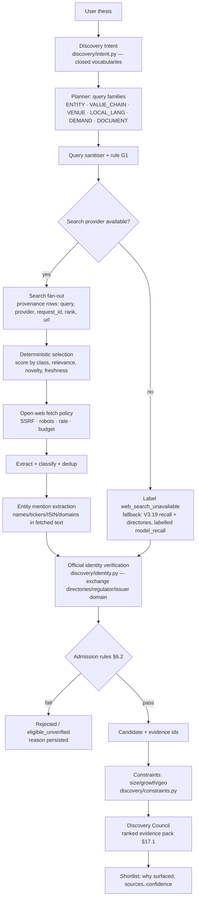
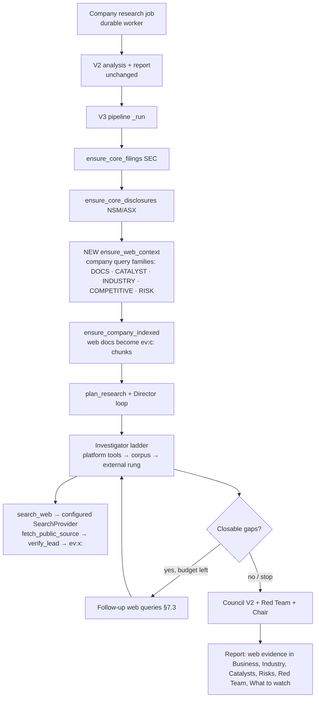
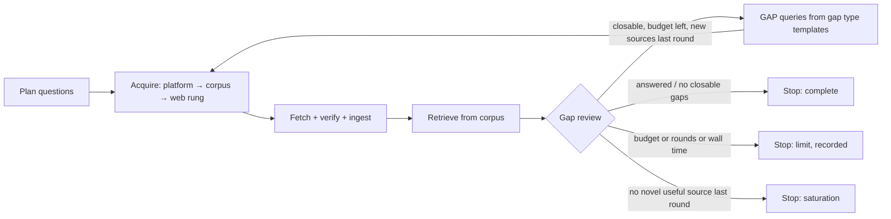
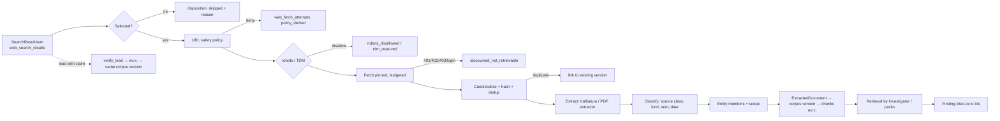
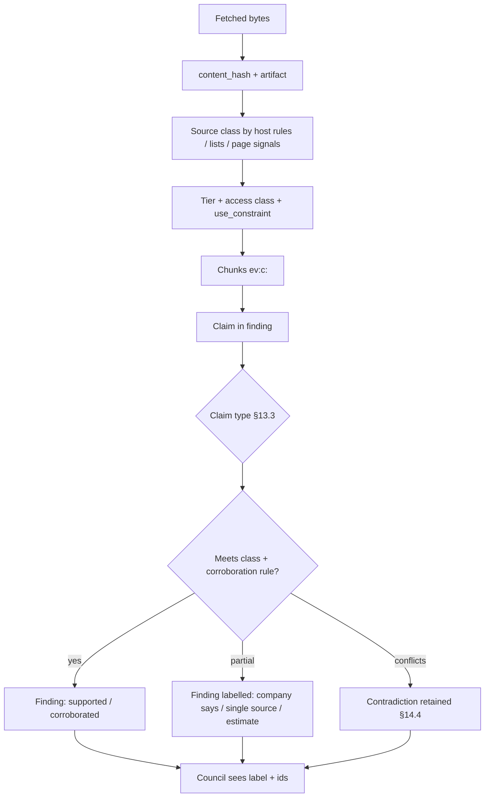
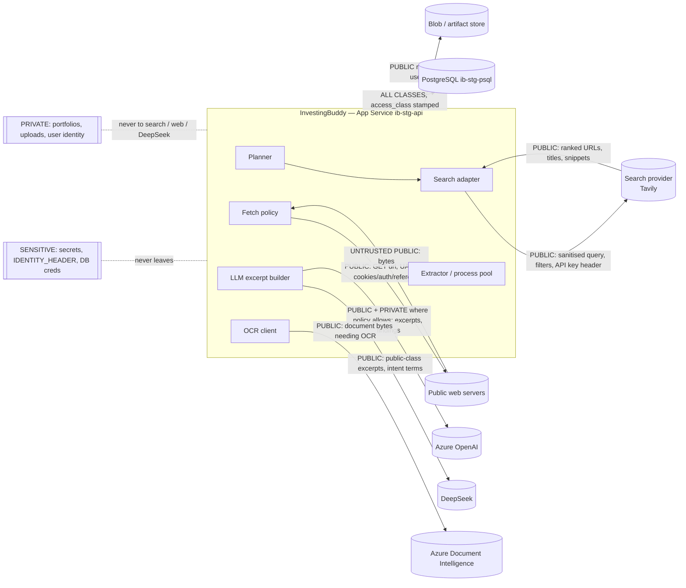

# Open-Web Research — Technical Specification

**Status:** `PROPOSED — SPECIFICATION ONLY, AWAITING USER APPROVAL`. Opened 2026-09-29 on
`main` = `d29f1e1`. The Alembic head in source is **041**, pipeline version 18. Nothing here
is implemented. No flag, key, migration or Azure resource has been created.

**Companion documents:**

- [implementation plan](open-web-research-implementation-plan.md)
- [search provider evaluation](open-web-search-provider-evaluation.md)
- [threat model](open-web-research-threat-model.md)
- [acceptance plan](open-web-research-acceptance-plan.md)

**Conventions:**

- Status labels follow [`docs/v3/README.md`](v3/README.md). `CURRENT` means verified against
  the code on `main` on the date above. `TARGET` means designed here and not yet built.
- File references are relative to `apps/api/app/` unless a path starts with `apps/`, `docs/`
  or `infra/`.

---

## 1. Product objective and governing principles

InvestingBuddy is moving from **"the model recalls companies, then official sources confirm
them"** to **"the platform searches the live public web, reads what it finds, verifies it,
and hands the Council a cited, ranked evidence pack"**.

The open web **broadens** the research corpus. It **does not replace** primary filings and
regulated disclosures, which remain canonical for every decision-critical financial fact.

Ten principles govern everything below. Each one is enforced somewhere in code, not merely
stated.

| # | Principle | Enforced by |
|---|---|---|
| P1 | **Search finds; InvestingBuddy verifies.** A search result, snippet, title or model claim is never evidence. | ADR-044 / ADR-056, unchanged. Evidence ids are minted only from bytes the platform fetched (§12, §15). |
| P2 | **Search, fetch, verify, ingest and analyse are separate stages** with separate interfaces and separate audit rows. | §3, §8, §9, §12 |
| P3 | **Provenance is a network fact.** "Found via search" requires a recorded, executed provider call. Recall is labelled as recall. | §22.3 |
| P4 | **Primary sources stay canonical** for financial-statement values. Web values become context, or a recorded conflict. | §13.3, §17.3 |
| P5 | **Every web claim is cited** to a fetched document, with URL, publisher, dates, excerpt and evidence id. | §15 |
| P6 | **Bounded by construction.** Every loop has a query, fetch, byte, time and round ceiling, and a failed call still counts against it. | §19, ADR-052 |
| P7 | **Fetched content is data, never instructions.** | [threat model §3](open-web-research-threat-model.md#3-prompt-injection) |
| P8 | **Public queries only.** No private data reaches a search provider. | §24, rule G1 |
| P9 | **Fail closed and say so.** Search outages are labelled; official-source research continues. | §23 |
| P10 | **Do not break primary research.** SEC, FCA NSM, ASX, Nordic and CONSOB, period and scope validation, numeric consistency, human review, and `publication_ready=false` are hard invariants. | §23.3, acceptance plan §8 |

---

## 2. Current state (`CURRENT`, verified 2026-09-29)

### 2.1 The reported internet gaps, each verified against the code

| Reported gap | Verdict | Evidence |
|---|---|---|
| Discovery does not truly search the web | **TRUE** | Lead generation is `discover_leads._ask`: a plain JSON completion with `thinking=False` and `max_tokens=2000` (`services/discovery/leads.py:361-390`). Every lead is tagged `discovery_mode="model_recall"` (`:257`) and returns `opened_urls: []` (`:397`). |
| Discovery uses DeepSeek recall with "no web access" | **TRUE, verbatim** | `leads.py:380` appends `"Answer from what you know; you have no web access in this call. Reply in json."` The module docstring still says "retrieval-backed DeepSeek `/responses` search" (`leads.py:13-16`), which is **DOC≠CODE**. |
| DeepSeek built-in search stopped executing | **TRUE, and it is documented behaviour, not an outage** | DeepSeek's Responses API guide lists `web_search` as **"Ignored"** and states "Unsupported parameters are silently ignored" (read 2026-09-29; [provider evaluation §2](open-web-search-provider-evaluation.md#2-the-incumbent-deepseek-responses-web_search-is-not-a-search-provider)). |
| No search-engine provider is configured | **TRUE** | No Tavily, Exa, Brave, Bing, Serper or SerpAPI code exists (grep). Exa and Perplexity appear only as governance rows marked "deferred, no adapter" (`services/providers/governance.py:415-429`). |
| GDELT returns headlines and URLs, not bodies | **TRUE** | `integrations/providers/free_news_provider.py:294` requests `mode: "ArtList"` and sets `summary=None` (`:335`). No body fetch exists anywhere. GDELT is configured only by an environment variable, not in Settings. |
| No generic browser or headless crawler | **TRUE** | No playwright, selenium or browserless in `apps/api`. `UnavailableBrowserProvider` returns no text plus a warning (`integrations/deepseek/providers.py:1164-1195`). `apps/web` uses Playwright only for e2e tests. |
| Arbitrary crawling and link traversal are absent | **TRUE, with a nuance** | `traverse_issuer_site` exists: bounded BFS, 12 pages, depth 2, robots-aware (`services/traversal/issuer_site.py:235-372`). It has **no production caller** and its flag defaults off (`config.py:1039`). Production document discovery parses already-fetched allowlisted issuer pages (`services/sources/document_discovery.py:1069-1700`; `discover_documents` at `:1620`). |
| V3 can fetch one model-cited URL and verify a claim | **TRUE** | `fetch_public_source` calls `verify_lead(allow_public_web=True)` (`services/agent_tools/external.py:320-425`). That applies HTTPS, an allowlist of the cited host and its sub-domains, DNS pinning, a redirect guard, sha256 of the bytes and a value, passage and period check. It mints `ev:x:` **only** when the lead is VERIFIED (`external.py:109-117, 428-434`). **Limits:** only 800 characters of excerpt are kept and the bytes are discarded (`models/research_lead.py:116-136`); scope is never checked (`scope_key=None`). **The tool accepts any http(s) URL** (`external.py:273-299`). In the Investigator the URL is a lead's `claimed_source_url`, which is vendor-model output, so **the fetched host is model-chosen today**. See [threat model §2.3](open-web-research-threat-model.md#23-defects-found-in-this-audit-current-to-fix-in-w0-before-any-widening) for why that matters now. |
| IR crawler is shallow and issuer-limited | **TRUE** | Registry IR pages plus `document_discovery`: at most 12 candidates and 3 documents per issuer (`config.py:887, 949`), on verified issuer hosts only (`services/sources/verified_issuer_sources.py`). |
| Recent FCA NSM and ASX ingestion works | **TRUE** | `services/sources/disclosures/uk_nsm.py`, `asx.py`, `acquisition.py:665` (`ensure_core_disclosures`). Flags have been on in production since 2026-09-28 ([acceptance](non-us-primary-documents-acceptance.md)). |
| Primary-source pipelines are far stronger than generic web research | **TRUE** | See §2.2. |

### 2.2 Inventory: what exists and is reusable

| Capability | State | Where |
|---|---|---|
| **Provider interfaces** (`ModelProvider`, `SearchProvider`, `BrowserProvider`, `ResearchProvider`) plus normalized `SourceCandidate` (snippet labelled untrusted), `ResearchLead` and `SearchResponse` | Built. `SearchProvider.search(query, top_k, domains)` has **no production implementation other than DeepSeek**, and **no production caller** of `DeepSeekSearchProvider.search()`. | `services/providers/contracts.py:161-505` |
| Fakes for all four interfaces, and a benchmark harness | Built | `services/providers/fakes.py:46-205`, `benchmark.py` |
| Provider governance matrix (provider × access class, credential refusal) | Built, but **no runtime call site** (grep): it is decorative today | `services/providers/governance.py` |
| DeepSeek search adapter and `SearchTrace` (query calls, pages opened, cited but never opened) | Built. The trace is **computed but never persisted**. | `integrations/deepseek/providers.py:219-568` |
| `search_web` / `fetch_public_source` tools | Built, and registered only when `V3_DEEPSEEK_SEARCH_ENABLED`. The flag was last recorded ON in production ([v3.16.1b report](v3.16.1b-production-acceptance-report.md)). `search_web` does not force the tool or disable thinking (`transport.py:720-729`), so **today it returns model recall labelled as a search lead**. | `services/agent_tools/external.py` |
| Lead verification (period, value, passage), closed rejection vocabulary, 90-day reuse of a prior verification | Built | `services/providers/leads.py:1274-1657`, `contracts.py:71-106` |
| Guarded fetchers (HTTPS, IP checks, DNS pinning, per-hop redirect checks, byte caps) | Built. It has **14 defects** that must be fixed before the allowlist is widened, **several of which are reachable today through `fetch_public_source`** ([threat model §2.3](open-web-research-threat-model.md#23-defects-found-in-this-audit-current-to-fix-in-w0-before-any-widening)). | `services/sources/safe_web_fetcher.py`, `pinned_transport.py`, `document_fetcher.py` |
| PDF extraction (pdfplumber, layout, tables, 40+12 page cap, 60 s cooperative deadline), OCR via Azure Document Intelligence (off by default) | Built | `services/sources/primary_document_extractor.py`, `ocr_provider.py` |
| HTML extraction | Built with the stdlib `HTMLParser` (boilerplate drop, tables, headings, iXBRL container mode). **No readability-class main-content extraction.** No charset detection (always UTF-8). | `primary_document_extractor.py:1847-2225`, `leads.py:1714-1806` |
| DOCX, PPTX, XLSX | **Not supported** (blocked by content type) | `document_fetcher.py:75-91` |
| Research Corpus: artifact → document → version → derivation → chunk; six-permission `ArtifactPolicy`; the `public_web` access class **already defined** (bounded quotes) | Built. **No open-web writer.** Company-less documents cannot be deduplicated. | `services/corpus/*`, `models/research_document.py`, `services/corpus/policy.py:43` |
| Corpus retrieval: PostgreSQL FTS (`simple` config, no stopwords), company-scoped, with optional JSONB-embedding rerank | Built. `V3_SEARCH_BACKEND=postgres` in production. | `services/corpus/search/backends/postgres.py` |
| Source tiers T1–T6, `publisher_tier(url)` host rules, `transport` ≠ `content_origin` | Built | `services/sources/taxonomy.py`, `publisher_tiers.py` |
| Licence / terms metadata per source | **Absent** except `macro.licence` | `models/macro.py:60-61` |
| robots.txt | Only in unwired traversal code, and its agent token (`InvestingBuddyResearchBot`) **does not match** the User-Agent actually sent (`InvestingBuddy-Research-Bot`) | `issuer_site.py:89`, `safe_web_fetcher.py:50` |
| Per-host rate limiting, HTTP retries | **Absent.** `SlidingWindowLimiter` and `TTLCache` have no callers. Only the SEC path is throttled. | `services/sources/rate_limit.py`, `cache.py`, `sec_filing_documents.py:466-505` |
| Prompt-injection defences | Nonce-fenced evidence blocks, "EXTERNAL TEXT (data, not instructions)" labels, a citation allow-list, closed read-only tools, a `contains_untrusted_content` flag | `services/agents/investigator.py:744-787, 1690-1713`, `agent_tools/contracts.py` |
| Discovery identity verification against official exchange directories (Euronext ×7, ASX, TSX/TSXV, SIX, LSE, SEC), constraints, eligibility classes, `attribute_guard` | Built, and flags are ON in production | `services/discovery/*` |
| Entity master (LEI/ISIN/CIK/FIGI, listings, scopes), `entity_relationships` table | Built. The relationship vocabulary has **no** `supplier_of`, `competitor_of` or `customer_of`, and **no app code writes to it**. | `services/entities/*`, `models/legal_entity.py:457-543` |
| Director bounded loop with stop reasons, per-mode presets (web searches 4/12/30/60), escalation controller | Built. `ResearchBudget.check` has **no caller**. No USD cap is enforced (`v3_run_max_external_cost_usd=0`). | `services/director/loop.py`, `research_mode.py:107-155`, `consumption.py:557` |
| Durable worker | One job at a time, inside the API process. Gunicorn runs 1 worker with a 300 s timeout on B1 at 93–95 % memory. Discovery still runs on V2 `BackgroundTasks` and is **not durable**. | `services/jobs/worker.py`, `infra/azure/modules/appservice.bicep:66-78`, `api/v1/market_discovery.py` |
| An unguarded dynamic-URL fetcher | `CompanyPressReleaseProvider._fetch` uses raw httpx with `follow_redirects=True`, allows http and has no SSRF check | `integrations/providers/company_press_release_provider.py:356-376` |
| A settings field referenced three times but never defined | `v3_external_search_timeout_seconds` is always 180 | `external.py:174`, `discovery/leads.py:377`, `discovery/screening.py:525` |

### 2.3 Conclusion on the current state

InvestingBuddy has almost every downstream piece an open-web research layer needs:

- guarded fetching;
- verification;
- a policy-aware corpus;
- tiers;
- evidence ids;
- a bounded Director;
- official identity verification.

It is missing four upstream pieces:

1. **a real search provider**;
2. **a planner that turns a thesis into bounded query families**;
3. **a generic, hardened open-web fetch policy with robots, rate and licence handling**;
4. **a path for fetched web documents to enter the corpus as first-class, citable,
   provenance-carrying evidence**.

It also has one live mislabelling to fix: DeepSeek recall passing through `search_web` looks
like search.

---

## 3. Target architecture

### 3.1 Components

```text
services/web_research/            (NEW package — the open-web layer)
  planner.py        thesis/intent/company → bounded query families (deterministic + bounded LLM expansion)
  queries.py        query sanitiser, operator allow-list, private-token guard (rule G1)
  search.py         SearchProvider orchestration: fan-out, caching, provenance rows, fail-closed state
  selection.py      result scoring → which URLs to fetch (deterministic)
  fetch.py          open-web fetch policy over the hardened safe fetcher: robots/TDM, per-host limiter, retries, cache
  extract.py        HTML main-content + metadata (trafilatura), routing PDFs to the existing extractor
  classify.py       source class, document kind, paywall/js-required detection, injection-suspect scoring
  entities.py       company mention detection + scope (brand→segment) for web documents
  dedup.py          canonical URL, content hash, near-duplicate + syndication/origin detection
  ingest.py         web document → ExtractedDocument → corpus (reusing ingest_extracted_document)
  packs.py          ranked evidence packs for Discovery Council / Investigator
  budget.py         WebResearchBudget (queries, results, fetches, PDFs, bytes, renders, wall time)
  audit.py          admin diagnostics read models

integrations/search/              (NEW — vendor adapters implementing SearchProvider)
  tavily.py         recommended primary (provider evaluation §6)
  fake.py           recorded-fixture provider for tests/CI (extends services/providers/fakes.py)
```

Everything else is **reused**: the guarded fetcher and pinning transport, the PDF extractor
and OCR, `ExtractedDocument`, the corpus chain and `ArtifactPolicy`, `verify_lead` and
`fetch_public_source`, the tiers, `publisher_tier`, discovery `identity.py` and
`constraints.py`, the Director loop, the consumption recorder and the durable worker.

**No parallel provenance system is created.** Web evidence is `ev:c:` corpus chunks and
`ev:x:` verified leads, exactly the two namespaces the Investigator already accepts.

### 3.2 A. End-to-end open-web Discovery



### 3.3 B. Company deep research



---

## 4. Search planning

### 4.1 Why not one query, and why not an agent that searches freely

A single query recalls the famous names in a theme. That is precisely what V3.19's recall
path already does. An unconstrained search agent is expensive, cannot be reproduced, and is
the easiest target for prompt injection (a page steers the next query). The planner sits
between the two: **a deterministic query set generated from the Discovery Intent and
verified entity facts, plus a bounded, validated, recorded LLM expansion.**

### 4.2 Query families

Each family has a fixed purpose, template set, freshness window, locale policy and per-run
cap. The templates below are illustrative. The real templates live as versioned data in
`services/web_research/planner.py`, where `QUERY_TEMPLATE_VERSION` is stamped on every query
row.

| Family | Purpose | Example templates (theme "European transformer manufacturers") | Freshness | Wave |
|---|---|---|---|---|
| `ENTITY` | Surface listed companies | `{theme_noun} manufacturer listed company Europe`; `{theme_noun} {venue_name} listed`; `{synonym} public company {region}` | 3 y | 1 |
| `VALUE_CHAIN` | Suppliers, customers, component makers | `{component} supplier {theme_noun}`; `{input_material} {theme_noun} supplier listed` | 3 y | 1 |
| `VENUE` | Long-tail by exchange segment | `{theme_noun} company AIM` / `First North` / `Euronext Growth` / `ASX` | 3 y | 1 |
| `LOCAL_LANG` | Local-language discovery | `Transformatorenhersteller börsennotiert`; `fabricant transformateurs coté` | 3 y | 1 |
| `DEMAND` | Market drivers, constraints | `Europe {theme_noun} shortage {year}`; `{theme_noun} lead times Europe` | 1 y | 1 |
| `DOCUMENT` | Whitepapers, reports, consultations | `{theme_noun} market report filetype:pdf`; `{theme_noun} {authority} consultation` | 5 y | 1 |
| `COMPANY_DOCS` | Issuer material beyond filings | `{company} investor presentation {year}`; `{company} capital markets day` | 18 m | 2 |
| `CATALYST` | Recent events | `{company} contract` / `order` / `new factory` / `acquisition` | 90 d | 2 |
| `COMPETITIVE` | Peers | `{company} competitors`; `{product} market share {region}` | 3 y | 2 |
| `INDUSTRY` | Structure and context | `{industry} value chain`; `{industry} capacity {region}` | 5 y | 2 |
| `RISK` (Red Team) | Disconfirming evidence | `{company} delay` / `lawsuit` / `profit warning` / `customer loss`; `{technology} disadvantages`; `{market} oversupply` | 1 y (18 m for litigation) | 3 |
| `GAP` | Follow-ups keyed to Director gaps | `{company} margin guidance`; `{company} backlog profitability` | per gap type | 3 |

**Slots are filled only from:**

- the Discovery Intent's closed vocabularies (`services/discovery/intent.py`), extended with a
  versioned synonym and translation table per theme dimension;
- **verified** entity facts: legal name, short name, ticker and venue from identity
  verification, and segment names learned from filings;
- the date.

**User free text never becomes a query directly** (threat model §5).

### 4.3 Bounded LLM expansion

Once per run, a cheap model (DeepSeek, `thinking=False`, JSON) may propose extra query
strings for `ENTITY`, `VALUE_CHAIN` and `DOCUMENT`: synonyms, technology names, process
terms. It receives only the intent and the template queries. It **never** receives fetched
page text, which is the rule against page text leaking into queries.

Every proposal must pass the query sanitiser, where:

- the length is ≤ 12 tokens;
- no URLs and no operators appear;
- no token comes from a private set;
- the proposal is capped at `max_expansion_queries`.

Proposals are **cached by `(intent_hash, model, prompt_version)`** and recorded with
`origin=llm_expansion`. The same thesis therefore produces the same query set until the
prompt version changes. Reproducibility comes from the cache, not from temperature 0.

### 4.4 Staged search: alternatives evaluated

| Option | Round trips | Cost control | Reproducibility | Adaptivity | Verdict |
|---|---|---|---|---|---|
| **Ten sequential stages** (broad → entities → identity → company → industry → peers → catalysts → adversarial → gaps → Council follow-up) | 10+ sequential | Good | Good | Low within a stage | Too slow on one worker. Most stages can run in parallel. |
| **Free-running search agent** | Unbounded | Poor | Poor | High | Rejected: P6, P7 |
| **Three bounded waves plus gap-driven follow-ups (recommended)** | 3 + ≤ mode rounds | Per-wave caps | Deterministic query set; cached results | Follow-ups come from **measured** gaps | **Adopted** |

The three waves:

- **Wave 1, Breadth** (Discovery only): `ENTITY`, `VALUE_CHAIN`, `VENUE`, `LOCAL_LANG`,
  `DEMAND` and `DOCUMENT` run in parallel under the budget. This is followed by entity
  extraction from fetched pages, then official identity verification of the extracted
  names (existing `identity.py`).
- **Wave 2, Depth** (per admitted candidate, or the one company in company research):
  `COMPANY_DOCS`, `CATALYST`, `COMPETITIVE` and `INDUSTRY`.
- **Wave 3, Challenge and gaps**: `RISK` always runs. `GAP` queries are generated from the
  Director's closable gaps (§7.3), for at most `mode.rounds` rounds.

Identity verification sits **between** waves 1 and 2. Depth is spent only on companies whose
listing is officially verified, which is also the cheapest ordering.

---

## 5. Freshness, language, geography and long tail

### 5.1 Temporal planning

Each family has a default window (§4.2). The planner maps it to the provider's date filter:
Tavily `start_date`/`end_date`, or `time_range`.

Two exceptions to the defaults:

- Annual reports are sought as "latest plus the previous one" by explicit year.
- Catalyst and news queries use 90 days by default; DEEP mode extends them to 12 months.

After the fetch, a document's **own** date (§10.2) is checked against the window. A search
engine's `published_date` is only a hint. A document outside the window is kept as context
but is not "recent".

### 5.2 Multilingual research

- **Locale set.** A per-venue locale table maps the venue to its queries. Examples: Xetra/Frankfurt → de; Euronext Paris → fr; Milan → it; Madrid → es; Copenhagen → da; Stockholm → sv; Oslo → no; Helsinki → fi; Warsaw → pl; Prague → cs; TSE → ja; HKEX/SSE → zh. **English is always included.**
- **Where the translations come from.** Query translations come from a versioned glossary per theme dimension, reviewed like code. A bounded LLM translation fills gaps and is cached and recorded as `origin=llm_translation`. Company names are used in their **legal local form plus the English short name**.
- **Provider parameters.** `country` and `language` are passed where the provider supports them (Tavily: `country`, `language`, `filter_by_language`).
- **Source text is never replaced.** The original bytes and text are stored, and citations quote the original language. A translation is a *derived* rendering (existing `services/sources/translation.py`, off by default). It is shown alongside the original and labelled.
- **Language detection** today is a stopword heuristic for en/fr/de/it/da (`services/sources/language.py:29-37`). It is extended to the locale set. The HTML `lang` attribute and `Content-Language` are preferred when present.

### 5.3 Small-cap and long-tail measures (no randomness)

1. **Family diversity.** `VALUE_CHAIN`, `VENUE` and `LOCAL_LANG` exist mainly to reach names
   that `ENTITY` queries miss.
2. **Saturation-aware follow-up.** A known name is one already in `THEME_COMPANY_REGISTRY`,
   among held companies, or already a candidate. If ≥ 70 % of a query's result domains belong
   to known names, the next variant of that family adds `exclude_domains` for their IR
   domains and uses page 2 for `ENTITY`. This is deterministic.
3. **Post-identity size filter.** Size constraints are applied **after** identity, from the
   exchange-published market cap (V3.19). A small company is never dropped for being absent
   from a big-company list.
4. **Novelty metric.** `novel_candidate = not in curated registry and not a held company`.
   The metric is reported per run (acceptance plan §5), never used as a score bonus that
   could admit a weakly evidenced name.
5. **No famous-name penalty in ranking.** The Council ranks on evidence (§17.1). Measures
   1–4 widen the funnel. They do not tilt the ranking.

---

## 6. Discovery integration

### 6.1 Redesign

**Current** (V3.19, `services/discovery/pipeline.py:405-600`): leads come from the curated
registry, held companies and model recall. They then pass `verify_identity`, screening,
constraints, the Council and the shortlist.

**Target:** a fourth lead source, `discovery_mode="search"`. The field already exists
(`leads.py:136-137`). The source is produced by wave 1 (§4.4) and prepended to the lead
priority order. Everything downstream is reused unchanged:

- identity (`discovery/identity.py:433-551`);
- constraints (`constraints.py:550-593`);
- `attribute_guard`;
- the freshness classes;
- the Council contract.

A web-discovered lead also carries an `evidence_url`. For venues **without** a directory
(Frankfurt, Copenhagen), that URL gives identity verification a fetchable page. This
addresses a limitation the V3.19 acceptance report records.

Discovery moves onto the durable worker as a new job type, `discovery_research`, so it gains
leases, heartbeats and retries. It is not durable today (`api/v1/market_discovery.py:118`).
This is a prerequisite: a web-search Discovery can take several minutes, and a container
recycle must not lose it.

### 6.2 Admission criteria (deterministic)

A candidate enters the **web-discovered** shortlist only if all of the following hold.

| Rule | Requirement | Failure code (persisted) |
|---|---|---|
| A1 Search provenance | At least one `web_search_results` row from an **executed** provider call whose fetched page named the company (§16.1). | `no_search_provenance` |
| A2 Official identity | `verify_identity` → PASS: exchange directory, regulator, or issuer domain with ticker or ISIN on the page. | `identity_unverified` (existing reasons: `not_in_exchange_directory`, `unknown_venue`, …) |
| A3 Theme relevance evidence | At least one **fetched and extracted** passage (not a snippet) where the company mention and a theme term from the intent vocabulary co-occur within the same paragraph or table row. The source class must be at least `trade_publication`, `industry_association`, `government_publication` or issuer material. The passage becomes an evidence id. | `theme_evidence_missing` |
| A4 Hard constraints | Existing `constraints.py`: listing, geography, industry, size. | Existing: `EXCLUDED` / `ELIGIBLE_UNVERIFIED` |

**Outcomes:**

- A1–A4 all pass → `ELIGIBLE`, with evidence ids.
- A3 missing → `eligible_unverified(theme)`. It is shown only in the "also surfaced" list and
  never fills the quota.
- A1 missing is not a rejection when the lead came from the registry, a held company or
  recall. The candidate is simply labelled by its true source.

**An LLM naming a company admits nothing** (A1 and A3 both require fetched bytes).

### 6.3 Discovery Council

The Discovery Council ranks on the dimensions below, fed by the evidence pack (§17.1). Every
dimension carries `evidence_confidence` (§14) and a list of ids:

- theme relevance;
- growth drivers;
- profitability and cash generation, where filings exist;
- business quality;
- catalysts;
- resilience;
- principal downside.

The V3.19 requested-vs-verified contract stays. **Missing-field counts are not a ranking
input.** Eligibility class is the first sort key (`constraints.py:586-593`), and then the
Council's evidence-based priority.

---

## 7. Company research, Red Team search and the bounded follow-up loop

### 7.1 The acquisition stage

A new step, `ensure_web_context`, runs after `ensure_core_disclosures`
(`pipeline/v3_pipeline.py:430-458`) and before `ensure_company_indexed`.

1. It runs wave 2 and the `RISK` family for the company under the mode's web budget.
2. It fetches the selected documents and ingests them into the corpus (§12). By the time
   `plan_research` runs, the documents are ordinary `ev:c:` chunk evidence, reachable through
   the existing `search_company_corpus` tool.

This mirrors how filings and NSM/ASX disclosures already reach the Council, so there is no
new consumption path.

### 7.2 The Investigator's external rung

`search_web` is re-pointed from `research_provider_for` (DeepSeek) to the configured
`SearchProvider`:

- It returns **candidates** (URL, title, rank and published hint), never claims.
- `_verify_external_leads` (`investigator.py:1516-1593`) and `fetch_public_source` stay the
  only evidence minters.
- `fetch_public_source` additionally ingests the fetched document into the corpus (§12.3), so
  an `ev:x:` id resolves to a stored document version, not only to an 800-character excerpt.

DeepSeek remains available as a `ResearchProvider` (a contractor producing leads). It is
never called a search provider (§22.3).

### 7.3 Follow-up loop (Director integration)

The existing loop (`services/director/loop.py`) already has:

- rounds and stop reasons;
- `_has_a_rung_left`;
- closable-gap detection.

Web research joins as a rung, not as a new loop:



**Gap type → template map (examples):**

| Gap | Follow-up query |
|---|---|
| `margin_trend` | `{company} margin guidance` |
| `backlog_quality` | `{company} order backlog profitability` |
| `capacity` | `{company} capacity expansion cost` |
| `customer_concentration` | `{company} largest customer` |

**Stop criteria**, all recorded as the loop's `stopped_by`:

- rounds ≥ mode limit;
- web queries or fetches exhausted;
- wall time;
- **saturation**: no newly admitted document with relevance above threshold in the last
  round;
- **answered**: the gap is closed by a finding.

**Escalation.** `escalation/evidence.py` counts indexed chunks and closed gaps as improvement.
Web documents in the corpus therefore count automatically. Verified `ev:x:` leads should also
count; that is a small change listed in the plan.

### 7.4 Red Team search

The `RISK` family always runs in wave 3, whatever the thesis says. Queries are neutral
("delay", "lawsuit", "profit warning"), never loaded. Results feed the Red Team with source
class and date.

**A single low-trust source cannot carry a Red Team challenge.** The claim-type rules in
§13.3 apply.

### 7.5 Research-question generation

After wave 2, the Director's existing gap review identifies economically meaningful missing
questions. An example is "large backlog, low margins → margin guidance, pricing, cost pass-through".

Gaps come from:

- playbook completion rules;
- the thesis dimensions;
- contradictions (§14.4).

They are never generated freely by a model.

---

## 8. Search provider abstraction

### 8.1 Contract (extends `services/providers/contracts.py:475-484`)

```python
@dataclass(frozen=True)
class SearchRequest:
    query: str                       # sanitised (§4.3, threat model §5)
    family: QueryFamily              # ENTITY, CATALYST, …
    max_results: int = 10
    page: int = 1
    date_from: date | None = None
    date_to: date | None = None
    include_domains: tuple[str, ...] = ()
    exclude_domains: tuple[str, ...] = ()
    country: str | None = None       # ISO 3166
    language: str | None = None      # ISO 639-1
    topic: Literal["general", "news"] = "general"

@dataclass(frozen=True)
class SearchExecution:              # the network fact (§22.3)
    provider: str
    executed: bool                   # True only on a 2xx with a parseable result list
    provider_request_id: str | None
    http_status: int | None
    latency_ms: int
    result_count: int
    cost_units: dict[str, float]     # e.g. {"tavily_credits": 1}
    error_code: str | None           # timeout, http_429, http_5xx, auth, parse, disabled, no_key
    filters_enforced_by: dict[str, Literal["provider", "client", "unsupported"]]

@dataclass(frozen=True)
class SearchResultItem:             # normalized; extends SourceCandidate
    rank: int
    url: str
    canonical_url: str
    domain: str                      # registrable domain (PSL)
    title: str | None                # untrusted
    snippet: str | None              # untrusted; ranking only (§8.4)
    published_hint: datetime | None  # provider's estimate, never authoritative
    language_hint: str | None
    provider_score: float | None
    metadata: Mapping[str, Any]      # provider-specific, never read by prompts

class SearchProvider(Protocol):
    name: str
    capabilities: SearchCapabilities   # which filters the vendor enforces
    async def search(self, request: SearchRequest) -> tuple[SearchExecution, list[SearchResultItem]]: ...
```

**Filters the vendor does not enforce are applied client-side.** Domain and date filters, for
example, are applied by InvestingBuddy, and `filters_enforced_by` records who enforced each
one. This is the precedent DeepSeek set (ADR-055).

### 8.2 Adapters and selection

| Setting | Values |
|---|---|
| `V3_WEB_SEARCH_PROVIDER` | `none` (default), `fake` (tests and local), `tavily` |
| `DeepSeekSearchProvider` | **not selectable**. Its `search()` is kept for the benchmark only. |

- A later second adapter (Exa) is the same interface and a new file under
  `integrations/search/`.
- **Search is never bound to a model vendor** (ADR-045).
- `FakeSearchProvider` serves recorded fixtures keyed by query. It is the only provider CI
  uses, and live API calls are never made in normal CI (acceptance plan §3).

### 8.3 Governance at the adapter

`ProviderGovernance.assert_permitted(provider, access_class="public_web")` and
`assert_no_credentials(payload)` are called in the adapter before every request. This is
the first runtime call site the governance matrix gets (§24).

### 8.4 Snippets and titles

Snippets and titles are untrusted discovery metadata. They may be used for:

- selection scoring (§11.3);
- entity **hints** (a name in a snippet makes the page worth fetching; it admits nothing);
- admin display.

They are **never** placed in a Council or Investigator prompt and **never** cited. They are
stored only when the provider's terms permit it. Each adapter declares
`result_storage: full | url_only | transient` (provider evaluation §4). Tavily is `full`.

---

## 9. Fetch architecture and browser strategy

### 9.1 Tiers

| Tier | What | When |
|---|---|---|
| 1 | Plain HTTPS GET via the **open-web fetch policy** | Always first |
| 2 | Document handlers by sniffed type: PDF → existing extractor (+OCR); HTML → §10; later DOCX/PPTX/XLSX/CSV | By magic bytes, not by extension |
| 3 | Headless browser | **Deferred** (§9.4) |

### 9.2 The open-web fetch policy (`services/web_research/fetch.py`)

The policy wraps `safe_fetch_document` with a new mode, `FetchPolicy.OPEN_WEB`, which
**replaces the host allowlist with a policy**: public internet, minus denied ranges and
suffixes, minus the domain denylist, within per-run caps. This is the change the V3 security
document anticipated (§3 there).

Every rule in [threat model §2.4](open-web-research-threat-model.md#24-target-defences-the-open-web-fetch-policy) applies.

**Additional behaviour:**

- **robots.txt (RFC 9309).**
  - robots.txt is fetched through the same policy and cached for 24 h.
  - Our User-Agent product token is matched, which fixes the mismatch in §2.2.
  - A `Disallow` means no fetch, recorded as `robots_disallowed`.
  - 4xx on robots.txt means allowed. 5xx or unreachable means **no fetch this run**,
    fail-closed, and differs from the traversal code today.
  - `Crawl-delay` is honoured up to 10 s.
- **TDM reservation signals** are read and recorded per URL:
  - TDMRep (`/.well-known/tdmrep.json`, `tdm-reservation` header or meta);
  - `noai` meta;
  - IETF AIPREF `Content-Usage` where present.

  The proposed default is in §20.2.
- **Per-host limiter.**
  - The unused `SlidingWindowLimiter` is wired with at most 1 request per second per
    registrable domain and a concurrency of 2 per host.
  - Globally, at most 4 open-web fetches are in flight on B1.
  - A run may fetch at most 8 pages per domain.
- **Retries.**
  - One retry on a connect error, 5xx, or 429 with `Retry-After` ≤ 30 s. Backoff is jittered
    but deterministic in tests.
  - There are no retries on other 4xx responses.
  - A retried fetch counts once against the budget, and its extra attempts are logged.
- **Canonicalisation.**
  - Everything in `canonicalize_source_url`, plus removal of tracking parameters: `utm_*`,
    `fbclid`, `gclid`, `mc_cid`, `mc_eid`, `_hsenc`, `_hsmi`, `ref`, `ref_src`, `cmpid`,
    `ocid`, `igshid`.
  - `rel=canonical` is honoured only when it points to the **same registrable domain**, and is
    recorded either way.
- **Content handling.**
  - The content type is sniffed.
  - Charset comes from BOM, header, meta, then detection (`charset_normalizer`), replacing
    today's UTF-8-only decoding.
  - `Content-Disposition` gives a filename hint only; it is never used for any path.
- **Access restriction detection** (§20.3). Status 401, 402 and 403, login-wall markers,
  CAPTCHA pages, and JSON-LD `isAccessibleForFree:false` all produce
  `discovered_not_retrievable`, **not** a retry through any circumvention.
- **Cache** (§18).

### 9.3 W0 hardening first

The 14 defects in [threat model §2.3](open-web-research-threat-model.md#23-defects-found-in-this-audit-current-to-fix-in-w0-before-any-widening)
are fixed **before** any open-web fetch is enabled. That work also routes the unguarded
press-release fetcher through the guard.

### 9.4 Does InvestingBuddy need a browser? Not yet.

**Evidence of need so far:**

- Nasdaq refuses non-browser clients, and the platform does not spoof.
- Stooq serves a JS proof-of-work page.
- The traversal code flags JS-gated IR pages (`issuer_site.py:337-339`).

Those are data-source problems rather than research-page problems, and a search provider
often indexes the underlying PDF directly.

**Decision rule:** build the browser fallback only if, over the live acceptance campaign,
**≥ 15 % of selected high-value URLs** (score in the top quartile) end as `js_required`. If
built, it follows [threat model §7](open-web-research-threat-model.md#7-browser-fallback-risk-later-phase):

- an isolated Azure Container Apps Job (new infrastructure, user approval);
- Playwright;
- the sandbox on;
- no secrets;
- the fetch policy applied to every sub-request;
- a 20 s deadline;
- the result returned as HTML to the normal extractor.

**Trigger per URL:** main text under 500 characters, **and** HTML over 20 KB with SPA
markers, **or** the host is in the `js_required` registry learned from earlier runs.

**Never:** stealth plug-ins, CAPTCHA solving, proxy rotation or unblockers.

**Cost:** the Container Apps consumption free grant (180k vCPU-s per month) covers about 9,000
renders at 1 vCPU × 20 s.

**A search provider's pre-rendered content** (for example Tavily `raw_content`) is provider
output. It may help select or triage a URL. It can **never** mint evidence, because it is not
bytes we fetched.

---

## 10. Extraction and document ingestion

### 10.1 HTML

- **Primary:** `trafilatura.bare_extraction()` on **our** bytes. Its downloader is never used,
  because the default configuration retries without TLS verification. The call keeps metadata
  and tables and drops links. trafilatura has been Apache-2.0 since 1.8.0, and the latest
  release is 2.2.0. It scores highest in independent and in-house benchmarks (F1 0.958 on the
  ScrapingHub benchmark).
- **Fallback:** the existing stdlib extractor in `primary_document_extractor` (container
  mode). It is used when trafilatura returns under 300 characters. Documents extracted this
  way get `extraction_confidence=low`.
- **Metadata:**
  - title;
  - `published_at` via htmldate (a trafilatura dependency), with the **date source recorded**
    (`json_ld | meta | url | text`);
  - author;
  - site name;
  - OpenGraph and JSON-LD `@type`, fed to source classification;
  - `rel=canonical`;
  - language;
  - headings;
  - tables;
  - outbound links, used only for crawl candidates (§11).
- **Visible text only.** Anything hidden is dropped from the prompt rendering and retained in
  storage ([threat model §3.3](open-web-research-threat-model.md#33-presentation-defences-reduce-the-chance-the-model-obeys)).
- **Isolation.** Extraction runs in a bounded process pool with a hard kill timeout of 20 s for
  HTML. Input is capped at 3 MB before parsing. `huge_tree` is off.

### 10.2 PDF

Web PDFs reuse `extract_primary_document`:

- pdfplumber, with layout, tables and headings;
- page caps and a deadline;
- the magic-byte check;
- honest failure codes;
- OCR through Azure Document Intelligence when the PDF is scanned.

OCR stays **off by default for web documents**. It is enabled per document class by
decision U6, because it is paid and the F0 tier analyses only 2 pages per request.

**Large documents.** Whitepapers and market reports can run to 300+ pages. They get a
two-pass design:

1. **Cheap text pass:** pypdf text for up to 400 pages, with no layout. Each page is scored
   against the run's query terms and the intent vocabulary, and TOC and headings are detected.
2. **Layout pass:** pdfplumber with tables on the **top N scoring pages**. N is 25 in
   STANDARD and 60 in DEEP, plus the existing 12 supplemental targeted pages.

Every page's text is chunked into the corpus with page lineage. Only the pass-2 pages get
table chunks. **The Council never receives a document.** It receives retrieved chunks
(§17.2). The budget is 120 s per large document inside the process pool, with
`stopped_by` recorded.

### 10.3 Office, spreadsheets and CSV (later phase)

- DOCX and PPTX use python-docx and python-pptx.
- XLSX uses openpyxl with `read_only=True, data_only=True, keep_links=False`, plus
  defusedxml.
- CSV is read with byte and row caps, `dtype=str`.

**Zip-bomb and macro rules** ([threat model §4](open-web-research-threat-model.md#4-malicious-and-malformed-files)) apply.

**Alternative:** Document Intelligence Layout accepts DOCX, PPTX, XLSX and HTML at $10 per
1k pages.

**Deferred:** the value is lower than HTML and PDF, and it adds dependencies.

### 10.4 iXBRL

Unchanged. It stays on the primary-filing path. A web search that lands on an SEC or ESEF
iXBRL document hands off to the existing SEC and disclosure connectors by host, rather than
being treated as a generic web page.

### 10.5 One pipeline

Web PDFs and HTML both become an `ExtractedDocument`, then go through
`ingest_extracted_document` into the corpus (`services/corpus/documents.py:429-534`). That
is the same bridge filings and NSM/ASX use. Key fields:

| Field | Value |
|---|---|
| `source_type` | `open_web` |
| `provider` | `web:<search provider>` or `web:direct` |
| extraction pipeline version | bumped |

`ExtractedDocument` is shared by content hash (a known trap). The subjects join (§12.2) is
what attributes a shared document to several companies.

---

## 11. Link following, bounded crawling and document discovery

### 11.1 Crawl rules

Crawling is **seeded only** from:

- fetched search results;
- the verified issuer domain;
- a user-supplied URL.

| Rule | Value (STANDARD) |
|---|---|
| Max depth from a seed | 2 |
| Max pages per registrable domain per run | 8 |
| Max documents (PDF etc.) per run | 10 (DEEP 20) |
| Link scope | same registrable domain by default. A cross-domain link is followed only when its target scores as a document candidate (§11.2) **and** is on an official, issuer or association host. |
| Candidate links per page considered | 40 |
| Stop | budget · depth · novelty (the last 3 pages added no chunk whose score is above threshold) · `robots_disallowed` · repeated URL pattern (calendar/pagination trap) |

The unwired `traverse_issuer_site` is **generalised, not duplicated**. Its BFS, robots and
JS-gated detection are reused, with the public-suffix fix (threat model D11).

The following chains become ordinary bounded walks:

- IR landing → reports → latest annual PDF;
- association page → whitepaper;
- consultation page → attached PDF.

### 11.2 Document scoring

Signals come from the link and the page. The score is deterministic and versioned.

| Signal | Weight |
|---|---|
| Sniffed or declared type: PDF, PPTX, XLSX | high |
| Anchor or URL keywords (multilingual): annual report, Geschäftsbericht, rapport annuel, interim, results presentation, investor presentation, capital markets day, whitepaper, technical report, market report, consultation, study, factsheet | high |
| Host class: issuer, regulator, government, association, academic | high |
| Year in URL or anchor within the family's freshness window | medium |
| Query-term overlap (anchor, surrounding text) | medium |
| Company identity match (ticker, name or domain) | medium |
| Declared size between 50 KB and 35 MB | low |
| Previously fetched (same canonical URL or hash) | skip |

The existing kind classifier (`document_discovery.py:100-160`) is extended with new kinds:

- `whitepaper`
- `government_report`
- `consultation`
- `industry_report`
- `academic_paper`
- `news_article`
- `press_release`
- `web_page`
- `factsheet`

`document_type` is `String(50)`, so no migration is needed for this.

### 11.3 Search-result selection (which results to fetch)

`score = class_prior(domain) + relevance(title/snippet vs family terms) + freshness_fit + novelty(not seen) + identity_hint − duplicate_penalty`

Selection is the **top K per family** under the fetch budget, with tie-breaks on
`(provider rank, url)`, so it is deterministic.

Snippets feed only this score (§8.4).

---

## 12. Research Corpus integration

### 12.1 What is reused unchanged

The chain `research_artifacts` → `research_documents` → `research_document_versions` →
derivations, pages, sections, tables → `research_document_chunks` is reused as it is. So are:

- the content-addressed artifact store;
- structural chunking (target 1,200 characters, maximum 2,000);
- the `public_web` access class: stored, indexed and model-sendable, with **bounded**
  quoting.

A web chunk's id is an ordinary `ev:c:<sha>` evidence id.

### 12.2 What needs schema (migration 043, §26.3)

| Need | Why existing schema cannot hold it | Proposed |
|---|---|---|
| **Theme and industry documents with no single company** | `research_documents` is unique on `(company_id, document_key)`, and NULL companies never deduplicate. Retrieval is company-scoped (`search/types.py:219-223`). | `research_documents.subject_scope` (`company | theme | industry | macro`), `theme_key`, plus a partial unique index on `document_key WHERE company_id IS NULL` |
| **One article about several companies** | A document has one `company_id` | A new `research_document_subjects` table: `(document_id, company_id nullable, legal_entity_id nullable, relation primary|mentioned|competitor|customer|supplier, confidence, method, evidence_chunk_id)` |
| **How a document was found** | No discovery provenance on versions | `research_document_versions.web_fetch_attempt_id` FK |
| **Licence and use constraint** | No licence column | `research_document_versions.use_constraint` (§20.1) |
| **Injection taint** | None | `research_document_versions.injection_suspect` bool |
| **An `ev:x:` resolving to a stored document** | Leads keep only an excerpt and hash | `research_leads.research_document_version_id` FK, plus `research_leads.web_search_result_id` FK |

### 12.3 Write path

Every fetched document follows this path:

1. `web_fetch_attempts` row
2. `ExtractedDocument` (deduplicated by content hash)
3. `ingest_extracted_document`
4. version: `access_class=public_web`, or `public_issuer` / `public_official` when the source
   class says so (§13), with `transport="open_web:<provider|direct>"`,
   `content_origin=<publisher domain>`, `source_tier=publisher_tier(url)`, `use_constraint`
   and `injection_suspect`
5. subjects rows
6. chunks

`fetch_public_source` joins the same path after verification. Retrieval is extended with
filters for `source_class`, `published_at` window, `subject_scope`/`theme_key` and
`use_constraint`.

### 12.4 C. Search → fetch → verify → corpus



---

## 13. Source taxonomy and trust model

### 13.1 Source classes and their mapping to existing tiers

A source class is assigned **deterministically**, never by an LLM, in this order:

1. host rules (`publisher_tiers.py`, exchange and regulator hosts, the verified issuer domain);
2. curated lists (trade press, associations, standards bodies), kept as versioned data;
3. page signals (JSON-LD `@type`, `.gov`/`.europa.eu`, `citation_*` meta);
4. fallback `unknown_web`.

The provider's `topic=news` flag is only a hint.

| Source class | Tier (existing) | Access class | `decision_critical` allowed | Notes |
|---|---|---|---|---|
| `issuer_filing` | T1 | public_official | ✅ | Routed to the filing connectors when possible |
| `regulatory_filing`, `exchange_announcement` | T1 | public_official | ✅ | |
| `government_publication`, `regulator_publication`, `statistical_agency` | T2 | public_official | ✅ for macro and industry facts | |
| `specialist_agency` (IEA, USGS, EIA) | T3 | public_official | ✅ for industry facts | already T3 in `publisher_tiers` |
| `standards_body`, `academic_paper`, `industry_association` | T3 | public_web | ✅ for industry and technology facts | |
| `company_press_release`, `investor_presentation`, `company_web_page` | T1_primary_company_source | public_issuer | ✅ **as an issuer claim** | labelled "company says" |
| `major_financial_press` | T4 | public_web | ✅ for events, with corroboration rules | curated list (exists) |
| `trade_publication` | T4 if curated, else T5 | public_web | events and industry context | |
| `local_press` | T4 if curated, else T5 | public_web | events (permits, local projects) | |
| `research_consultancy` (public summaries) | T3 or T5 | public_web | context only | market-size figures are "estimates" |
| `market_data_api` | T5 | — | unchanged | |
| `aggregator` / `syndication` | T5, plus `derived_from` | public_web | ❌ alone | collapses to its origin (§14.2) |
| `community_social` (forums, Reddit) | T5, plus the flag `never_sole_support` | public_web | ❌ | **deferred** (§13.4) |
| `unknown_web` | T5 | public_web | ❌ alone | |

A web page is not automatically T5. A USGS PDF found through search is T3 because of its
host, not because of the transport.

### 13.2 D. Trust and provenance flow



### 13.3 Compatibility between claim types and source classes

| Claim type | Minimum source | Corroboration | Label if unmet |
|---|---|---|---|
| Financial-statement value (revenue, EBIT, net debt) | issuer_filing or regulatory_filing (the existing canonical path) | n/a. A web value is **context** only. If it differs, a conflict is recorded (§17.3). | "reported in the press; the filing says X" |
| Guidance or management statement | issuer (press release, presentation, filing) | none | "management says" |
| Corporate event (contract, order, factory, permit, M&A, financing) | issuer release **or** T4 press | issuer plus one independent origin preferred. A single T4 source is allowed and labelled. | "single source" |
| Regulatory status (approval, permit delay) | regulator or government | issuer-only is labelled | "company says" |
| Litigation | court or regulator, or T4 press | ≥ 1 T4 or better | "single source" |
| Industry metric (lead times, capacity, prices) | T2/T3, association, or T4 trade | 2 independent origins for a headline number | "single source estimate" |
| Market size or forecast | T2/T3 or consultancy summary | always labelled an estimate, with its origin | "estimate by <origin>" |
| Superlative or ranking ("largest", "leading") | an independent T2–T4 source | **2 independent origins**. Issuer-only is **never** stated as fact. | "company describes itself as …" |
| Technology or process fact | T3 (academic, standards, association) or issuer technical paper | one T3 source is sufficient | "issuer technical claim" |
| Sentiment or anecdote | any | never decision-critical | "anecdotal" |

These rules are deterministic checks at finding persistence, in the same style as the
V3.19 `attribute_guard`. A finding that fails them is **kept with its label**, not deleted.

### 13.4 Social and forum sources: deferred

Forums can surface product problems and adoption signals. They are also low-trust, noisy,
heavy on terms of service, and offer no reliable dating. **Recommendation: defer.**

If they are ever added:

- they get their own source class, `community_social`;
- they are never sole support;
- they appear only in "signals to check" and never in findings.

### 13.5 Scholarly search

Crossref, OpenAlex, Semantic Scholar and arXiv would genuinely help technology and process
research. **Recommendation: a later phase (W10), not V1.**

Reasons:

- OpenAlex now requires a key and is usage-priced (a free $1 per day).
- Semantic Scholar's licence is **non-commercial**.
- Crossref has strict new rate limits.
- A general search provider already surfaces academic PDFs.

When it is added, use metadata only (CC0 for OpenAlex, Crossref and arXiv), store a licence
per document, and fetch full text only when it is open-licensed.

---

## 14. Corroboration, independence, deduplication and contradictions

### 14.1 Duplicate detection

1. Canonical URL (§9.2) combined with the redirect chain.
2. Exact `content_hash` of the bytes.
3. **Near-duplicate** detection: a 64-bit SimHash over normalised main-text shingles; a
   Hamming distance ≤ 3 means the same text. The fingerprint is stored on the version
   (migration 043).
4. Documents are the same if any of these match. The earliest-published document is the
   representative. The others are linked, not re-chunked.

### 14.2 Independence and origin

Each document gets an `origin_key`. Two documents are **independent** only if their origin
keys differ.

`origin_key` is assigned deterministically, in order:

1. Near-duplicate cluster: the whole cluster shares the origin of its earliest member.
2. Wire and syndication attribution patterns (multilingual):
   - "(Reuters)", "Reuters reported", "according to Bloomberg";
   - a `dpa`/`AFP`/`ANSA` byline;
   - "Source: <Company>";
   - PR-wire hosts (GlobeNewswire, Business Wire, PR Newswire, Cision) → origin = issuer.
3. Press-release boilerplate: "About <Company>" plus the issuer's contact block → origin =
   issuer.
4. A `rel=canonical` pointing to another domain → the origin is that domain.
5. A publisher-group registry (versioned data): outlets under the same owner count as one
   origin for corroboration.
6. Otherwise, origin = the publisher's registrable domain.

**Five copies of one press release are one origin (the issuer).** The Council sees
"1 source (company), 4 republications".

### 14.3 Corroboration states

These attach to a claim key, the same shape as a lead's claimed metric, entity, period and
event:

| State | Meaning |
|---|---|
| `single_source` | One origin supports the claim. |
| `issuer_only` | The only support is the issuer's own material. |
| `independently_corroborated` | Two or more distinct origins, at least one of them non-issuer. |
| `conflicting` | At least two origins disagree. |

The state is computed at pack-build time from the findings' evidence ids and their origin
keys. It is stored as the finding's `evidence_confidence` input.

### 14.4 Contradictions

The existing contradiction model is reused (ADR-036: contradiction classes become
assertions).

- Conflicting sources are **all retained**, each with its class, date and origin.
- The report shows "Sources disagree", with a row per side.
- There is **no automatic winner**, with one exception: financial-statement values, where the
  filing is canonical (P4).
- For events, the display order is regulator > issuer > press, then newer before older. The
  order is presentation only; the disagreement stays visible.
- A contradiction becomes a Director gap (§7.5), so follow-up searches can resolve it.

---

## 15. Provenance and citation model

### 15.1 Search provenance

Every lead and document found through search can answer "was this found by search?" from
rows, not prose.

| Field | Table |
|---|---|
| provider, `provider_request_id`, `executed`, http status, latency, cost units | `web_search_queries` |
| query text, family, `origin` (template, llm_expansion, llm_translation, gap), template version, filters, `issued_at`, run and job ids | `web_search_queries` |
| rank, URL, canonical URL, domain, title, snippet (subject to `result_storage`), published hint, disposition (selected or skipped, with reason) | `web_search_results` |
| requested URL, final URL, redirect chain, HTTP status, robots and TDM decision, bytes, truncated, MIME served vs sniffed, timings, content hash | `web_fetch_attempts` |
| parent or referring URL (crawl) | `web_fetch_attempts.parent_attempt_id` |

### 15.2 Citation

Every web-derived claim in a finding or report must be backed by the following. There are
**no uncited external-web claims**, and there is no snippet-only citation.

- evidence id: `ev:c:` (chunk) or `ev:x:` (verified lead, now linked to a document version);
- URL (canonical and as fetched), title, publisher or domain, source class and tier;
- `published_at` together with where the date came from, and `retrieved_at`;
- a bounded excerpt of at most 300 characters, and the chunk location: the page number for
  PDFs, the heading path and paragraph index for HTML;
- query provenance (§15.1), reachable through the version's `web_fetch_attempt_id`;
- verification state, corroboration state and `use_constraint`.

---

## 16. Entity resolution, competitors and the value-chain graph

### 16.1 Company mention detection in web documents

Mentions are matched deterministically against the entity master and the discovery lead set.
Each match gets a confidence level:

| Confidence | Match |
|---|---|
| `exact_identifier` | ISIN, LEI, or ticker together with the venue |
| `domain` | the page is on the issuer's official domain |
| `name_context` | the legal or short name plus sector or venue context in the same paragraph |
| `name_only` | lead-level only; never admits |

**Guards against false matches:**

- Names that are common words or ambiguous require `exact_identifier` or `domain`. Examples:
  "Aker", "Premier", "Orsted" vs "Ørsted".
- Case and diacritics are normalised.
- Short names are used only after a ticker match. This is the rule V3.19's directory
  matching already uses.

### 16.2 Brand and subsidiary scope

A result about Cartier must not become a Richemont Group fact.

1. A new alias type, `brand`, is linked to a `reporting_scopes` row. The vocabulary lives in
   code (`services/entities/vocabulary.py`).
2. A mention of the brand resolves to the parent entity with `scope_key = segment:<segment>`
   when the filing names the segment, or `brand:<name>` otherwise.
3. The existing rule applies: **never promote to group**
   (`services/corpus/scope_resolution.py`).
4. Subsidiary mentions resolve through `entity_relationships` `parent_of` when it is known.
   The GLEIF level-2 fetch is a later addition.

### 16.3 Competitor and peer discovery

Sources are ranked in this order:

1. the issuer's own competitor discussion (filings);
2. industry, association or government reports that list players;
3. T4 trade press;
4. market maps and co-occurrence;
5. LLM suggestion (a lead only).

| Confidence | Condition |
|---|---|
| high | 1 applies, or 2 independent origins among 2–3 |
| medium | a single origin among 2–3 |
| low | co-occurrence only |

Peers stay `ResearchLead`s until they are identity-verified (the V3.19 dynamic-peers flow is
reused). They become canonical relationships only with a source (DATA_AND_EVIDENCE §9).

### 16.4 Value-chain graph: an evaluation

- **Benefit:** supplier and customer links are the best route to niche names ("who supplies
  grain-oriented electrical steel to transformer makers?").
- **Cost:**
  - relationship extraction is error-prone;
  - it needs effective dating and a source for every edge;
  - `entity_relationships` exists, but has **no app writer** and no supplier/customer
    vocabulary.

**Recommendation: do not build a persistent graph in the first phases.** In the meantime:

- `VALUE_CHAIN` queries plus run-scoped relationship **hints**, stored as
  `research_document_subjects.relation`, give most of the discovery benefit with no new
  canonical data.
- A later phase (W10) adds `supplier_of`, `customer_of`, `competitor_of`,
  `technology_provider_to` and `offtake_partner` to the vocabulary, written only through
  `record_relationship`, which already requires a source.
- **No migration is needed for the vocabulary.** `relationship_type` is `String(40)` with no
  DB CHECK constraint (migration 028). The vocabulary is enforced in code
  (`require_relationship_type`, `services/entities/vocabulary.py:187-236`).

---

## 17. Evidence packs, retrieval, facts and report integration

### 17.1 Ranked evidence packs

The Council receives the best evidence, and the corpus keeps everything useful.

Pack items are chunks and verified leads, each scored as follows (versioned weights):

`score = w1·source_class_prior + w2·relevance(question) + w3·freshness(fit to family window) + w4·company_specificity(subject relation, scope) + w5·claim_coverage(new claim keys) + w6·primary_preference − w7·duplicate_origin_penalty − w8·injection_suspect`

**Pack constraints:**

- Existing ceilings stay: `MAX_EVIDENCE_CHARS=16_000`, `MAX_ITEMS_PER_TOOL=8`
  (`investigator.py:80-109`).
- At most 3 items per origin.
- At least 1 primary item where one exists.
- Web items are always labelled with their class.
- For Discovery, one pack per candidate, capped at 6 items across A3 relevance, catalysts and
  downside.

### 17.2 Retrieval

The existing PostgreSQL FTS is reused (ADR-047). The embedding rerank is kept feature-gated
(ADR-053).

New filters: `source_classes`, `since`, `subject_scope`/`theme_key`, `exclude_suspect`.

`search_company_corpus` gains these filters. A sibling tool, `search_theme_corpus`, is scoped
to the run's `theme_key`. It is closed, read-only and entity- or theme-scoped, and added to the
vocabulary.

**Multilingual retrieval:**

- The `simple` configuration has no stopwords, so queries use the planner's per-language
  terms.
- Per-language `tsvector` configurations are a later optimisation.

### 17.3 Fact extraction from web content

| Becomes a structured fact | Condition |
|---|---|
| Event facts: contract value, counterparty, capacity (MW, t/yr), commissioning date, permit status, approval | source class and corroboration per §13.3. Stored with `fact_origin=web`, the source class and the corroboration state |
| Market-size and industry metrics | always `estimate`, with the origin named |
| **Financial-statement values** | **never canonical from the web.** Stored as `web_reported_value` context. If they differ from the canonical filing fact, a conflict row is created. The existing period and scope validators run on every extraction (P10). |

### 17.4 Report and Council integration

| Report section (V3 professional) | Web evidence used |
|---|---|
| business_model, competitive_position | issuer pages, trade press, association reports, competitor evidence |
| industry_and_market | government, agency, association and consultancy summaries; demand and constraint evidence |
| growth_and_catalysts | `CATALYST` family: dated events with corroboration state |
| risks_and_counter_thesis, Red Team | the `RISK` family |
| what_would_change_the_thesis / what to watch | pending events such as permits, tenders and capacity dates |
| evidence_quality_and_gaps | `discovered_not_retrievable` sources, single-source claims, conflicts |
| **financial_capacity / Key financials** | **filings only**. Web values appear only as flagged conflicts. |

The V2 `news_catalyst_discovery` section can read the same catalyst evidence instead of
headlines from GDELT.

---

## 18. Caching and revalidation

| Class | Key | TTL / rule |
|---|---|---|
| Search results | `(provider, normalised request hash, date bucket)` | 24 h. This saves cost and makes reruns reproduce. Kept only if `result_storage=full`. |
| robots.txt / TDMRep | registrable domain | 24 h |
| Negative (403, 404, paywall, policy deny) | canonical URL | 24 h, then 7 d after a repeat |
| News or article HTML | canonical URL | revalidate after 6 h with `ETag`/`If-Modified-Since`; a 304 reuses the version |
| Other HTML | canonical URL | 7 d |
| PDF and other documents | content hash (and URL) | immutable by hash; a URL recheck after 30 d detects replacement |
| Issuer filings | existing connectors | unchanged (long-lived, immutable) |

**Storage and versioning:**

- The cache lives in PostgreSQL rows plus the artifact store, with no new infrastructure.
- `retrieved_at` and `content_hash` are stored for every retrieval.
- A changed hash for the same URL creates a **new version**, and the old version stays
  citable.
- This reuses the version immutability of the existing corpus
  (`models/research_document.py:239-255`).

---

## 19. Budgets, depth, performance and concurrency

### 19.1 Budget profiles (recommended initial values)

| Limit | Discovery STANDARD | Discovery DEEP | Company QUICK | Company STANDARD | Company DEEP / MAX | Targeted follow-up |
|---|---|---|---|---|---|---|
| Search queries | 24 | 48 | 6 | 16 | 36 / 60 | 6 |
| LLM expansion queries (within the above) | 6 | 10 | 0 | 3 | 6 | 0 |
| Result URLs evaluated | 200 | 400 | 40 | 120 | 300 | 40 |
| URLs fetched | 40 | 80 | 8 | 30 | 70 / 100 | 12 |
| PDFs downloaded | 8 | 15 | 2 | 6 | 12 / 20 | 3 |
| Bytes downloaded | 80 MB | 160 MB | 20 MB | 60 MB | 150 MB | 30 MB |
| Browser renders | 0 | 0 | 0 | 0 | 0 until W10 | 0 |
| Per-domain fetches | 8 | 8 | 4 | 8 | 10 | 4 |
| Web-stage wall time | 6 min | 10 min | 2 min | 6 min | 12 / 20 min | 3 min |
| Extra LLM tokens (expansion, entity extraction) | 30k | 60k | 5k | 15k | 40k | 10k |

**How the budget works:**

- A new `WebResearchBudget` in `services/web_research/budget.py` is checked before every
  call.
- A failed or empty call counts against it.
- Run limits are clamped by `V3_RUN_MAX_*` and the platform daily cap
  `V3_WEB_SEARCH_MAX_QUERIES_PER_DAY` (proposed 300).
- The budget connects to the existing presets (ADR-052). Company QUICK, STANDARD and DEEP
  map onto the existing web-search counts of 4, 12 and 30. Those counts are raised to 6, 16
  and 36 here.
- `ResearchBudget.check` gets its first caller.

### 19.2 Depth control

**Recommendation: automatic.** Depth follows the existing research mode (ADR-052). There is
no new user-facing knob.

| Entry point | Default |
|---|---|
| Discovery | STANDARD |
| Company research | its mode, as today |
| Follow-ups | the "targeted" profile |

DEEP is **admin-selectable**. In the single-user private deployment the user is the admin,
so no UI switch is added until there are multiple users.

### 19.3 Performance targets (B1, one worker)

| Flow | Target |
|---|---|
| Discovery web stage | ≤ 6 min STANDARD (P50 ~3 min); the end-to-end Discovery run including the Council ≤ 10 min |
| Company research | adds ≤ 6 min STANDARD to today's 261–451 s; DEEP 10–20 min |
| Search call | P50 ≤ 3 s per query; fan-out at concurrency 4 |
| Fetch | P50 ≤ 2 s for HTML; a PDF under 20 s including extraction |

The web stage runs on the durable worker (§6.1). It has to fit the job lease and heartbeat,
with a 120 s lease and 40 s heartbeat. The work is async I/O, and parsing runs in the
process pool, never on the event loop. This is the lesson of `4b60e07`.

### 19.4 Concurrency

| Scope | Limit |
|---|---|
| Search | concurrency 4 per run; provider rate limit respected (Tavily dev key 100 RPM) |
| Fetch | 4 global, 2 per host, 1 request/s per registrable domain |
| Process pool for extraction | 1 worker on B1 (memory) |

**Isolation from the Council.** Web concurrency is separate from Council LLM pacing
(ADR-020). The web stage finishes before the Council starts, so the two never contend for
token rate.

**Queue behaviour.** One job at a time today. If the worker later runs jobs in parallel,
the global fetch semaphore lives in the process and is shared, so a thundering herd is
impossible.

### 19.5 Expected cost per run

The provider evaluation (§5) has the detail. With Tavily basic:

| Run | Search cost |
|---|---|
| Discovery STANDARD | ≈ $0.19 |
| Company STANDARD | ≈ $0.13 |
| Company DEEP | ≈ $0.29–0.35 |

On top of that, DeepSeek expansion and extraction adds ≈ $0.01–0.05 per run, and the
existing Council cost is unchanged. OCR is off by default.

At expected volume this is **≈ $28–40 a month** for search.

---

## 20. Licensing, robots, copyright and paywalls

*This section is not legal advice. Items marked ⚖ need legal review before any public or
commercial launch.*

### 20.1 The `use_constraint` field (per document version)

| Value | Meaning |
|---|---|
| `public_domain` | e.g. USGS and US federal works |
| `open_licence` | CC-BY or similar; the licence id is recorded |
| `private_use_permitted` | FCA NSM and ASX today, by owner decision |
| `commercial_permitted` | Explicit licence or terms |
| `redistribution_prohibited` | May be analysed; may not be quoted beyond minimal citation |
| `requires_licence` | Discovered; not ingested |
| `unknown` | **The default for the open web** |

The field is set from a versioned per-domain policy registry kept in code, like
`publisher_tiers`, plus page signals (licence links, `dc.rights`, CC badges).

**A future public or commercial product filters to**
`public_domain | open_licence | commercial_permitted`, plus bounded quotation under an
applicable exception ⚖. The existing FCA and ASX private-use restrictions are unchanged, and
this field now expresses them.

### 20.2 robots.txt and TDM signals

robots.txt is not law (RFC 9309 is a protocol). Honouring it is still the operational norm,
the EU GPAI Code of Practice benchmark, and cheap to do.

**Proposed default (decision U3):**

- Honour `robots.txt` Disallow for our product token and `*`, meaning no fetch.
- Honour TDM reservation signals (TDMRep, `noai`, AIPREF) with **no corpus ingestion**. The
  URL is recorded as `tdm_reserved`, and the document is discovered but not ingested.
- EU DSM Art. 4 permits text and data mining with lawful access unless the rights are
  reserved in a machine-readable way. The UK's s29A covers non-commercial research only, and
  the 2026 UK report dropped the proposed commercial exception ⚖.

Source-specific restrictions are kept in the policy registry:

- FCA NSM and ASX (private use);
- a `fail_closed` flag for providers whose terms prohibit automated access.

### 20.3 Paywalls and access restrictions

**Never bypass.**

- No login automation.
- No cookie reuse.
- No archive or cache mirrors of paywalled content.
- No unblockers.
- No User-Agent spoofing.
- No CAPTCHA solving.

The record is `discovered_not_retrievable`, holding:

- the reason (`http_401`, `http_402`, `http_403`, `login_wall`, `paywall_jsonld`, `captcha`,
  `robots_disallowed`, `tdm_reserved`);
- the title, date and URL, taken from the search result where `result_storage` permits.

These appear under "Sources found but not accessible" in `evidence_quality_and_gaps`. A
freely accessible preview is ingested only as far as it is served, and is marked
`partial_preview`.

### 20.4 Copyright and storage policy

| Artefact | Policy |
|---|---|
| Raw bytes of `unknown`-licence web documents | retained with a **TTL of 30 days** (decision U4, which applies OPEN DECISION #12 option (b) to the open web), for re-extraction and audit |
| Extracted text chunks | retained for internal retrieval, with provenance |
| Quotation in reports | **bounded**: ≤ 300 characters and ≤ 2 sentences per citation, with attribution, per the existing `public_web` "bounded" quote policy |
| Full articles | never republished or displayed in full |
| Facts | stored with a citation |

Before any commercial product ⚖:

- press publishers' right (DSM Art. 15);
- quotation exceptions per jurisdiction;
- UK licensing;
- the terms of every source class and news API.

---

## 21. User-supplied URLs and sources

A URL in a thesis, or "also use this report: https://…", goes through **exactly the same
pipeline**:

1. It is extracted from the text (threat model QI-02).
2. It passes the open-web fetch policy.
3. It is fetched, extracted and classified by the same code.
4. It is ingested as `web:user_supplied`, with `origin=user` in `web_fetch_attempts`.

**There is no separate or unsafe path.** The user's URL gains no trust from the user: it is
classified by host like any other.

**Future compatibility.** User-provided company lists, uploaded reports and URL lists fit
the same shapes:

- lists become discovery leads with `source=user_list` that still need identity;
- uploads become `user_private` documents under the existing policy, never sent to a search
  provider (rule G1);
- URLs follow the same pipeline.

This is not built now.

---

## 22. Observability, auditability, cost and quality

### 22.1 Metrics

Every metric below is emitted per run and aggregated in Application Insights. Logs contain
counts, codes and hashes: **never page text, prompts or secrets**.

| Area | Metrics |
|---|---|
| Search | queries issued / executed / failed by error code, **network call count**, zero-result rate, provider latency P50/P95, cost units, result storage mode |
| Fetch | attempts, success rate, 403 / paywall / robots / TDM / policy-deny rates, redirect counts, bytes, retries, `js_required` rate, browser-fallback rate (later) |
| Extraction | HTML extraction success and fallback rate, PDF parse success, OCR pages, taint rate |
| Corpus | documents ingested, chunks indexed, duplicate ratio, near-duplicate ratio, origins per claim |
| Admission | Discovery A1–A4 pass and fail counts, evidence admitted, novel candidates |
| Council use | share of findings citing web evidence, by source class; web evidence in the pack vs cited |

### 22.2 Audit (admin)

An admin can reconstruct any run from rows alone:

- the search plan, with families and query origins;
- every query, its provider and request id;
- every result, with rank, disposition and reason;
- every fetch, with HTTP status, policy decision, robots and TDM decision, bytes and timing;
- rejections and their reasons;
- documents ingested, with hash and version;
- evidence ids minted;
- which ids the Council cited;
- cost units.

### 22.3 Search provenance is a network fact (fixes the DeepSeek ambiguity)

- `executed=true` requires all of: a 2xx response from the provider's search endpoint, a
  provider request id or equivalent, and a parsed result list. A 200 with an empty `tools`
  echo is **not** a search (a lesson from ADR-055).
- `network_call_count` counts real HTTP calls to the search endpoint.
- **A lead or candidate is labelled `discovery_mode="search"` only if it links to a
  `web_search_results` row whose query row has `executed=true`.** Anything else is
  `model_recall`, `curated_registry`, `held_company` or `user_list`.
- Immediate fix, delivered in W0: DeepSeek `search_web` output with
  `SearchTrace.query_call_count == 0` is labelled `model_recall`, and the tool summary says
  `web_search_unavailable`.

### 22.4 Cost accounting

Cost is recorded per run in `research_run_consumption.consumption_json` (existing), with
these units:

- `web_search_calls`, plus `tavily_credits`;
- `url_fetch_calls`;
- `bytes_downloaded`;
- `pdf_pages_parsed`;
- `ocr_pages`;
- `browser_renders`;
- LLM tokens by vendor and price class;
- elapsed time per stage.

Prices come from `V3_PRICE_VENDOR_RATES`, adding a `tavily` entry. **An unpriced unit makes
cost unknown, never zero** (the existing `derive_cost` rule). The search price must be
configured together with the key, or escalation's unknown-cost block engages (a known
consequence, documented).

### 22.5 Quality metrics

There is **no single overall score**. Each metric is reported separately, with definitions
in [acceptance plan §5](open-web-research-acceptance-plan.md#5-quality-metrics):

- candidate discovery recall against a reviewed reference set;
- candidate novelty;
- source diversity (distinct origins and classes);
- verified-page ratio;
- primary-source ratio;
- citation validity (the cited text contains the claim);
- duplicate rate;
- false entity-match rate;
- unsupported-claim rate;
- economically useful finding rate (human-judged sample).

### 22.6 Provider health

Per provider, the following is tracked:

- a rolling executed-call success rate;
- the zero-result rate;
- a latency window;
- the last error code.

Two consecutive runs with executed success below 50 % mark the provider `degraded` on the
admin page. There is no silent failover to recall (§23).

---

## 23. Failure modes and fail-closed behaviour

### 23.1 States

| State | Cause | Behaviour | User-visible label |
|---|---|---|---|
| `web_search_disabled` | flag off | Official-source research as today | nothing extra |
| `web_search_unavailable` | no key, auth error, or provider down (every query not executed) | Discovery falls back to V3.19 recall plus directories, **labelled `model_recall`**. Company research continues without the web stage. | "Live web search unavailable — results come from official sources and model suggestions verified on exchange lists" |
| `web_search_degraded` | some queries failed or the budget hit its limit | continue with what executed; record the coverage | "Web search incomplete (n of m searches ran)" |
| `web_fetch_blocked` | policy deny, robots, paywall | per URL; the source is listed as not retrievable | in the sources-not-accessible list |
| `official_source_only` | the operator chooses it, or both of the above | explicit mode | "Official sources only" |

### 23.2 No masquerade

Recall never produces a row with `discovery_mode="search"` (§22.3). A test asserts this with
a provider outage fixture (acceptance ACC-88).

### 23.3 Hard invariants (P10)

These hold whatever the flag state:

- **Every existing connector is untouched in its own code path.** The web stage runs after
  them and cannot block them. An exception in the web stage is caught and recorded, and the
  job continues, following the precedent of `market_discovery_service.py:1076-1087`.
- Primary-document facts remain canonical.
- The period and scope validators and numeric consistency run on every fact path.
- Human review is required, and `publication_ready` stays false.

---

## 24. Privacy, data governance and the data-flow diagram

### 24.1 Governance rules

- **G1. Public context only.** A search provider receives only queries built from public
  thesis terms, public entity facts and closed vocabularies. The run's private-token set (a
  portfolio, uploaded-document phrases, user identity) is checked by the sanitiser, and a
  match refuses the query.
- **G2.** A public web server receives a bare GET: no cookies, no auth, no `Referer`.
- **G3.** DeepSeek receives public-class excerpts only, unless a document's policy says
  otherwise (ADR-049, unchanged).
- **G4.** Governance is **enforced**, not declared. `ProviderGovernance` gets runtime call
  sites in the search adapter, the LLM excerpt builder and the OCR call (§8.3). Today it has
  none.
- **G5.** Browser providers, when they exist, receive only the URL.

### 24.2 Data-flow diagram



---

## 25. UX

### 25.1 Investor-facing (minimal)

**Progress states** on Discovery and company research. There is no query noise and no URL
lists while a run is in progress.

- Planning searches
- Searching the web
- Reading sources
- Checking official sources
- Validating companies
- Building evidence
- Council analysis

**Discovery card**, extending the existing `CandidateCard`:

- **Why this company surfaced:** the source type and a one-line evidence excerpt, cited;
- theme relevance;
- key supporting evidence (2–3 items with publisher and date);
- growth or catalyst signal;
- principal downside;
- evidence confidence (§14.3);
- source links;
- "Open full research";
- a discovery-mode label: *Found via web search* / *Suggested by model, verified on exchange*
  / *Curated*.

**Company report:** web evidence appears naturally in the sections listed in §17.4. An
evidence and source panel, extending `EvidenceDisclosure` and `EvidencePanel`, shows for each
item:

- publisher and date;
- URL;
- source class;
- corroboration state;
- "company says" and "single source" labels.

A "Sources found but not accessible" list sits in the evidence-quality section.

### 25.2 Admin (essential for debugging)

A new admin page, `app/admin/web-research/[runId]`. Admin routes are never public; this one
uses the existing admin proxy. It shows:

- the search plan: families, query origins, template version;
- queries, with provider, request id, executed state, results, latency and cost;
- results, with rank, disposition and reason;
- fetches, with HTTP status, policy, robots and TDM decision, bytes and timings;
- rejections;
- document parse results and taint;
- evidence ids;
- Council consumption, meaning which ids were cited.

Provider health (§22.6) appears on the admin home.

---

## 26. Proposed ADRs, feature flags and migrations

### 26.1 Proposed ADRs

These are drafts, to be added to `docs/DECISIONS.md` as each phase is approved.

| Proposed | Title | Decision |
|---|---|---|
| ADR-057 | A dedicated search provider replaces DeepSeek `web_search`; DeepSeek is not a search provider | Supersedes ADR-048's search clause and the premise of ADR-055. Tavily is the primary, behind `SearchProvider`. Subject to U1. |
| ADR-058 | Search provenance is a network fact | `executed` and the network call count; `discovery_mode="search"` requires an executed result row (§22.3). |
| ADR-059 | The open-web fetch policy replaces the host allowlist for research fetches | The rules in threat model §2.4. W0 hardening is a precondition. Egress isolation is the target. |
| ADR-060 | Web documents enter the existing corpus as `public_web` evidence with source classes | No parallel provenance system; `ev:c:` and `ev:x:` only; theme scope and subjects (§12). |
| ADR-061 | Web evidence trust: source classes, compatibility between claim types and source classes, origin-based corroboration | §13–§14. Filings stay canonical. |
| ADR-062 | Licence and use-constraint metadata on every document version | §20.1; commercial filtering becomes possible. |
| ADR-063 | robots.txt and TDM reservations are honoured; paywalls are never bypassed | §20.2–§20.3 (U3). |
| ADR-064 | Discovery admission requires search provenance, official identity and fetched theme evidence | §6.2. |
| ADR-065 | The browser fallback is deferred behind a measured trigger and must run isolated | §9.4. |
| ADR-066 | Discovery runs on the durable worker | §6.1. |

### 26.2 Feature flags

All default to off or empty. Each is read at call time, and **each has a named consumer**
(a lesson from a past flag that had no consumer).

| Flag | Gates | Consumer |
|---|---|---|
| `V3_WEB_SEARCH_ENABLED` | any call to a search provider | `web_research/search.py` |
| `V3_WEB_SEARCH_PROVIDER` | `none` / `fake` / `tavily` | adapter factory |
| `TAVILY_API_KEY` | credential. `repr=False`, and listed in `CREDENTIAL_SETTING_FIELDS` | `integrations/search/tavily.py` |
| `V3_WEB_SEARCH_MAX_QUERIES_PER_DAY` | platform cap (proposed 300) | `web_research/budget.py` |
| `V3_WEB_FETCH_ENABLED` | open-web fetch policy (non-allowlisted hosts) | `web_research/fetch.py` |
| `V3_WEB_CORPUS_INGEST_ENABLED` | web documents into the corpus | `web_research/ingest.py` |
| `V3_COMPANY_WEB_RESEARCH_ENABLED` | `ensure_web_context` and `search_web` on the new provider | `pipeline/v3_pipeline.py` |
| `V3_DISCOVERY_WEB_SEARCH_ENABLED` | Discovery wave 1 | `discovery/pipeline.py` |
| `V3_WEB_FOLLOWUP_ENABLED` | GAP queries in the Director loop | `director/loop.py` |
| `V3_WEB_BROWSER_FALLBACK_ENABLED` | later; needs infrastructure | `web_research/fetch.py` |
| `V3_EXTERNAL_SEARCH_TIMEOUT_SECONDS` | **defines the field that is missing today** (§2.2) | existing three readers |

`V3_DEEPSEEK_SEARCH_ENABLED` is **retired** once the company web path is live (decision U12).

### 26.3 Migrations

**Yes, two additive migrations are needed.** Both are nullable and new-table only, and both
are reversible. No V2 column is changed or removed. **None is created in this session.**

- **042 (W1): search and fetch provenance**
  - `web_search_queries`:
    - id, research_job_id, discovery_run_id, agent_run_id, company_id;
    - stage, family, origin, template_version, query_text, request_hash, filters_json;
    - provider, executed, provider_request_id, http_status, network_call_count, latency_ms;
    - result_count, cost_units_json, error_code, created_at.
  - `web_search_results`:
    - id, query_id, rank, url, canonical_url, domain;
    - title, snippet (nullable by `result_storage`), published_hint, language_hint;
    - provider_score, disposition, disposition_reason, created_at.
  - `web_fetch_attempts`:
    - id, research_job_id, discovery_run_id;
    - web_search_result_id nullable, parent_attempt_id nullable;
    - origin (search / crawl / user / lead);
    - requested_url, final_url, canonical_url, redirect_chain_json;
    - policy_decision, robots_decision, tdm_decision;
    - http_status, mime_served, mime_sniffed, bytes, truncated;
    - content_hash, fetch_ms, status, failure_code, created_at.
  - Why it cannot reuse existing tables:
    - `research_tool_calls` has no rank, disposition or result rows.
    - `document_ingestion_attempts` (a V2-era table; `company_id` is nullable) models
      document extraction. It has no search-result link, no robots/TDM/policy decision and no
      redirect chain. Adding all of those would reshape a table V2 reads, so a separate table
      keeps V2 untouched.
- **043 (W3): web documents in the corpus**
  - `research_documents`:
    - `subject_scope`, `theme_key`;
    - a partial unique index on `document_key WHERE company_id IS NULL`.
  - `research_document_subjects`: a new table.
  - `research_document_versions`:
    - `web_fetch_attempt_id`, `use_constraint`, `injection_suspect`;
    - `simhash`, `origin_key`, `published_at_source`.
  - `research_leads`:
    - `web_search_result_id`, `research_document_version_id`.

Each migration is applied **before** the code that reads it is deployed, following the V3.19
pattern. It is run against the live database **only with explicit approval (U9)**.

---

## 27. User decisions and approvals required before implementation

| # | Decision | Blocks |
|---|---|---|
| **U0** | **Approve this specification.** Nothing is implemented until you do. | everything |
| U1 | Amend the "no new paid SaaS" rule for **one** search provider, and approve **Tavily**: a free-tier account and key created by you, then pay-as-you-go with a vendor spend cap (proposed $60/month) and a 300 queries/day platform cap. Acknowledge its training-on-inputs terms for public-context queries ([provider evaluation §7](open-web-search-provider-evaluation.md#7-decision-gate--user-approval-required)). | live search (W1 live smoke onward). **Code and fake-provider tests do not wait.** |
| U2 | Approve fetching **arbitrary public hosts from the App Service process** (after W0 hardening), before egress isolation exists. Residual risk: [threat model §9](open-web-research-threat-model.md#9-residual-risks-stated-plainly). | W2 live |
| U3 | robots and TDM stance: honour robots Disallow (no fetch) and TDM reservations (no ingest), as proposed in §20.2 | W2 |
| U4 | Raw web-byte retention: a 30-day TTL for `unknown`-licence documents (applies OPEN DECISION #12 (b) to the web) | W3 |
| U5 | Browser fallback infrastructure (Azure Container Apps Job, a new resource). **Deferred.** Asked only if the §9.4 trigger fires. | W10 |
| U6 | OCR (Document Intelligence spend) for scanned web PDFs, for which classes | W3 option |
| U7 | Re-surface **Decision #23**: whether V3 output should get the one-call `safety_terms.scan_value` backstop now that open-web text feeds model prose. You decided "not required" on 2026-09-08; this asks only whether that still stands. | none (informational) |
| U8 | A real contact address for the crawler User-Agent. It is `research@investingbuddy.example` today. | W2 live |
| U9 | Apply migrations 042 and 043 to the live database, each at its deploy time | W1 and W3 deploys |
| U10 | Move Discovery onto the durable worker (a behaviour change: runs survive restarts, one job at a time) | W6 |
| U11 | Accept automatic depth (no user knob), with DEEP admin-only | W5/W6 |
| U12 | Retire `V3_DEEPSEEK_SEARCH_ENABLED` once W5 is live | W5 |
| U13 | *(Optional)* Email Exa about storing result provenance, for a second adapter | W10 |
| **U14** | **Interim, independent of this spec: set `V3_DEEPSEEK_SEARCH_ENABLED=false` in production now.** DeepSeek's search no longer executes, and the flag exposes a model-chosen-host fetch path through a guard with live defects ([threat model §2.3](open-web-research-threat-model.md#23-defects-found-in-this-audit-current-to-fix-in-w0-before-any-widening)). The cost is that the Investigator loses its external rung, which today yields only verified recall. This is an app-setting change and needs your approval. | nothing; recommended now |

---

## 28. Risk register

| Risk | Severity | Likelihood | Mitigation |
|---|---|---|---|
| Provider dependence (terms, pricing, acquisition) | Medium | Medium | `SearchProvider` interface; `FakeSearchProvider`; the second adapter kept designed; change triggers in the provider evaluation §6 |
| Search cost runaway | Medium | Low | Per-run caps, a daily cap, a vendor spend limit, failed calls counted |
| Search noise and SEO spam | Medium | High | Deterministic selection, class priors, the domain denylist, admission rule A3 on fetched text |
| Prompt injection | High | Medium | Structural defences (threat model §3.2), fencing, taint, the corroboration rules |
| SSRF | Critical | Medium today (see U14); high without W0 once widened | W0 fixes D1–D14, the open-web policy, mandatory pinning, later egress isolation |
| Malicious documents | High | Medium | Sniffing, caps, process pool with a kill timeout, defusedxml, no macros or JS |
| Wrong-company matching | High | Medium | Confidence levels, identifier or domain required for ambiguous names, brand-to-segment scope |
| Copyright | Medium | Medium | Bounded quotes, text for internal use, raw-byte TTL, no republication ⚖ |
| Terms of service and licensing | Medium | Medium | `use_constraint`, the policy registry, private-use first, a commercial filter ⚖ |
| Paywalls | Low | High | Discovered-not-retrievable; never bypass |
| Rate limits and bot blocking | Medium | High | Per-host limiter, honest User-Agent, backoff, the negative cache; no spoofing |
| Browser cost and risk | Medium | Low (deferred) | Measured trigger; isolated job |
| Latency on B1 | Medium | Medium | Budgets, async I/O, process pool, durable worker, targets in §19.3 |
| Duplicate content inflating confidence | High | High | Content hash, SimHash, origin keys, 3 items per origin in packs |
| Hallucinated leads | Medium | High | Leads are never evidence; A1 and A3 need fetched bytes |
| Citation contamination (snippet or provider text cited) | High | Low | No snippet or provider-content field in prompts; only `ev:c:` and `ev:x:` citable |
| Source conflicts | Medium | High | The contradiction model retains both sides; filings canonical for financials |
| Non-English extraction quality | Medium | Medium | trafilatura is language-agnostic; the locale table; originals preserved; retrieval with the `simple` config |
| LLM context inflation | Medium | High | Ranked packs, existing character ceilings, retrieval instead of whole documents |
| Memory pressure on B1 (93–95 %) | High | Medium | One extraction worker, byte caps, no browser on B1, bounded concurrency |
| Governance declared but not enforced | High | Certain today | G4: runtime call sites in W1 |
| Breaking primary research | Critical | Low | The web stage runs after the connectors and is exception-isolated; P10 regression suite (acceptance §8) |

---

## 29. Build vs buy

**Buy search. Build everything that decides what is true.** The rationale is in
[provider evaluation §8](open-web-search-provider-evaluation.md#8-build-vs-buy).
